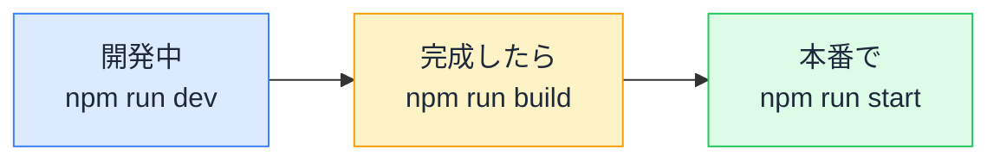

# npm run の正体 — 毎日打つ dev と build は何をしているのか

## 今日のゴール

- package.json の scripts が「コマンドのショートカット」だと知る
- dev / build / start の役割の違いを知る
- scripts を読める = プロジェクトの動かし方が分かる、と知る

## 毎日のおまじない

Next.js のプロジェクトで最初に言われるのは「`npm run dev` で開発サーバーが起動します」。その通りに打てば画面が出るので、深く考えずに毎日打ち続けます。

しかし「dev って何？」と聞かれると、意外と答えられません。`npm` は知っている。`run` も分かる。`dev` は何でしょう。

答えは `package.json` にあります。

## scripts — コマンドの辞書

`package.json` の `scripts` フィールドは、**長いコマンドに短い名前を付ける辞書**です。

```json
{
  "scripts": {
    "dev": "next dev",
    "build": "next build",
    "start": "next start",
    "lint": "eslint"
  }
}
```

`npm run dev` は、この辞書から `dev` を引いて `next dev` を実行する。それだけのことです。

| 打つもの | 実行されるもの |
|---------|-------------|
| `npm run dev` | `next dev` |
| `npm run build` | `next build` |
| `npm run start` | `next start` |
| `npm run lint` | `eslint` |

`dev` や `build` は Next.js の機能名ではなく、**プロジェクトが自由に決めた名前**です。`scripts` に `"banana": "echo hello"` と書けば `npm run banana` で `echo hello` が実行されます。名前と中身の対応は、プロジェクトごとに `package.json` を見れば分かります。

## 3 つのモード — dev / build / start

Next.js プロジェクトの定番 3 コマンドは、役割がはっきり分かれています。

| コマンド | モード | やること |
|---------|--------|---------|
| `npm run dev` | 開発 | 開発サーバーを起動。ファイルを保存すると画面が即座に更新される |
| `npm run build` | ビルド | 本番向けにすべてのファイルを変換・最適化して `.next/` に出力する |
| `npm run start` | 本番起動 | build の成果物をもとにサーバーを起動する |



`dev` は開発者の味方で、型チェックの一部を後回しにしたり、キャッシュを甘くしたりして**速さ優先**で動きます。`build` はすべてのチェックと最適化を実行するので時間がかかりますが、その分**本番で速くなる**出力を作ります。

「dev では動いたのに build でエラーが出た」は定番のトラブルです。dev が見逃す種類のエラー（型の問題、動的 import の解決など）が build で初めて表面化するからです。**build を通してから安心する**のが習慣として正しいのです。

## lint — コードの機械レビュー

`npm run lint` は、コードを実行せずに機械的にチェックするコマンドです。中身は **ESLint** で、「使われていない変数」「アクセシビリティのルール違反」「React のフック規則違反」などを検出します（かつては `next lint` という Next.js 同梱のコマンドがありましたが、Next.js 16 で廃止され、ESLint や Biome を直接呼ぶ形になりました。AI が古い `next lint` を出してきたら、その名残です）。

`dev` や `build` と違い、lint は**動作には影響しません**。指摘を無視してもアプリは動きます。しかし「動くけれど問題のあるコード」を機械が見つけてくれるのは、AI のコードを大量に引き受ける時代には貴重です。

## scripts を読む習慣

初めて触るプロジェクトで最初にやることは、`package.json` の `scripts` を読むことです。

- **どうやって起動するか**（dev）
- **テストはどう実行するか**（test）
- **build 以外にどんなコマンドがあるか**（db:migrate、storybook、e2e など）

scripts はプロジェクトの「**操作マニュアルの目次**」です。AI に「このプロジェクトの動かし方」を聞く代わりに、`scripts` を読むだけで全貌が掴めることもあります。逆に AI への指示でも、「テストを実行して」より「**`npm run test:e2e` を実行して**」のほうが、迷いなく意図どおりのコマンドが走ります。scripts の名前は、人間と AI の共通語彙です。

```json
{
  "scripts": {
    "dev": "next dev",
    "build": "next build",
    "start": "next start",
    "lint": "eslint",
    "test": "vitest",
    "test:e2e": "playwright test",
    "db:migrate": "prisma migrate deploy"
  }
}
```

「テストは Vitest、E2E は Playwright、DB は Prisma」。使っている技術スタックまで scripts から読み取れます。

## まとめ

- package.json の scripts は長いコマンドに短い名前を付ける辞書
- dev は開発用（速さ優先）、build は本番向け最適化、start は本番起動
- dev で動いても build で落ちることがある。build を通して安心
- scripts を読む = プロジェクトの動かし方と技術スタックが分かる
