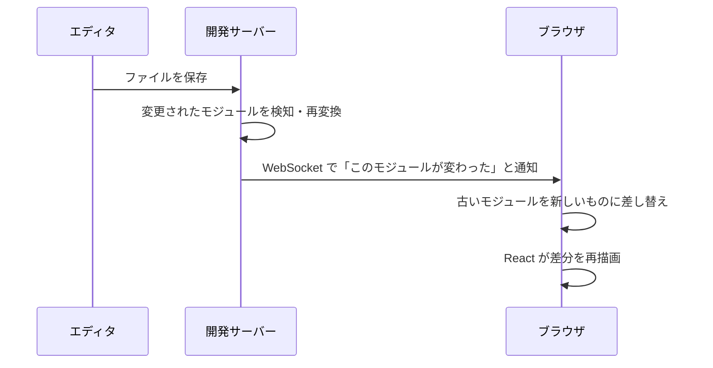

# HMR — 保存した瞬間に画面が変わる仕組み

## 今日のゴール

- 保存 → 画面更新が「リロード」ではないことを知る
- HMR が「変わったモジュールだけ差し替える」仕組みだと知る
- HMR で state が保たれる場面とリセットされる場面の違いを知る

## 保存してから画面が変わるまでに起きること

`npm run dev` でアプリを起動して CSS の色を変え、ファイルを保存する。目を画面に移すと、もう変わっている。

この体験は当たり前すぎて疑問を持ちにくいですが、よく考えると不思議です。**ブラウザを手動でリロードしていない**のに画面が変わっています。しかもフォームに入力途中の文字がそのまま残っていることもあります。リロードなら全部消えるはずです。

この裏側で動いているのが **HMR**（Hot Module Replacement、モジュールのホットな差し替え）です。

## リロードとの違い

| | フルリロード | HMR |
|---|------------|-----|
| やること | ページ全体を破棄して最初から読み込み直す | **変更されたファイル（モジュール）だけ差し替える** |
| 画面の状態 | すべて消える（入力中の文字、スクロール位置、開閉状態） | 多くの場合、**保たれる** |
| 速度 | ページ全体を再構築するので遅い | 変更分だけなので速い |

HMR の「Hot」は「**システムを止めずに**（ホットな状態のまま）入れ替える」という意味です。

## 仕組み — 開発サーバーが差分を届ける

1. ファイルを保存すると、開発サーバーが**変更されたファイルだけ**を検知して再変換する
2. **WebSocket**（常時つながっている双方向の通信路）を通じて、ブラウザに「このモジュールが新しくなった」と通知する
3. ブラウザは古いモジュールを**捨てて新しいものに差し替え**、React がその部分だけ再描画する

ページ全体を取り直すのではなく、**変わった部品だけ入れ替える**。だから速く、だから状態が（多くの場合）残ります。

## state が保たれるときとリセットされるとき

HMR で state が保たれるのは、**React のコンポーネントが「同じもの」だと認識された場合**です。

| 変更の内容 | state |
|-----------|-------|
| JSX の表示や CSS だけの変更 | **保たれる** |
| ファイルの export 構造を変える（export を増やす、default を named に変えるなど） | **リセットされる** |
| ファイル名を変更する | リセットされる |

「さっきまで入力していた文字が消えた」が起きたら、HMR がコンポーネントを「別物」と判断してフルマウントし直した（つまりリセットされた）兆候です。バグではなく仕組みの動作なので、慌てる必要はありません。

## 開発専用の仕組み

HMR は**開発中だけ**動きます。本番ビルド（`npm run build` + `npm run start`）には HMR の仕組みは一切入りません。本番のアプリには WebSocket 接続も差し替えのコードも含まれないので、HMR がパフォーマンスに影響することはありません。

「開発中だけ画面が勝手に更新される」のはこのためで、本番でそれが必要なら別の仕組み（ポーリングや SSE）を使うことになります。

## 開発体験を支える裏方

HMR は地味な裏方ですが、開発体験への貢献は絶大です。

- CSS を 1px 変えて保存 → 即座に反映を確認 → 微調整を繰り返す。このサイクルが**秒単位で回る**
- フォームに 10 項目入力した状態でバリデーションを修正 → 入力し直さなくていい
- コンソールに出ているエラーを直して保存 → その場で消えるか確認できる

この速さのおかげで「書く → 見る → 直す」のループが短くなり、結果的に開発速度が上がります。Next.js が Turbopack を採用したのも、この HMR のループをさらに速くするためです。

## まとめ

- 保存して画面が変わるのはリロードではなく HMR（変更モジュールだけの差し替え）
- 開発サーバーが WebSocket で差分を通知し、ブラウザが部品を入れ替える
- state は多くの場合保たれるが、export 構造の変更でリセットされることがある
- 開発専用の仕組みで、本番には含まれない
