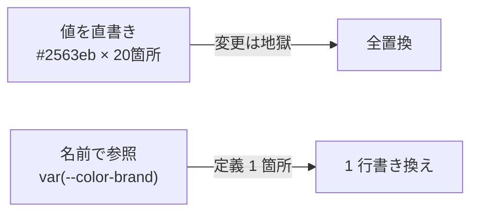
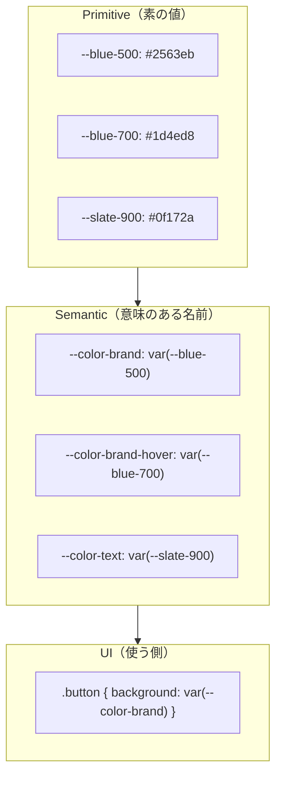

# 同じ値を何度も書きたくない — カスタムプロパティで設計する

## 今日のゴール

- CSS カスタムプロパティ（`--name`）が「実行時に評価される CSS 変数」であり、DOM ツリーに沿って継承されることを理解する
- デザイントークン（色・余白・角丸など）を名前で管理する発想を身につける
- テーマ切替・JS 連携・`color-mix()` など、実行時に値を変えるユースケースを知る

## 「`#2563eb` を 20 箇所に書いた」問題

AI が生成した CSS を眺めていて、こんな光景に見覚えはないだろうか。

```css
.button-primary { background: #2563eb; }
.link          { color: #2563eb; }
.badge-info    { border-color: #2563eb; }
.focus-ring    { outline-color: #2563eb; }
/* ... あと 16 箇所 ... */
```

ブランドカラーを少しだけ濃くしたい、と言われた瞬間に全ファイルを grep する羽目になる。これは「同じ値」が「意味のない文字列」として散らばっているから起きる。

Tailwind を使ったことがある人なら `bg-blue-500` `text-slate-700` のようなクラスに馴染みがあるはずだ。あれは値を直接書く代わりに **名前で参照** する仕組みで、変更が 1 箇所で済むようになっている。この「名前で参照する」ための CSS 標準機能がカスタムプロパティ（CSS 変数）だ。



今日はこの仕組みを、3 本の柱で押さえる。

## 柱 1: カスタムプロパティの基本 — `:root` で宣言、`var()` で参照

カスタムプロパティは `--` で始まるプロパティ名で値を宣言し、`var(--name)` で参照する。`:root`（HTML のルート要素）で宣言するとドキュメント全体から参照できる。

```css
:root {
  --color-brand: #2563eb;
  --color-text: #1e293b;
  --space-md: 1rem;
  --radius-md: 0.5rem;
}

.button {
  background: var(--color-brand);
  color: white;
  padding: var(--space-md);
  border-radius: var(--radius-md);
}

.link {
  color: var(--color-brand);
}
```

ブランドカラーを変えたくなったら `:root` の 1 行を書き換えるだけ。`#2563eb` という文字列は設計の中から消え、「ブランドカラー」という **意味** だけが残る。

### 継承とスコープ

カスタムプロパティは普通の CSS プロパティと同じく DOM ツリーに沿って継承される。つまり「途中の要素だけ上書き」もできる。

```css
:root {
  --color-brand: #2563eb; /* 青 */
}

.theme-danger {
  --color-brand: #dc2626; /* この要素以下では赤 */
}
```

`.theme-danger` の内側にある `.button` や `.link` は、何もしなくても赤になる。ダークモードやエラー領域といった「部分的な見た目の切替」がこれだけで実現できる。

未定義でも壊れないよう、`var(--card-bg, white)` のように第 2 引数でフォールバックも書ける。

### SASS 変数との決定的な違い

SASS（`$primary: #2563eb`）のような **プリプロセッサ変数** は、ビルド時にただの文字列置換として消える。一方 CSS カスタムプロパティは **実行時に評価される**。つまり開発者ツールで書き換えればその場で反映され、メディアクエリや `:hover` で値を切り替えたり、JavaScript から読み書きしたりできる。「実行時に生きている変数」である点が、今日一番覚えてほしいことだ。

## 柱 2: デザイントークン設計 — primitive と semantic を分ける

変数を使い始めると、今度は「どう名前を付けるか」で悩むことになる。業界で定着している考え方が **2 階建て** の設計だ。



- **Primitive トークン**: `--blue-500`, `--slate-900` のように色そのものを表す。パレットに相当する
- **Semantic トークン**: `--color-brand`, `--color-text` のように役割を表す。UI から参照するのはこちら

この階層があるおかげで「ダークモードではブランドカラーを明るめの青にする」「エラー色を赤から橙に変える」といった変更が、Primitive を差し替えるだけ、あるいは Semantic の向き先を変えるだけで済む。

```css
:root {
  /* Primitive */
  --blue-500: #2563eb;
  --blue-300: #93c5fd;
  --slate-900: #0f172a;
  --slate-50: #f8fafc;

  /* Semantic（ライト） */
  --color-brand: var(--blue-500);
  --color-text: var(--slate-900);
  --color-bg: var(--slate-50);
}

@media (prefers-color-scheme: dark) {
  :root {
    --color-brand: var(--blue-300);
    --color-text: var(--slate-50);
    --color-bg: var(--slate-900);
  }
}
```

### 余白もトークンにする理由（アクセシビリティ）

色だけでなく、余白やフォントサイズも変数化するのが王道だ。ここで `rem` を使うのが大事なポイント。

```css
:root {
  --space-xs: 0.25rem;
  --space-sm: 0.5rem;
  --space-md: 1rem;
  --space-lg: 2rem;

  --font-size-base: 1rem;
  --font-size-lg: 1.125rem;
}
```

`rem` はルート要素のフォントサイズを基準にした単位。ユーザーがブラウザ設定でフォントを大きくすると、余白もフォントも一緒にスケールしてくれる。`px` で固定すると、視力に不安のあるユーザーが設定を変えても文字だけ大きくなって余白が窮屈になる。**ユーザーの設定を尊重する** のは当たり前のアクセシビリティ実装だ。

### Tailwind CSS v4 との関係

Tailwind CSS v4（2025 年に安定）は、`@theme` ディレクティブで定義したトークンを **CSS 変数としてそのまま公開** するようになった。

```css
@import "tailwindcss";

@theme {
  --color-brand: #2563eb;
  --spacing-gutter: 1rem;
}
```

こう書くと `bg-brand` `p-gutter` のようなクラスが自動生成される一方、素の CSS からも `var(--color-brand)` で参照できる。「Tailwind の `bg-blue-500` って何？」の答えは「CSS 変数として定義されたトークンを、ユーティリティクラス経由で参照している」だ。Tailwind の思想と CSS 標準が完全に同じ方向を向いている。

## 柱 3: 実行時に値を変える — テーマ切替・JS・`color-mix()`

カスタムプロパティの真価は「実行時に値が変えられる」ところにある。

### テーマ切替

`data-*` 属性や `class` に応じて変数を切り替えれば、要素以下のツリー全体のテーマが変わる。

```css
.theme-scope { --color-bg: white; --color-text: #1e293b; }
.theme-scope[data-theme="dark"] { --color-bg: #0f172a; --color-text: #f1f5f9; }
.theme-scope { background: var(--color-bg); color: var(--color-text); }
```

```html
<div class="theme-scope">
  <button type="button" aria-pressed="false"
          onclick="const s=this.closest('.theme-scope');
                   const d=s.getAttribute('data-theme')==='dark';
                   s.setAttribute('data-theme', d?'light':'dark');
                   this.setAttribute('aria-pressed', String(!d));">
    テーマ切替
  </button>
</div>
```

`aria-pressed` でトグル状態を支援技術に伝え、`<button>` を使うことでキーボード操作（Enter / Space）も自動で効く。セマンティック HTML はアクセシビリティの出発点だ。

ちなみに、わざわざ属性を切り替えなくても、CSS 側で両テーマを素直に書ける `light-dark()` 関数が主要ブラウザで使える。

```css
:root {
  color-scheme: light dark;
  --color-bg: light-dark(white, #0f172a);
}
```

### JavaScript から変数を書き換える

JS からは `setProperty` で書き換え、`getPropertyValue` で読み出せる。

```ts
const root = document.documentElement;
root.style.setProperty("--color-brand", "#e11d48");
const current = getComputedStyle(root).getPropertyValue("--color-brand");
```

ユーザーが選んだ色をその場でページ全体に反映する、といったことが 1 行で書ける。下のデモを試してみてほしい。

<div style="padding:1rem;border:1px solid #cbd5e1;border-radius:8px;background:#f8fafc;color:#1e293b;--demo-brand:#2563eb;">
  <label style="display:flex;align-items:center;gap:.5rem;">
    ブランドカラー:
    <input
      type="color"
      value="#2563eb"
      aria-label="ブランドカラーを選択"
      oninput="this.parentElement.parentElement.style.setProperty('--demo-brand', this.value)"
      style="width:3rem;height:2rem;border:0;background:transparent;"
    />
  </label>
  <div style="display:flex;gap:.5rem;margin-top:.75rem;flex-wrap:wrap;">
    <button type="button" style="background:var(--demo-brand);color:white;border:0;padding:.5rem 1rem;border-radius:6px;">ボタン</button>
    <span style="color:var(--demo-brand);font-weight:600;align-self:center;">テキスト</span>
    <span style="border:2px solid var(--demo-brand);padding:.25rem .75rem;border-radius:999px;background:white;color:#1e293b;">バッジ</span>
  </div>
</div>

1 つの変数を変えるだけで、それを参照していた 3 つの要素がまとめて変わる。これが「実行時に評価される」ということの実感だ。

### `color-mix()` で派生色を作る

ホバー色や薄い背景色を毎回定義するのは面倒だが、`color-mix()` を使えばブランドカラーから派生させられる。

```css
.button {
  background: var(--color-brand);
}
.button:hover {
  /* ブランド色 80% + 黒 20% で少し暗く */
  background: color-mix(in oklch, var(--color-brand) 80%, black);
}
.info-banner {
  /* ブランド色 15% + 白 85% で薄い背景 */
  background: color-mix(in oklch, var(--color-brand) 15%, white);
}
```

`oklch` は人間の視覚に近い色空間で、明度を混ぜたときの見え方が自然になる。Primitive を増やさず派生色を作れるので、トークンの数を抑えられる。

### `@property` で型付きカスタムプロパティ

通常のカスタムプロパティは「文字列」として扱われるため、色や数値のアニメーションができない。`@property` で型を宣言すれば `transition` が効くようになる。

```css
@property --glow {
  syntax: "<color>";
  inherits: true;
  initial-value: #2563eb;
}
.card { box-shadow: 0 0 20px var(--glow); transition: --glow 300ms ease; }
.card:hover { --glow: #e11d48; }
```

「カスタムプロパティなのにアニメーションする」という引き出しは、凝った UI を作る場面で効いてくる。

## まとめ

- カスタムプロパティは **実行時に評価される CSS 変数**。DOM に沿って継承され、JS やメディアクエリで切り替えられる点が SASS 変数と決定的に違う
- `primitive → semantic` の 2 階建てで値を名前で参照すれば、変更は 1 箇所で済む。`rem` ベースのトークンはユーザーのフォントサイズ設定も尊重する
- テーマ切替、JS 連携、`color-mix()`、`@property`、Tailwind v4 の `@theme` まで、CSS 変数は現代フロントエンドの共通言語になっている

次に Tailwind のクラス名や AI が生成したスタイルを見たとき、「これは `:root` のどの変数を指しているのだろう？」と一段深く見られれば、今日はそれで十分だ。
