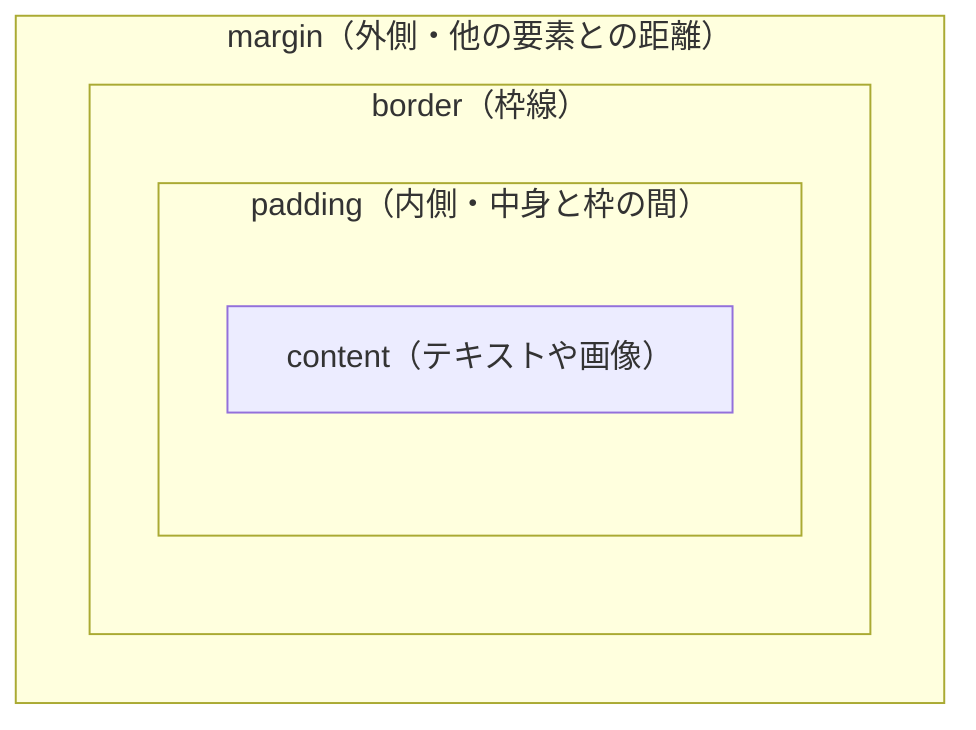

# CSS の余白設計 — margin、padding、gap の使い分け

## 今日のゴール

- margin と padding の違いを知る
- margin の相殺という仕組みと、その回避策を知る
- コンポーネントに margin を持たせない設計と、gap による余白管理を知る

## margin と padding の違い

CSS で余白を作るプロパティは `margin` と `padding` の 2 つがあります。どちらも「スペースを空ける」ものですが、役割が違います。

```css
.card {
  padding: 16px;
  margin: 24px;
  background-color: #e8f0fe;
  border: 1px solid #93c5fd;
}
```

- **padding**: 要素の**内側**の余白です。背景色の中に含まれます。上の例では、テキストと枠線の間に 16px の余白ができます
- **margin**: 要素の**外側**の余白です。背景色の外にあります。上の例では、この要素と隣の要素の間に 24px の距離ができます



使い分けの基本はシンプルです。

| やりたいこと | 使うプロパティ |
|-------------|--------------|
| テキストが枠にくっつかないようにする | `padding` |
| 要素と要素の間に距離を作る | `margin`（または `gap`） |

## margin の相殺

margin には直感に反する仕組みがあります。

```html
<div style="margin-bottom: 24px;">上の要素</div>
<div style="margin-top: 24px;">下の要素</div>
```

上に `margin-bottom: 24px`、下に `margin-top: 24px` を付けたので、間は 48px 空きそうに思えます。しかし実際の間隔は **24px** です。

これを**margin の相殺（margin collapsing）**と呼びます。隣り合うブロック要素の上下の margin は、合算されるのではなく、大きい方だけが適用されます。

```css
.first  { margin-bottom: 30px; }
.second { margin-top: 20px; }
/* 間隔は 30 + 20 = 50px ではなく、大きい方の 30px */
```

相殺のルールは次のとおりです。

- **上下の margin だけ**で起きます。左右の margin は相殺されません
- **ブロック配置のときだけ**起きます。親が Flexbox や Grid のときは相殺されません
- **親子間でも起きます**。子の `margin-top` が親の上端からすり抜けて外に出ることがあります

相殺はレイアウトが意図どおりにならない原因になりがちです。次のセクションでは、そもそも相殺が起きにくい書き方を見ていきます。

## margin は一方向に揃える

margin の相殺を避ける最もシンプルな方法は、**margin を付ける方向を片側に統一する**ことです。

```css
/* margin-bottom だけを使う */
.heading { margin-bottom: 16px; }
.paragraph { margin-bottom: 24px; }
```

`margin-bottom` だけ、または `margin-top` だけに統一すれば、兄弟要素同士で上下の margin がぶつかることがないので、相殺は起きません。どちらでもいいですが、`margin-bottom`（下方向）に統一するのが一般的です。上から下に読むページの流れに沿って「次の要素との距離」を指定するほうが直感的だからです。

## コンポーネントに margin を持たせない

React や Next.js では、UI をコンポーネント（再利用可能な部品）に分けて組み立てます。このとき、**コンポーネントのルート要素に margin を付けない**のが重要な設計原則です。

```tsx
// よくない例: コンポーネント自身が margin を持つ
function Card({ title }: { title: string }) {
  return (
    <article className="rounded-lg bg-white p-4 mb-4">
      <h2 className="text-lg font-bold">{title}</h2>
    </article>
  );
}
```

この `Card` は下に `mb-4`（`margin-bottom: 1rem`）を常に持っています。カードを横に並べたいとき、間隔を変えたいとき、最後のカードだけ余白をなくしたいとき、どれもうまくいきません。

```tsx
// よい例: コンポーネントは margin を持たない
function Card({ title }: { title: string }) {
  return (
    <article className="rounded-lg bg-white p-4">
      <h2 className="text-lg font-bold">{title}</h2>
    </article>
  );
}
```

`padding` はコンポーネントの**内側**の話なので問題ありません。`margin` はコンポーネントの**外側**、つまり他の要素との関係の話です。外側の距離をコンポーネント自身が決めてしまうと、使う場所によって調整が効かなくなります。

では、コンポーネント同士の間隔はどこで決めるのでしょうか。それが `gap` です。

## gap で親が間隔を決める

Flexbox や Grid で使える `gap` プロパティを親に指定すると、**子要素同士の間にだけ**間隔が入ります。

```tsx
function CardList() {
  return (
    <div className="flex flex-col gap-4">
      <Card title="1 件目" />
      <Card title="2 件目" />
      <Card title="3 件目" />
    </div>
  );
}
```

```css
/* gap の動きを CSS で書くとこうなります */
.card-list {
  display: flex;
  flex-direction: column;
  gap: 16px;
}
```

`gap` のメリットは明確です。

- **端に余白が付かない**: 最初と最後の要素の外側にはスペースが入りません。`margin` で書いた場合の `:last-child { margin-bottom: 0 }` のような後始末が不要です
- **相殺が起きない**: Flexbox / Grid 上では margin の相殺は発生しません。`gap` は margin とは別の仕組みなので、相殺の心配自体がありません
- **間隔の責任が親にある**: 子コンポーネントは自分の外側の余白を知りません。間隔を変えたければ親の `gap` を変えるだけです

### gap が使えないケース

`gap` は親が Flexbox か Grid のときだけ使えます。通常のブロック配置（`display: block`）では効きません。

また、子要素ごとに異なる間隔をつけたい場合（見出しの上は広く、段落の間は狭くしたいなど）には `gap` だけでは対応できません。その場合は、一方向に統一した `margin` を使います。

| 場面 | 使う方法 |
|------|---------|
| 同じ間隔で並べる（カード一覧、ボタン群など） | 親に `gap` |
| 要素ごとに異なる間隔が必要 | 一方向の `margin` |
| コンポーネント同士の間隔 | 親に `gap`（コンポーネント自身は margin を持たない） |

## まとめ

- `padding` は要素の内側、`margin` は要素の外側の余白です
- 隣り合う上下の margin は相殺されて大きい方だけが残ります
- margin は一方向（`margin-bottom` だけなど）に統一すると相殺を避けられます
- コンポーネントのルート要素に margin を持たせないのが設計の原則です。外側の距離は使う側が決めます
- 同じ間隔で並べるなら親に `gap` を指定するのが今の定番です
