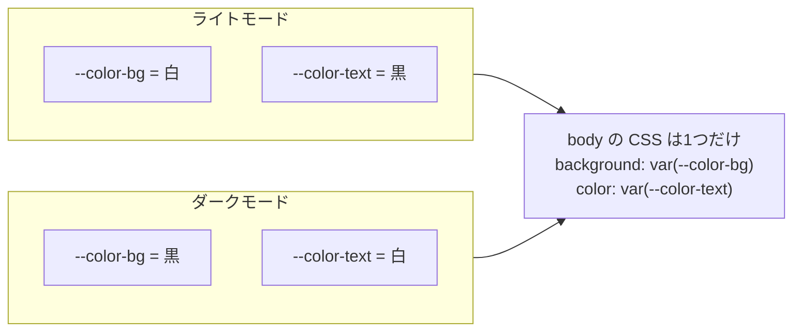
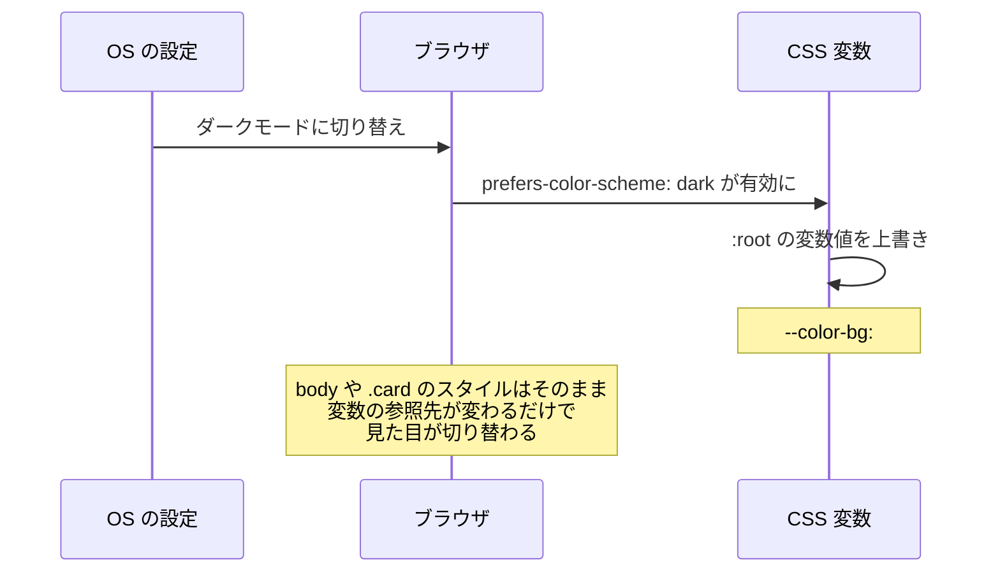

# ダークモードの仕組み — CSS 変数で見た目を切り替える

## 今日のゴール

- CSS にも変数があることを知る
- ダークモードは CSS 変数の値を切り替えて実現していることを知る
- デザイントークンという考え方を知る

## ダークモードの裏側

Web サイトやアプリで、ライトモードとダークモードを切り替えられる機能を見たことがあると思います。OS の設定で「ダークモード」を選ぶと、対応しているサイトの背景が暗くなり、文字が明るくなります。

あの切り替え、どうやって実現しているか想像できますか？

「ライト用のデザインとダーク用のデザインを 2 つ作っている」と思うかもしれません。でも実際は違います。やっていることは**「変数に入った色の値を差し替えているだけ」**です。



CSS のスタイル自体は 1 つしか書いていません。変数の中身が変わることで、見た目が切り替わるのです。

では、この「CSS の変数」とは何なのかを見ていきます。

## CSS 変数（カスタムプロパティ）

CSS にも変数の仕組みがあります。**カスタムプロパティ**と呼ばれるもので、`--` で始まる名前を付けて値を定義し、`var()` で参照します。

```css
:root {
  --color-bg: #ffffff;
  --color-text: #292524;
}

body {
  background-color: var(--color-bg);
  color: var(--color-text);
}
```

`:root` は HTML 文書全体を指すセレクタです。ここで定義した変数は、ページ内のどこからでも `var(--変数名)` で参照できます。

変数に入れられるのは色だけではありません。余白、角丸、フォントなど、CSS のあらゆる値を格納できます。

```css
:root {
  --color-bg: #ffffff;
  --color-text: #292524;
  --color-primary: #064e3b;

  --spacing-sm: 8px;
  --spacing-md: 16px;

  --radius: 8px;

  --font-body: system-ui, -apple-system, sans-serif;
}

.card {
  background-color: var(--color-bg);
  color: var(--color-text);
  padding: var(--spacing-md);
  border-radius: var(--radius);
  font-family: var(--font-body);
}
```

ポイントは、**値を直接書く代わりに名前で参照している**ことです。値を変えたくなったら、`:root` の定義を 1 箇所変えるだけで、参照しているすべての場所に反映されます。

## 変数でダークモードを作る

CSS 変数の仕組みがわかったところで、ダークモードの実装を見てみます。

ブラウザには「ユーザーが OS でダークモードを選んでいるか」を検知する仕組みがあります。`@media (prefers-color-scheme: dark)` というメディアクエリです。

```css
/* ライトモード（デフォルト） */
:root {
  --color-bg: #ffffff;
  --color-text: #292524;
  --color-text-muted: #57534e;
  --color-primary: #064e3b;
  --color-border: #e7e5e4;
}

/* ダークモード — 変数の値だけを上書き */
@media (prefers-color-scheme: dark) {
  :root {
    --color-bg: #1b1b1f;
    --color-text: #f5f5f4;
    --color-text-muted: #a8a29e;
    --color-primary: #6ee7b7;
    --color-border: #3f3f46;
  }
}

/* スタイルは1つだけ */
body {
  background-color: var(--color-bg);
  color: var(--color-text);
}

.card {
  background-color: var(--color-bg);
  border: 1px solid var(--color-border);
  border-radius: 8px;
  padding: 16px;
}

.card p {
  color: var(--color-text-muted);
}

a {
  color: var(--color-primary);
}
```

`body` や `.card` のスタイルは 1 つしか書いていません。`@media (prefers-color-scheme: dark)` のブロックで変数の値だけを差し替えることで、ライトモードとダークモードの両方に対応しています。

CSS を書き換えるのではなく、**変数の値を差し替えるだけ**。これがダークモードの仕組みです。



## デザイントークン — 変数を設計の単位にする

ここまで見てきたように、サイト全体の色・余白・フォントなどを CSS 変数として一元管理すると、ダークモード対応だけでなく、さまざまなメリットがあります。

この「サイト全体の設計値を変数として管理する」考え方を**デザイントークン**と呼びます。

```css
:root {
  /* 色 */
  --color-primary: #064e3b;
  --color-text: #292524;
  --color-text-muted: #57534e;
  --color-bg: #ffffff;
  --color-border: #e7e5e4;

  /* 余白 */
  --spacing-xs: 4px;
  --spacing-sm: 8px;
  --spacing-md: 16px;
  --spacing-lg: 24px;

  /* 角丸 */
  --radius-sm: 4px;
  --radius-md: 8px;

  /* フォント */
  --font-body: system-ui, -apple-system, sans-serif;
}
```

デザイントークンがあると:

- **一貫性が保てる** — 「微妙に違う色」「微妙に違う余白」が増えない
- **変更が 1 箇所で済む** — ブランドカラーを変えたくなったら変数の値を 1 つ変えるだけ
- **ダークモードに対応しやすい** — 変数を上書きするだけで見た目を切り替えられる

実は、Tailwind CSS はまさにこの考え方を徹底したフレームワークです。`bg-white`、`text-sm`、`p-4` といったユーティリティクラスは、あらかじめ定義されたデザイントークンの集合です。

Tailwind CSS v4 では `@theme` ブロックで CSS 変数としてトークンを定義します。

```css
@import "tailwindcss";

@theme {
  --color-brand: #064e3b;
  --font-display: "Inter", sans-serif;
}
```

こう書くと `bg-brand` や `font-display` といったユーティリティクラスが自動的に使えるようになります。CSS 変数でデザイントークンを定義し、それをユーティリティクラスとして使う。Tailwind v4 は、ここまで見てきた CSS 変数の仕組みの上に成り立っています。

## まとめ

- CSS にも変数があります。`--名前: 値` で定義し、`var(--名前)` で参照します
- ダークモードは CSS を書き換えているのではなく、**変数の値を差し替えているだけ**です
- `@media (prefers-color-scheme: dark)` で OS のダークモード設定を検知し、変数を上書きします
- サイト全体の色・余白・フォントを変数として一元管理する考え方を**デザイントークン**と呼びます
- Tailwind CSS v4 の `@theme` は、デザイントークンを CSS 変数として定義する仕組みです
