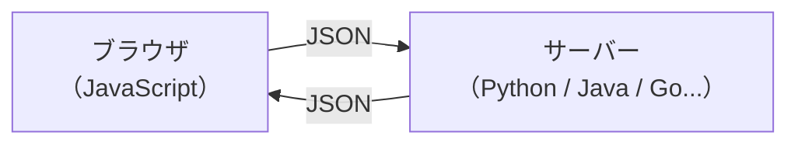

# JSON — サーバーとブラウザの共通語

## 今日のゴール

- JSON というデータ形式を知る
- JavaScript のオブジェクトとの違いを知る
- `JSON.parse` / `JSON.stringify` でオブジェクトと文字列を相互変換できることを知る
- API レスポンスや設定ファイルなど、Web のあらゆる場面で使われていることを知る

## あちこちで見る同じ形式

Next.js のプロジェクトを AI で作ったことがあれば、`package.json` というファイルを見たことがあると思います。

```json
{
  "name": "my-app",
  "version": "1.0.0",
  "scripts": {
    "dev": "next dev",
    "build": "next build"
  },
  "dependencies": {
    "next": "15.3.1",
    "react": "19.1.0"
  }
}
```

API からデータを取得したとき、レスポンスもこんな形式だったはずです。

```json
{
  "id": 1,
  "name": "田中太郎",
  "email": "tanaka@example.com",
  "isActive": true
}
```

`tsconfig.json`（TypeScript の設定）も同じ形式です。パッケージの設定、API のレスポンス、TypeScript の設定ファイル。用途はバラバラなのに、どれも同じ書き方をしています。この形式が **JSON**（JavaScript Object Notation）です。

JSON は「サーバーとブラウザの間でデータをやり取りするための共通語」として、Web の世界で最も広く使われているデータ形式です。

## JSON の書き方

JSON のルールはシンプルです。**キーと値のペア**を波括弧 `{}` で囲みます。

```json
{
  "name": "田中太郎",
  "age": 25,
  "isStudent": false,
  "address": null
}
```

使える値の種類は 6 つだけです。

| 種類 | 例 | 説明 |
|------|-----|------|
| 文字列 | `"hello"` | ダブルクォートで囲む |
| 数値 | `42`, `3.14` | 整数も小数も OK |
| 真偽値 | `true`, `false` | |
| null | `null` | 値がないことを表す |
| 配列 | `[1, 2, 3]` | 角括弧で囲む |
| オブジェクト | `{"key": "value"}` | 入れ子にできる |

これらを組み合わせれば、配列の中にオブジェクト、オブジェクトの中に配列、といった入れ子構造も表現できます。

守らなければならないルールがいくつかあります。

- **キーはダブルクォート必須** — `name` ではなく `"name"` と書く
- **文字列もダブルクォート** — シングルクォート `'hello'` は使えない
- **末尾のカンマは不可** — 最後の要素の後ろに `,` を付けてはいけない
- **コメントは書けない** — `//` や `/* */` は使えない

特にコメントが書けない点は、設定ファイルで不便に感じるかもしれません。実際、`tsconfig.json` は厳密には JSON ではなく「コメント付き JSON」（JSONC）という拡張形式です。エディタが特別に対応しています。

## JavaScript のオブジェクトとの違い

JSON の名前には「JavaScript Object Notation」とある通り、JavaScript のオブジェクト記法がベースです。見た目はほとんど同じですが、いくつか違いがあります。

```javascript
// JavaScript のオブジェクト
const user = {
  name: "田中太郎",      // キーにクォート不要
  age: 25,
  isStudent: false,       // 末尾カンマ OK
};
```

```json
{
  "name": "田中太郎",
  "age": 25,
  "isStudent": false
}
```

違いをまとめると次の通りです。

| | JavaScript オブジェクト | JSON |
|---|---|---|
| キーのクォート | 省略できる | ダブルクォート必須 |
| 末尾カンマ | OK | 不可 |
| コメント | OK | 不可 |
| 関数 | 値にできる | 不可 |
| undefined | 値にできる | 不可（null を使う） |

JSON は JavaScript のサブセット（一部分）のような存在です。JavaScript のオブジェクトからいくつかの機能を削って、**どの言語でも読み書きできるように単純化したもの**が JSON です。

だからこそ、Python で動いているサーバーも、Java で動いているサーバーも、JavaScript で動いているブラウザも、全員が同じ JSON を読み書きできます。これが「共通語」と呼ばれる理由です。



## JSON.parse と JSON.stringify

JSON はあくまで**テキスト**（文字列）です。ネットワークでやり取りするときは文字列として送受信されます。JavaScript で扱うには、文字列をオブジェクトに変換する必要があります。

この変換を行うのが `JSON.parse` と `JSON.stringify` です。

```javascript
// JSON 文字列 → JavaScript オブジェクト
const jsonString = '{"name": "田中太郎", "age": 25}';
const user = JSON.parse(jsonString);

console.log(user.name); // "田中太郎"
console.log(user.age);  // 25
```

```javascript
// JavaScript オブジェクト → JSON 文字列
const user = { name: "田中太郎", age: 25 };
const jsonString = JSON.stringify(user);

console.log(jsonString); // '{"name":"田中太郎","age":25}'
```

`JSON.stringify(user, null, 2)` のように第 3 引数にスペース数を指定すると、インデント付きで整形されます。デバッグで中身を確認したいときに便利です。

### fetch と JSON

`fetch` で API からデータを取得すると、レスポンスは文字列として届きます。`.json()` メソッドを呼ぶと、内部で `JSON.parse` と同じ変換が行われ、JavaScript オブジェクトとして使えるようになります。

```javascript
const response = await fetch("https://api.example.com/users/1");
const user = await response.json(); // JSON 文字列 → オブジェクト

console.log(user.name); // "田中太郎"
```

データを送信するときは、逆に `JSON.stringify` でオブジェクトを文字列に変換してから送ります。

```javascript
const newUser = { name: "佐藤花子", email: "sato@example.com" };

const response = await fetch("https://api.example.com/users", {
  method: "POST",
  headers: {
    "Content-Type": "application/json",
  },
  body: JSON.stringify(newUser),
});
```

`Content-Type: application/json` は「このリクエストのボディは JSON 形式ですよ」とサーバーに伝えるヘッダーです。

つまり、受け取るときは `.json()` で変換、送るときは `JSON.stringify` で変換。この 2 つの変換が、ブラウザとサーバーの間で JSON をやり取りする基本パターンです。

## どこで使われているか

JSON が使われている場面を改めて整理してみます。

**API のデータ交換** — サーバーとブラウザの間でデータをやり取りするとき、ほとんどの Web API は JSON を使います。REST API も GraphQL も、レスポンスの形式は JSON です。

**設定ファイル** — `package.json`（パッケージ管理）、`tsconfig.json`（TypeScript 設定）、`.eslintrc.json`（リンター設定）など、開発ツールの設定ファイルの多くが JSON 形式です。

**localStorage** — ブラウザにデータを保存する `localStorage` は文字列しか保存できません。オブジェクトを保存したいときは `JSON.stringify` で文字列に変換し、取り出すときに `JSON.parse` でオブジェクトに戻します。

```javascript
// 保存: オブジェクト → JSON 文字列
localStorage.setItem("settings", JSON.stringify({ theme: "dark", fontSize: 16 }));

// 取得: JSON 文字列 → オブジェクト
const settings = JSON.parse(localStorage.getItem("settings"));
console.log(settings.theme); // "dark"
```

JSON が広く使われている理由は、**人間にも読めて、機械にも解析しやすい**バランスの良さです。XML のような代替形式もありますが、JSON のほうがシンプルで軽量なため、Web の世界のデファクトスタンダード（事実上の標準）になっています。

## まとめ

- JSON は **JavaScript のオブジェクト記法をベースにしたデータ形式**です
- キーにはダブルクォートが必須で、末尾カンマやコメントは使えません
- `JSON.parse` で JSON 文字列をオブジェクトに、`JSON.stringify` でオブジェクトを JSON 文字列に変換します
- `fetch` の `.json()` メソッドは内部で `JSON.parse` と同じ変換を行っています
- API レスポンス、設定ファイル、localStorage など、Web のあらゆる場面で使われている共通のデータ形式です
