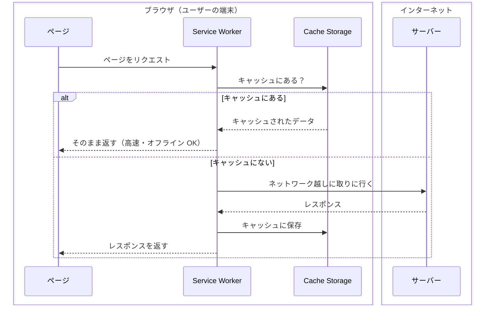

# 番外編: ブラウザでここまでできる — PWA と Web API デモ

## 今日のゴール

- Web サイトがアプリとしてインストールできることを知る
- ブラウザに音声合成や翻訳、要約の機能が組み込まれていることを知る
- 「Web でここまでできるんだ」という引き出しを持ち帰る

## この研修サイト、インストールできます

普段ブラウザのタブで開いているこの研修サイトは、実はアプリとしてインストールできます。

### やってみよう

1. Chrome でこのサイトを開く
2. アドレスバーの右にあるインストールアイコン（またはメニュー →「アプリをインストール」）をクリック
3. 「インストール」を押す

ブラウザのタブから切り離されて、独立したウィンドウで開きます。タスクバー（Dock）にもアイコンが並びます。

### 何が起きているのか

これは **PWA**（Progressive Web App）という仕組みです。Web サイトに 2 つのファイルを追加するだけで、アプリとしてインストール可能になります。

- **manifest.json** — アプリ名、アイコン、テーマカラーなどを定義するファイル
- **Service Worker** — バックグラウンドで動く JavaScript。キャッシュやオフライン対応を担当

DevTools の「Application」タブを開くと、manifest の中身や Service Worker の状態が確認できます。

App Store を通さずに、URL を開くだけでインストールできる。これが PWA の面白いところです。

## ブラウザが喋る — Speech Synthesis API

ブラウザには音声合成エンジンが組み込まれています。JavaScript から呼び出すと、テキストを音声で読み上げます。

<div style="background:#f8fafc;color:#1e293b;padding:20px;border-radius:8px;border:1px solid #e2e8f0;margin:16px 0">
<p style="margin:0 0 12px;font-weight:bold;color:#1e293b">音声読み上げデモ</p>
<div style="display:flex;gap:8px;align-items:center;flex-wrap:wrap">
<input type="text" id="sp68-text" value="こんにちは、Web フロントエンド研修へようこそ" style="flex:1;min-width:200px;padding:8px 12px;border:1px solid #cbd5e1;border-radius:6px;font-size:14px;color:#1e293b;background:white" />
<button type="button" onclick="speechSynthesis.cancel();const u=new SpeechSynthesisUtterance(document.getElementById('sp68-text').value);u.lang='ja-JP';speechSynthesis.speak(u)" style="padding:8px 16px;background:#064e3b;color:white;border:none;border-radius:6px;cursor:pointer;font-size:14px;white-space:nowrap">▶ 再生</button>
</div>
<div style="margin-top:12px;display:flex;gap:12px;align-items:center;flex-wrap:wrap">
<label style="font-size:13px;color:#475569">速度</label>
<input type="range" id="sp68-rate" min="0.5" max="3" step="0.1" value="1" style="width:120px" />
<label style="font-size:13px;color:#475569">ピッチ</label>
<input type="range" id="sp68-pitch" min="0" max="2" step="0.1" value="1" style="width:120px" />
<button type="button" onclick="speechSynthesis.cancel();const u=new SpeechSynthesisUtterance(document.getElementById('sp68-text').value);u.lang='ja-JP';u.rate=parseFloat(document.getElementById('sp68-rate').value);u.pitch=parseFloat(document.getElementById('sp68-pitch').value);speechSynthesis.speak(u)" style="padding:8px 16px;background:#064e3b;color:white;border:none;border-radius:6px;cursor:pointer;font-size:14px;white-space:nowrap">▶ 調整して再生</button>
</div>
</div>

コードはこれだけです。

```javascript
const utterance = new SpeechSynthesisUtterance("読み上げたいテキスト");
utterance.lang = "ja-JP";
speechSynthesis.speak(utterance);
```

外部サービスを使っていません。ブラウザに最初から入っている機能です。速度やピッチも `utterance.rate` や `utterance.pitch` で変更できます。

## ブラウザが翻訳する — Translator API

Chrome 138 以降、ブラウザに翻訳エンジンが内蔵されています。JavaScript から呼び出すと、サーバーに送信せずにブラウザ内で翻訳が完結します。

<div style="background:#f8fafc;color:#1e293b;padding:20px;border-radius:8px;border:1px solid #e2e8f0;margin:16px 0">
<p style="margin:0 0 12px;font-weight:bold;color:#1e293b">ブラウザ内翻訳デモ（Chrome 138+）</p>
<textarea id="tr68-input" rows="3" style="width:100%;padding:8px 12px;border:1px solid #cbd5e1;border-radius:6px;font-size:14px;color:#1e293b;background:white;resize:vertical" placeholder="英語のテキストを入力してください">The web browser is no longer just a document viewer. It has become a powerful application platform.</textarea>
<div style="margin-top:8px">
<button type="button" id="tr68-btn" onclick="(async()=>{const btn=document.getElementById('tr68-btn');const out=document.getElementById('tr68-output');btn.disabled=true;btn.textContent='翻訳中...';try{if(!('Translator' in window)){out.textContent='この機能は Chrome 138 以降で利用できます';return}const t=await Translator.create({sourceLanguage:'en',targetLanguage:'ja'});out.textContent=await t.translate(document.getElementById('tr68-input').value)}catch(e){out.textContent='エラー: '+e.message}finally{btn.disabled=false;btn.textContent='翻訳する'}})()" style="padding:8px 16px;background:#064e3b;color:white;border:none;border-radius:6px;cursor:pointer;font-size:14px">翻訳する</button>
</div>
<div id="tr68-output" style="margin-top:12px;padding:12px;background:white;border:1px solid #e2e8f0;border-radius:6px;min-height:40px;color:#1e293b;font-size:14px"></div>
</div>

```javascript
const translator = await Translator.create({
  sourceLanguage: "en",
  targetLanguage: "ja",
});
const result = await translator.translate("Hello, world!");
// → "こんにちは、世界！"
```

初回は言語パック（翻訳用のモデル）がダウンロードされるため少し時間がかかります。一度ダウンロードされれば、以降はオフラインでも翻訳できます。

## ブラウザが要約する — Summarizer API

翻訳と同じく Chrome に内蔵された AI 機能で、テキストの要約ができます。Chrome 140 から日本語にも対応しています。

<div style="background:#f8fafc;color:#1e293b;padding:20px;border-radius:8px;border:1px solid #e2e8f0;margin:16px 0">
<p style="margin:0 0 12px;font-weight:bold;color:#1e293b">ページ要約デモ（Chrome 140+）</p>
<p style="margin:0 0 12px;font-size:13px;color:#475569">ボタンを押すと、このページの本文をブラウザ内蔵 AI が要約します。</p>
<button type="button" id="sm68-btn" onclick="(async()=>{const btn=document.getElementById('sm68-btn');const out=document.getElementById('sm68-output');btn.disabled=true;btn.textContent='要約中...';try{if(!('Summarizer' in window)){out.textContent='この機能は Chrome 140 以降で利用できます';return}const s=await Summarizer.create({type:'tldr',length:'short',format:'plain-text'});const text=document.querySelector('.vp-doc').innerText;out.textContent=await s.summarize(text)}catch(e){out.textContent='エラー: '+e.message}finally{btn.disabled=false;btn.textContent='このページを要約する'}})()" style="padding:8px 16px;background:#064e3b;color:white;border:none;border-radius:6px;cursor:pointer;font-size:14px">このページを要約する</button>
<div id="sm68-output" style="margin-top:12px;padding:12px;background:white;border:1px solid #e2e8f0;border-radius:6px;min-height:40px;color:#1e293b;font-size:14px"></div>
</div>

```javascript
const summarizer = await Summarizer.create({
  type: "tldr",
  length: "short",
  format: "plain-text",
});

const text = document.querySelector("main").innerText;
const summary = await summarizer.summarize(text);
```

翻訳も要約も、サーバーには一切データを送っていません。すべてブラウザ内の Gemini Nano（Google のオンデバイス AI モデル）が処理しています。

### ブラウザ上で処理できると何が嬉しいか

「サーバーに送ればいいのでは？」と思うかもしれません。ブラウザ内で完結することには、いくつかの大きなメリットがあります。

**プライバシー**: 入力したテキストがネットワークの外に出ません。社内の機密文書を要約したい、患者の情報を含むメモを翻訳したい ── こうした場面でも、データが端末から離れないなら安心して使えます。

**速度**: ネットワークの往復がないので、応答が速いです。サーバーの混雑にも影響されません。

**オフライン対応**: モデルが一度ダウンロードされれば、ネットワークがなくても動きます。飛行機の中でも翻訳ができます。

**コスト**: サーバー側の API を呼ばないので、API 利用料がかかりません。

## 通知を出す — Notification API

Web サイトから OS のネイティブ通知を出すこともできます。

<div style="background:#f8fafc;color:#1e293b;padding:20px;border-radius:8px;border:1px solid #e2e8f0;margin:16px 0">
<p style="margin:0 0 12px;font-weight:bold;color:#1e293b">通知デモ</p>
<button type="button" onclick="(async()=>{const s=document.getElementById('nt68-status');try{const p=await Notification.requestPermission();s.textContent='権限: '+p;if(p==='granted'){new Notification('Web Front-end Training',{body:'ブラウザから通知が届きました！',icon:'/pwa-192x192.png'});s.textContent='権限: granted — 通知を送信しました。表示されない場合は OS の通知設定を確認してください'}else{s.textContent='権限が拒否されました（'+p+'）'}}catch(e){s.textContent='エラー: '+e.message}})()" style="padding:8px 16px;background:#064e3b;color:white;border:none;border-radius:6px;cursor:pointer;font-size:14px">通知を送る</button>
<p id="nt68-status" style="margin:8px 0 0;font-size:13px;color:#475569"></p>
<p style="margin:8px 0 0;font-size:13px;color:#475569">初回は許可ダイアログが出ます。</p>
</div>

```javascript
const permission = await Notification.requestPermission();
if (permission === "granted") {
  new Notification("タイトル", {
    body: "通知の本文",
    icon: "/pwa-192x192.png",
  });
}
```

`Notification.requestPermission()` でユーザーに許可を求め、許可されたら `new Notification()` で通知を作成します。Service Worker と組み合わせれば、サイトを開いていないときにもプッシュ通知を受け取れます。

## オフラインで読める — Service Worker のキャッシュ

この研修サイトは、一度開けばオフラインでも読めます。試しにネットワークを切ってページを移動してみてください。

これは Service Worker が初回アクセス時にページのデータをキャッシュしているからです。Service Worker はブラウザの中で動くプログラムで、ページとサーバーの間に立ってリクエストを仲介します。ネットワークの手前、**ブラウザ側に立つ中間者**です。



ポイントは、Service Worker とキャッシュが**ブラウザの中にいる**ことです。ネットワークが切れてもブラウザの中で完結するため、オフラインでも表示できます。

DevTools の「Application」→「Cache Storage」を開くと、キャッシュされているファイルの一覧が確認できます。

### Cache API — キャッシュをコードで制御する

Service Worker がキャッシュを管理するために使っているのが **Cache API** です。JavaScript からキャッシュの読み書きを直接制御できます。

```javascript
// キャッシュにファイルを保存
const cache = await caches.open("my-cache-v1");
await cache.add("/index.html");
await cache.add("/style.css");

// キャッシュからファイルを取り出す
const response = await cache.match("/index.html");
```

Service Worker の中でこれを使い、「リクエストが来たらまずキャッシュを見て、なければネットワークに取りに行く」というロジックを組みます。

```javascript
// Service Worker 内のキャッシュ戦略（簡略版）
self.addEventListener("fetch", (event) => {
  event.respondWith(
    caches.match(event.request).then((cached) => {
      return cached || fetch(event.request);
    })
  );
});
```

この研修サイトでは、ビルド時にすべてのページを自動でキャッシュに入れる **precache** という戦略を使っています。だから一度サイトを開けば、全ページがオフラインで読めるのです。

### キャッシュ戦略の種類

| 戦略 | 動き | 用途 |
|------|------|------|
| Cache First | まずキャッシュ、なければネットワーク | 変わらないファイル（CSS, JS, 画像） |
| Network First | まずネットワーク、失敗したらキャッシュ | 最新データが重要な API |
| Stale While Revalidate | キャッシュを返しつつ裏でネットワーク更新 | ニュースフィードなど |

「オフラインで動く」の裏には、こうしたキャッシュ戦略の選択があります。

## まとめ

- **PWA**: manifest + Service Worker で Web サイトがアプリとしてインストールできます
- **Speech Synthesis**: ブラウザに組み込まれた音声合成で、テキストを読み上げられます
- **Translator API**: Chrome に内蔵された AI が、サーバーを使わずにブラウザ内で翻訳します
- **Summarizer API**: 同じく Chrome 内蔵 AI で、テキストの要約ができます。日本語対応
- **Notification API**: Web サイトから OS のネイティブ通知を出せます
- **Service Worker**: ページをキャッシュしてオフラインでも表示できます

どれもブラウザの標準機能です。「Web サイト = ドキュメントを表示するもの」というイメージは、もう過去のものかもしれません。
