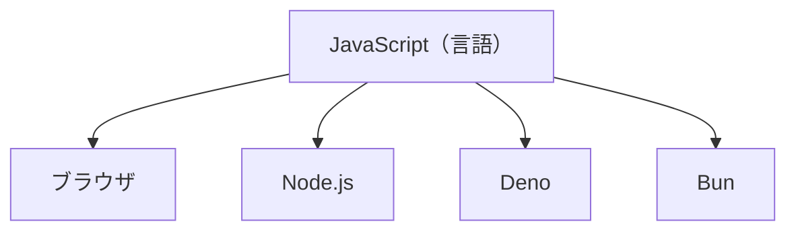
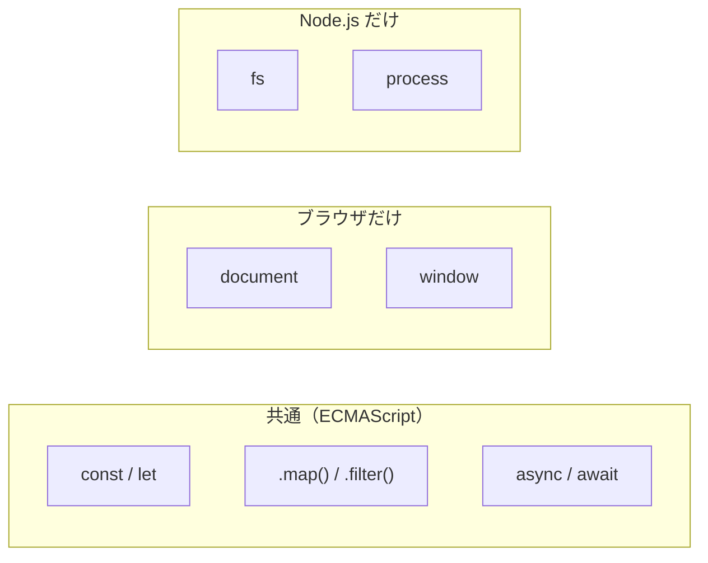
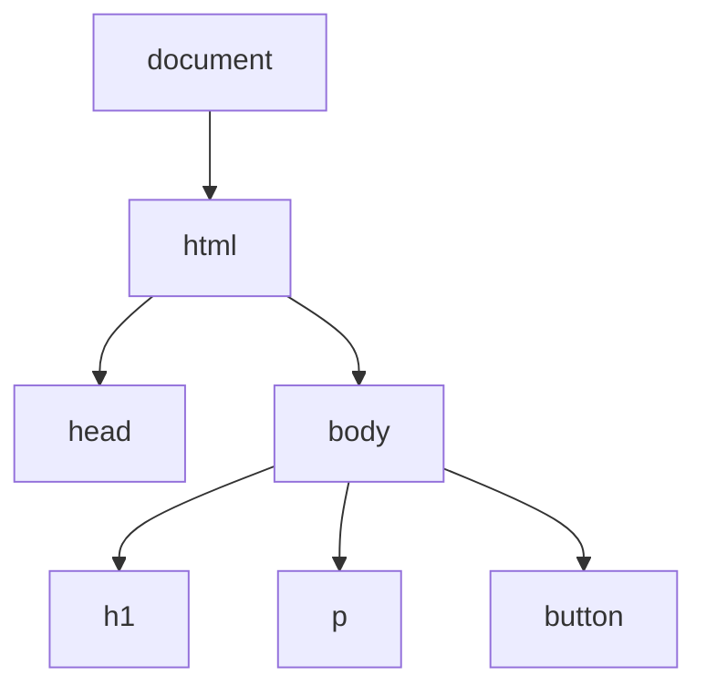

# JavaScript の実行環境 — 同じ言語なのに動く場所で使えるものが違う

## 今日のゴール

- JavaScript は 1 つの言語だが、動く場所が複数あることを知る
- ブラウザと Node.js で使えるものが違うことを知る
- ブラウザにだけある DOM という仕組みを知る

## AI が書いたコードを見てみると

AI に Next.js のアプリを作ってもらうと、`.tsx` ファイルの中に JavaScript のコードが並びます。あるファイルには `document.getElementById` と書いてあり、別のファイルには `fs.readFile` と書いてある。どちらも JavaScript なのに、なぜ使っている機能が違うのでしょうか。

答えは「動いている場所が違うから」です。

## JavaScript が動く場所は 1 つではない

JavaScript というと「ブラウザで動くもの」というイメージがあるかもしれません。かつてはその通りでしたが、今は違います。



ブラウザの中で動く JavaScript。サーバーで動く JavaScript（Node.js）。他にも Deno や Bun といった環境があります。`npm run dev` を実行したとき、ターミナルで動いているのは Node.js です。ブラウザで画面を見ているとき、そこで動いているのはブラウザの JavaScript です。

同じ JavaScript という言語を使っているのに、動く場所が違う。これが最初の大事なポイントです。

## 共通の部分と、環境ごとの部分

JavaScript の言語仕様は ECMAScript という標準で決められています。変数の宣言（`const`、`let`）、関数、配列操作（`.map()`、`.filter()`）、`if` や `for` といった基本的な文法は、どの環境でも同じように使えます。

```javascript
// これはどの環境でも動く（ECMAScript の範囲）
const numbers = [1, 2, 3];
const doubled = numbers.map(n => n * 2);
```

しかし、環境ごとに「追加で使えるもの」が違います。

| 機能 | ブラウザ | Node.js |
|------|---------|--------|
| 変数、関数、配列操作 | 使える | 使える |
| `document`（HTML を操作する） | 使える | **ない** |
| `window`（画面の情報） | 使える | **ない** |
| `fetch`（データを取りに行く） | 使える | 使える |
| `fs`（ファイルの読み書き） | **ない** | 使える |
| `process`（実行中のプロセス情報） | **ない** | 使える |

ブラウザには HTML の画面があるので、画面を操作する機能（`document`、`window`）が用意されています。Node.js にはファイルシステムがあるので、ファイルを読み書きする機能（`fs`）が用意されています。それぞれ、自分の環境にあるものだけが使えます。



## ブラウザにだけある DOM

ブラウザで JavaScript を使う最大の目的は、画面に表示されている HTML を操作することです。この仕組みを DOM（Document Object Model）と呼びます。

ブラウザは HTML を読み込むと、タグの構造をツリー状のオブジェクトに変換します。JavaScript はこのツリーを通じて、要素を探したり、テキストを書き換えたり、要素を追加・削除したりできます。



```javascript
// ブラウザでだけ動くコード
const button = document.getElementById('my-button');
button.textContent = 'クリック済み';
button.style.backgroundColor = 'green';
```

このコードを Node.js で実行すると `document is not defined` というエラーになります。Node.js には画面がないので、`document` というオブジェクト自体が存在しないのです。

## なぜこれを知っておく必要があるのか

Next.js では、同じプロジェクトの中にブラウザで動くコードとサーバー（Node.js）で動くコードが混在しています。

```
my-app/
  app/
    page.tsx        ← サーバーで動く
    components/
      Counter.tsx   ← "use client" → ブラウザで動く
```

AI が生成したコードの中に `"use client"` と書いてあるファイルを見たことがあるかもしれません。あれは「このファイルはブラウザで動かしてください」という宣言です。ブラウザでしか使えない `document` や `window` を使うコードは、`"use client"` が必要になります。

逆に、サーバーで動くファイルではデータベースに接続したり、ファイルを読んだりできます。これはブラウザではできないことです。

今はまだ `"use client"` の詳しい意味を理解する必要はありません。「JavaScript は動く場所によって使えるものが違う。だからコードが置かれる場所に意味がある」ということを知っておけば、この先 Next.js のコードを読むときに迷子になりにくくなります。

## まとめ

- JavaScript は 1 つの言語ですが、ブラウザ、Node.js、Deno、Bun など動く場所が複数あります
- 変数や関数など言語の基本（ECMAScript）はどの環境でも共通です
- ブラウザには画面を操作する `document`（DOM）や `window` があり、Node.js にはファイル操作の `fs` があります。環境ごとに使えるものが違います
- Next.js では同じプロジェクトの中にブラウザ用のコードとサーバー用のコードが混在しています。`"use client"` はその境界を示す宣言です
