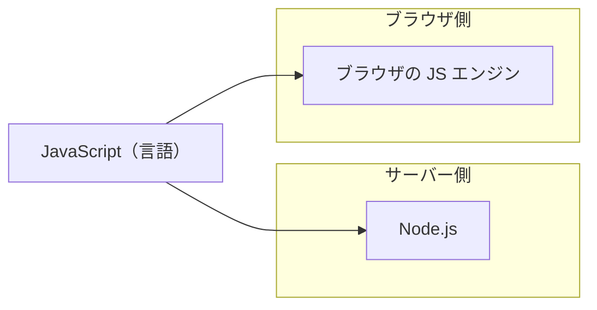
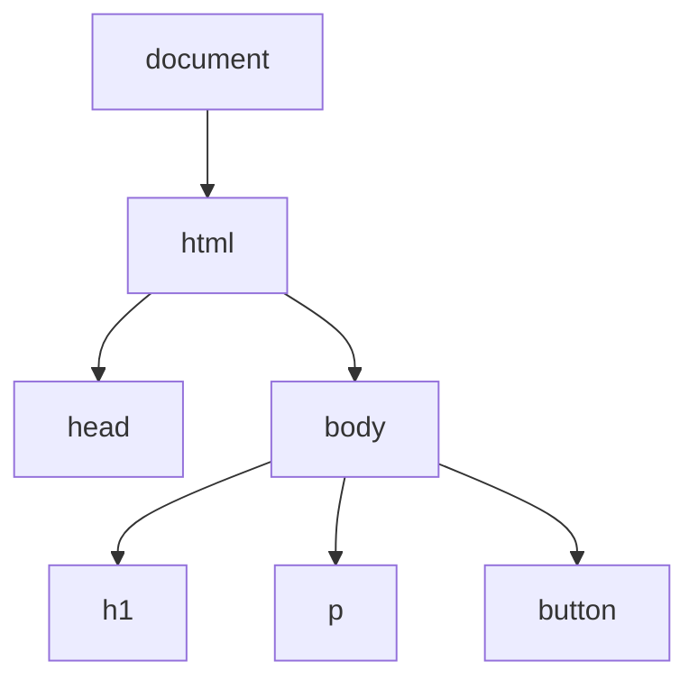

# JavaScript の実行環境 — 同じ言語が複数の場所で動く

## 今日のゴール

- JavaScript は 1 つの言語だが、動く場所が複数あることを知る
- ブラウザと Node.js で使えるものが違うことを知る
- ブラウザにだけある DOM という仕組みがあることを知る

## ブラウザとサーバー、どちらでも動く言語

Web はブラウザとサーバーの 2 つの世界で成り立っています。HTML や CSS はブラウザだけで使われますが、JavaScript はブラウザでもサーバーでも動きます。



ブラウザで動く JavaScript と、サーバーで動く JavaScript。同じ言語ですが、動く場所が違います。サーバー側で JavaScript を動かす代表的な環境が Node.js です。他にも Deno や Bun といった環境があります。

`npm run dev` をターミナルで実行すると、そこで動いているのは Node.js です。ブラウザで画面を見ているとき、そこで動いているのはブラウザの JavaScript です。1 つのプロジェクトの中で、2 つの場所が同時に動いています。

## 共通の部分と、環境ごとの部分

JavaScript の言語仕様は ECMAScript という標準で決められています。変数の宣言（`const`、`let`）、関数、配列操作（`.map()`、`.filter()`）といった基本的な文法は、どの環境でも同じです。

```javascript
// これはどの環境でも動く
const names = ["田中", "鈴木", "佐藤"];
const greeting = names.map(name => `こんにちは、${name}さん`);
```

ただし、環境ごとに「追加で使えるもの」が違います。

| 機能 | ブラウザ | Node.js |
|------|---------|--------|
| 変数、関数、配列操作 | 使える | 使える |
| `document`（HTML の操作） | 使える | ない |
| `window`（画面の情報） | 使える | ない |
| `fetch`（データの取得） | 使える | 使える |
| `fs`（ファイルの読み書き） | ない | 使える |

ブラウザには画面があるので、画面を操作する機能が用意されています。Node.js にはファイルシステムがあるので、ファイルを読み書きする機能が用意されています。それぞれの環境に合ったものが追加されている、というだけのことです。

## ブラウザにだけある DOM

ブラウザ固有の機能のうち、最も重要なのが DOM（Document Object Model）です。

ブラウザは HTML を読み込むと、タグの構造をツリー状のデータに変換します。このツリーが DOM です。JavaScript からこのツリーを操作することで、画面に表示されている内容を書き換えたり、要素を追加・削除したりできます。



```javascript
// ブラウザでだけ動く — DOM の操作
const button = document.getElementById('my-button');
button.textContent = 'クリック済み';
```

このコードを Node.js で実行すると `document is not defined` というエラーになります。Node.js には画面がないので `document` が存在しません。

DOM を直接操作するコードは、後で学ぶ React が大きく変えた部分です。今は「ブラウザには DOM という仕組みがあり、JavaScript で HTML を操作できる」ということを引き出しに入れておいてください。

## まとめ

- JavaScript は 1 つの言語ですが、ブラウザや Node.js など動く場所が複数あります
- 変数や関数など言語の基本（ECMAScript）はどの環境でも共通です
- ブラウザには画面を操作する DOM があり、Node.js にはファイル操作の `fs` があります。環境ごとに追加されている機能が違います
- `npm run dev` は Node.js、ブラウザの画面はブラウザの JS。1 つのプロジェクトで 2 つの環境が動いています
