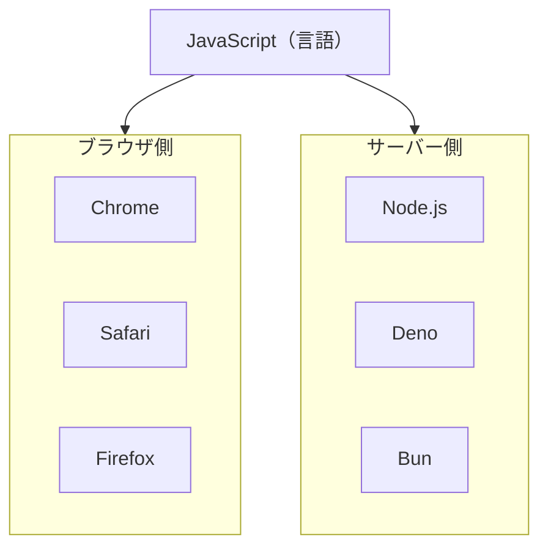
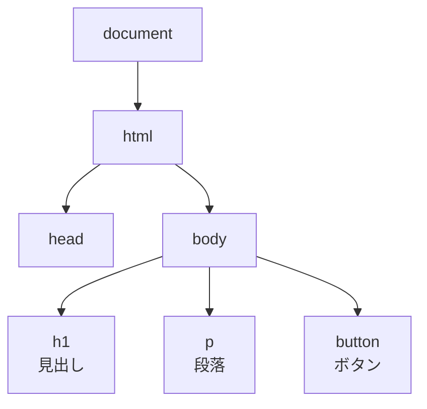
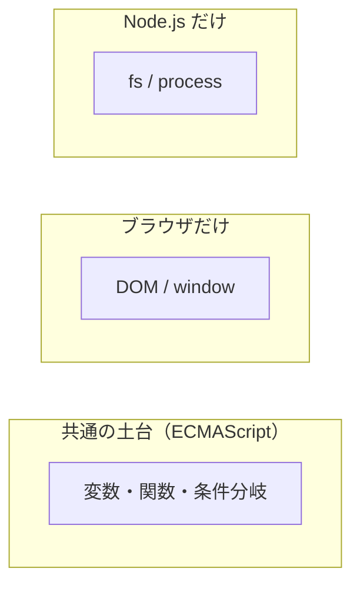

# JavaScript の実行環境 — 同じ言語が複数の場所で動く

## 今日のゴール

- JavaScript は 1 つの言語だが、動く場所が複数あることを知る
- ブラウザと Node.js で使えるものが違うことを知る
- ブラウザにだけある DOM という仕組みがあることを知る

## ブラウザとサーバー、どちらでも動く言語

Web はブラウザとサーバーの 2 つの世界で成り立っています。HTML や CSS はブラウザだけで使われますが、JavaScript はブラウザでもサーバーでも動きます。

| 環境 | 何をするもの |
|------|------------|
| **ブラウザ**（Chrome, Safari, Firefox） | ユーザーの端末で画面を表示する |
| **Node.js** | ブラウザの外で JavaScript を動かす。サーバー処理やコマンドラインツールに使われる |
| **Deno / Bun** | Node.js と同じくサーバー側の環境。仕組みが少しずつ異なる |

同じ JavaScript という言語を使っていますが、動く場所が違います。

## 共通の部分と、環境ごとの部分

JavaScript には ECMAScript と呼ばれる共通の土台があります。変数の宣言、関数、条件分岐といった基本的な文法はこの土台に含まれていて、どの環境でも同じように動きます。

::: details ECMAScript とは
JavaScript の文法や機能は、Ecma International という標準化団体が「ECMAScript」という仕様書にまとめています。たとえば「変数を `const` で宣言できる」「配列に `.map()` が使える」といったことは、この仕様書で決められています。

ブラウザや Node.js などの各環境は、この仕様書に沿って JavaScript を実装しています。だから同じコードがどの環境でも同じように動きます。

「JavaScript」と「ECMAScript」はほぼ同じものを指していますが、厳密には ECMAScript が仕様、JavaScript がその実装です。
:::

::: details 新しい機能はどうやって追加される？ — TC39 と Stage プロセス
ECMAScript に新しい機能を追加するかどうかは、TC39 という委員会が決めています。TC39 にはブラウザベンダー（Google、Apple、Mozilla など）や企業のエンジニアが参加しています。

新機能は Stage 0（アイデア）から Stage 4（完成）まで段階を踏んで進みます。

| Stage | 状態 | 意味 |
|-------|------|------|
| 0 | アイデア | 「こういう機能があるといいのでは」という提案 |
| 1 | 提案 | 委員会が検討する価値があると認めたもの |
| 2 | 草案 | 仕様の詳細が書かれ始めた段階 |
| 3 | 候補 | 仕様がほぼ完成。ブラウザが先行実装を始める |
| 4 | 完成 | 2 つ以上のエンジンで実装済み。次の年次仕様に含まれる |

ポイントは、Stage 4 の条件に「2 つ以上のエンジンで実装済み」が含まれていることです。つまり仕様が完成してから実装が始まるのではなく、実装と仕様策定が並行して進みます。年次の仕様書（ES2024 など）は、その年に Stage 4 に到達した機能をまとめたスナップショットです。

ブラウザごとに対応状況が異なるのは、この Stage プロセスで実装のタイミングにずれが生じるためです。
:::

ただし、環境ごとに「追加で使えるもの」が違います。

| 機能 | ブラウザ | Node.js | なぜ違う？ |
|------|:-------:|:-------:|----------|
| 変数、関数、条件分岐 | ✓ | ✓ | 共通の土台（ECMAScript） |
| `document`（HTML の操作） | ✓ | ✗ | ブラウザには画面がある |
| `window`（画面の情報） | ✓ | ✗ | ブラウザには画面がある |
| `fetch`（データの取得） | ✓ | ✓ | どちらもネットワークを使える |
| `fs`（ファイルの読み書き） | ✗ | ✓ | サーバーにはファイルシステムがある |

::: tip 考え方
環境ごとに違う機能があるのは、それぞれの環境にあるものが違うからです。ブラウザには画面がある → 画面を操作する機能がある。サーバーにはファイルシステムがある → ファイルを操作する機能がある。
:::

### 同じカテゴリの環境でも違いがある

「ブラウザかサーバーか」だけでなく、同じカテゴリ内でも差があります。

| 比較 | 何が違う | 例 |
|------|---------|---|
| Chrome vs Safari | 対応する機能が異なる | 新しい CSS や Web API が Chrome にはあるが Safari にはまだない |
| Node.js vs Deno | モジュールやパッケージ管理の仕組みが異なる | `require` vs `import` のデフォルト |

「どのブラウザが対応しているか」を確認するのは Web 開発ではよくある作業です。JavaScript の世界では「どこで動くか」が常に重要な情報です。

## ブラウザにだけある DOM

ブラウザ固有の機能のうち、最も重要なのが DOM（Document Object Model）です。

ブラウザは HTML を読み込むと、タグの入れ子構造をそのままツリー状のデータに変換します。このツリーが DOM です。

| DOM でできること | 例 |
|----------------|---|
| 要素のテキストを書き換える | 「送信」→「送信済み」 |
| 要素を追加する | エラーメッセージを画面に表示 |
| 要素を削除する | ローディング表示を消す |
| 見た目を変える | ボタンの色を変える |

::: info DOM はブラウザだけ
Node.js には画面がないので DOM がありません。`document` を使おうとすると `document is not defined` というエラーになります。
:::

React はこの DOM 操作の仕組みを大きく変えました。その話はまた別の機会に。

## まとめ

- JavaScript は 1 つの言語ですが、ブラウザや Node.js など動く場所が複数あります
- 共通の土台（ECMAScript）はどの環境でも同じ。環境ごとに追加されている機能が違います
- ブラウザには画面を操作する DOM があり、Node.js にはファイル操作の `fs` があります
- 同じブラウザ同士（Chrome と Safari）でも、同じサーバー環境同士（Node.js と Deno）でも差があります。「どこで動くか」は常に重要です
