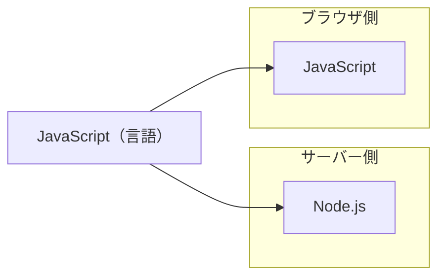
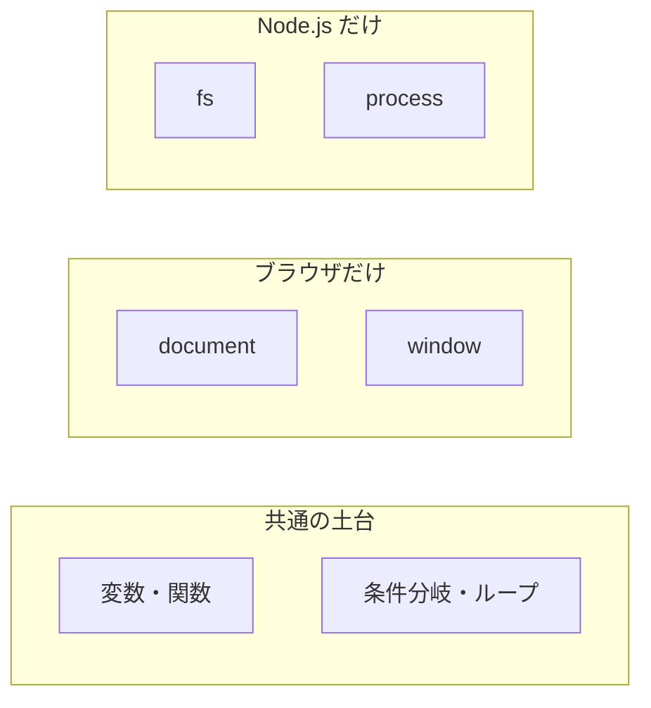
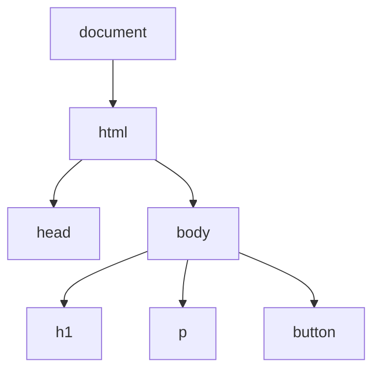

# JavaScript の実行環境 — 同じ言語が複数の場所で動く

## 今日のゴール

- JavaScript は 1 つの言語だが、動く場所が複数あることを知る
- ブラウザと Node.js で使えるものが違うことを知る
- ブラウザにだけある DOM という仕組みがあることを知る

## ブラウザとサーバー、どちらでも動く言語

Web はブラウザとサーバーの 2 つの世界で成り立っています。HTML や CSS はブラウザだけで使われますが、JavaScript はブラウザでもサーバーでも動きます。

ブラウザで動く JavaScript と、サーバーで動く JavaScript。同じ言語ですが、動く場所が違います。サーバー側で JavaScript を動かす代表的な環境が Node.js です。Node.js は「ブラウザの外でも JavaScript を動かせるようにしたもの」で、Web アプリのサーバー側の処理やコマンドラインのツールに使われています。他にも Deno や Bun といった環境があります。

## 共通の部分と、環境ごとの部分

JavaScript には ECMAScript と呼ばれる共通の土台があります。変数の宣言、関数、条件分岐といった基本的な文法はこの土台に含まれていて、どの環境でも同じように動きます。

ただし、環境ごとに「追加で使えるもの」が違います。

| 機能 | ブラウザ | Node.js |
|------|---------|--------|
| 変数、関数、条件分岐 | 使える | 使える |
| `document`（HTML の操作） | 使える | **ない** |
| `window`（画面の情報） | 使える | **ない** |
| `fetch`（データの取得） | 使える | 使える |
| `fs`（ファイルの読み書き） | **ない** | 使える |

ブラウザには画面があるので、画面を操作する機能（`document`、`window`）が用意されています。Node.js にはファイルシステムがあるので、ファイルを読み書きする機能（`fs`）が用意されています。それぞれの環境に合ったものが追加されている、というだけのことです。

### 同じカテゴリの環境でも違いがある

ブラウザ vs サーバーだけでなく、同じカテゴリの環境同士でも違いがあります。

**ブラウザ同士の違い**: Chrome と Safari は同じブラウザですが、使える機能が完全には一致しません。新しい CSS の機能や Web API が「Chrome では使えるが Safari ではまだ対応していない」ということは日常的に起きます。「どのブラウザが対応しているか」を確認するのは、Web 開発ではよくある作業です。

**サーバー環境同士の違い**: Node.js、Deno、Bun はいずれもサーバー側で JavaScript を動かす環境ですが、モジュールの読み込み方やパッケージ管理の仕組みなど、細かい部分が異なります。

つまり、「ブラウザかサーバーか」という大きな違いだけでなく、「どのブラウザか」「どのサーバー環境か」によっても使えるものが変わります。JavaScript の世界では「どこで動くか」が常に重要な情報です。

## ブラウザにだけある DOM

ブラウザ固有の機能のうち、最も重要なのが DOM（Document Object Model）です。

ブラウザは HTML を読み込むと、タグの構造をツリー状のデータに変換します。`<html>` の中に `<body>` があり、その中に `<h1>` や `<button>` がある、という入れ子の関係がそのままツリーになります。このツリーが DOM です。

JavaScript からこの DOM を操作すると、画面に表示されている内容を書き換えたり、要素を追加・削除したりできます。たとえばボタンのテキストを「送信」から「送信済み」に変えたり、エラーメッセージを画面に追加したりといったことです。

この DOM は画面を持つブラウザにだけ存在します。Node.js には画面がないので DOM がなく、`document` を使おうとするとエラーになります。

React はこの DOM 操作の仕組みを大きく変えました。その話はまた別の機会に。

## まとめ

- JavaScript は 1 つの言語ですが、ブラウザや Node.js など動く場所が複数あります
- 変数や関数など共通の土台（ECMAScript）はどの環境でも同じです
- ブラウザには画面を操作する DOM があり、Node.js にはファイル操作の `fs` があります。環境ごとに追加されている機能が違います
- 同じブラウザ同士（Chrome と Safari）でも対応する機能に差があり、サーバー環境同士（Node.js と Deno）でも違いがあります。「どこで動くか」は JavaScript では常に重要な情報です
