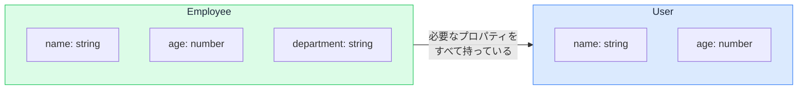

# 構造的型付け — 名前ではなく形で型を合わせる

## 今日のゴール

- TypeScript が「名前」ではなく「形」で型の互換性を判断することを知る
- 構造的型付けと名前的型付けの違いを知る
- 余剰プロパティチェックという例外の仕組みを知る

## 型が合うとは

TypeScript で型が「合う」とはどういう状態でしょうか。次のコードを見てください。

```tsx
type User = {
  name: string;
  age: number;
};

type Employee = {
  name: string;
  age: number;
  department: string;
};

function greet(user: User) {
  return `こんにちは、${user.name}さん（${user.age}歳）`;
}

const employee: Employee = { name: "田中", age: 25, department: "開発部" };

greet(employee); // エラーにならない
```

`greet` は `User` 型を要求していますが、`Employee` 型のオブジェクトを渡してもエラーになりません。`Employee` と `User` は別の型なのに、なぜ通るのでしょうか。

## 構造的型付け — 形が合えば OK

TypeScript は型の互換性を**名前ではなく形（プロパティの構造）**で判断します。これを**構造的型付け**（structural typing）と呼びます。

`greet` が求めているのは `User` という名前の型ではなく、「`name: string` と `age: number` を持つオブジェクト」です。`Employee` はその条件を満たしているので、型として互換性があると判断されます。



求められている形を**すべて持っていれば**互換性がある。余分なプロパティがあっても構わない。これが構造的型付けの原則です。

## 名前的型付けとの違い

Java や C# などの言語は**名前的型付け**（nominal typing）を採用しています。型の互換性は名前（定義の場所）で決まります。

| | 構造的型付け（TypeScript） | 名前的型付け（Java 等） |
|---|---|---|
| 判断基準 | プロパティの形が一致するか | 型の名前（定義）が一致するか |
| 別の型で形が同じ | 互換性あり | 互換性なし |
| メリット | 柔軟。型の宣言なしでも使える | 厳密。意図しない混同を防げる |

TypeScript が構造的型付けを選んだのは、JavaScript の世界に合わせるためです。JavaScript では、オブジェクトに名前を付けて定義する文化がありません。`{ name: "田中", age: 25 }` と書けばオブジェクトが作れ、同じ形であれば同じように扱えます。TypeScript はこの JavaScript の柔軟さを型の世界でも引き継いでいるのです。

## 型の名前が違っても通る具体例

構造的型付けのおかげで、ライブラリの型と自分の型が名前は違っても自然に噛み合います。

```tsx
// ライブラリが定義する型
type Printable = {
  toString(): string;
};

// 自分が定義する型
type Product = {
  id: number;
  name: string;
  toString(): string;
};

function printItem(item: Printable) {
  console.log(item.toString());
}

const product: Product = {
  id: 1,
  name: "コーヒー豆",
  toString() { return this.name; },
};

printItem(product); // OK。Product は Printable の形を満たしている
```

`Product` は `Printable` を `extends` も `implements` もしていませんが、`toString()` メソッドを持っているので互換性があります。名前的型付けの言語ではこの柔軟さはありません。

## 余剰プロパティチェック — 例外がある

ここまでの話だけだと「余分なプロパティは何でも通る」と思えますが、1 つだけ例外があります。

```tsx
type User = {
  name: string;
  age: number;
};

// オブジェクトリテラルを直接渡す場合
const user: User = {
  name: "田中",
  age: 25,
  email: "tanaka@example.com", // エラー: User に email は存在しない
};
```

変数に代入してから渡せばエラーにならないのに、**オブジェクトリテラルを直接渡すとエラーになる**。これが**余剰プロパティチェック**（excess property check）です。

```tsx
// 変数を経由すれば通る
const data = { name: "田中", age: 25, email: "tanaka@example.com" };
const user: User = data; // OK
```

### なぜ直接渡すときだけチェックするのか

オブジェクトリテラルを直接書いているということは、「今まさにこの型のために作っている」ということです。そこに余分なプロパティがあるのは、十中八九タイプミスか勘違いです。

- `emial` と書いてしまった（`email` のつもり）
- `User` 型に `email` があると思い込んでいた

構造的型付けの原則に従えば通るはずですが、**ミスの可能性が高い場面に限って厳しくチェックする**という実用的な判断です。

一方、変数を経由する場合は、そのオブジェクトが他の用途でも使われる可能性があるため、余分なプロパティがあっても不自然ではありません。

## props の型と構造的型付け

React のコンポーネントでもこの仕組みはそのまま当てはまります。

```tsx
type ButtonProps = {
  label: string;
  onClick: () => void;
};

function ActionButton({ label, onClick }: ButtonProps) {
  return <button onClick={onClick}>{label}</button>;
}

// 別の型から来たオブジェクトでも、形が合えば渡せる
type FormAction = {
  label: string;
  onClick: () => void;
  confirmMessage: string;
};

function Form({ action }: { action: FormAction }) {
  // action は FormAction 型だが、ButtonProps の形を満たしているので渡せる
  return <ActionButton label={action.label} onClick={action.onClick} />;
}
```

コンポーネントが要求する props の形を満たしていれば、元の型が何であるかは関係ありません。構造的型付けのおかげで、コンポーネント間の接続が柔軟になります。

## 「形が合えば通る」の裏側

構造的型付けは便利ですが、意図しない型の混同が起きることもあります。

```tsx
type UserId = string;
type ProductId = string;

function getUser(id: UserId) { /* ... */ }

const productId: ProductId = "prod-123";
getUser(productId); // エラーにならない。どちらも string だから
```

`UserId` と `ProductId` は意味的に別物ですが、どちらも `string` なので TypeScript は区別できません。構造（形）が同じだからです。

これは「名前が違っても形が同じなら通る」という構造的型付けの裏返しです。こうした混同を防ぎたい場合は、**ブランド型**（branded type）というテクニックが使われますが、それは上級の話題です。まずは「形で判断する」という原則を押さえておけば十分です。

## AI のコードに対して

コードでは、型の定義と使用場所が離れていることがあります。「この型とあの型は名前が違うのに、なぜエラーにならないのか」と疑問に感じたら、構造的型付けを思い出してください。形さえ合っていれば互換性があるのが TypeScript の設計です。

逆に、余剰プロパティチェックで AI のコードにエラーが出ているときは、「変数に一度入れれば通る」ではなく「本当にそのプロパティが必要か」を先に確認するのが正しい判断です。

## まとめ

- TypeScript は名前ではなく形（プロパティの構造）で型の互換性を判断する
- 余剰プロパティチェックはオブジェクトリテラル直接渡し時だけの安全装置
- 形が同じなら通る柔軟さの裏返しで、意味的に別の型を区別できない場面もある
