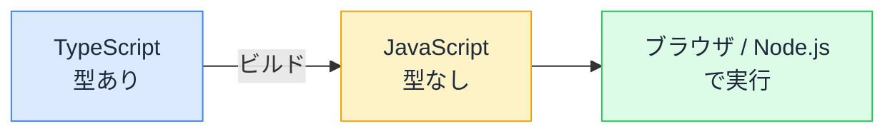
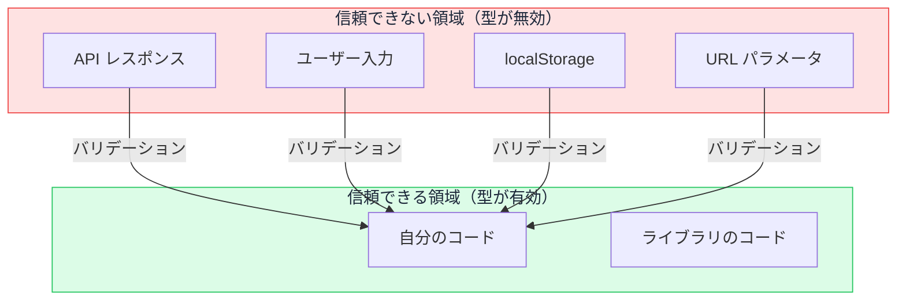

# 型は実行時に消える — API レスポンスの嘘をどう見抜くか

## 今日のゴール

- TypeScript の型がビルド時に消える（型消去）ことを知る
- 型があっても実行時のデータが嘘をつく可能性があると知る
- バリデーションライブラリで実行時に検証する手段を知る

## 型があるのにバグが起きる

TypeScript で型を付けたはずなのに、実行時にエラーが起きる。こんなケースがあります。

```tsx
type User = {
  name: string;
  age: number;
};

async function getUser(id: string): Promise<User> {
  const res = await fetch(`/api/users/${id}`);
  if (!res.ok) throw new Error("取得失敗");
  const data: User = await res.json();
  return data;
}
```

このコードには型エラーがありません。TypeScript は「`data` は `User` 型だ」と信じています。ところが、API が返す実際の JSON が次のような形だったらどうでしょう。

```json
{ "name": "田中", "age": "25" }
```

`age` が数値ではなく**文字列**です。TypeScript は何も警告しません。`data.age` は型の上では `number` ですが、実際には `"25"` という文字列が入っています。

## 型消去 — ビルドで型は消える

TypeScript のコードはそのまま実行されません。ビルド時に JavaScript に変換され、型の記述はすべて削除されます。

```tsx
// TypeScript（開発時）
const data: User = await res.json();
```

```js
// JavaScript（実行時）
const data = await res.json();
```

`: User` という型注釈が消えています。実行される JavaScript には型の情報が**一切残っていない**のです。これを**型消去**（type erasure）と呼びます。



つまり TypeScript の型は**開発時のチェック専用**であり、実行時には何の保護も提供しません。型を付けたコードも、実行されるときはただの JavaScript です。

## 型が守れる範囲と守れない範囲

型が有効なのは、**自分のコードの内部**です。

```tsx
const count: number = 0;
const name: string = count; // エラー: number を string に代入できない
```

自分が書いた変数同士の代入や関数呼び出しでは、TypeScript が矛盾を検出します。これはすべてビルド前の静的解析で完結します。

一方、**外の世界からやってくるデータ**に対しては無力です。

| データの入口 | 型で守れるか |
|------------|------------|
| 自分のコード内の代入 | 守れる |
| API レスポンス（`fetch` の結果） | 守れない |
| ユーザーの入力（フォーム） | 守れない |
| `localStorage` の読み取り | 守れない |
| URL のクエリパラメータ | 守れない |

これらはすべて実行時に初めて値が決まるデータです。TypeScript はビルド時にしか動かないので、実行時のデータの形を検証する手段を持っていません。

## `as` の危険性

「`as` を使えば型を付けられるのでは」と思うかもしれません。

```tsx
const data = (await res.json()) as User;
```

`as` は TypeScript に「この値はこの型だと自分が保証する」と宣言する構文です。しかし、実行時のチェックは何も行われません。API が `{ name: 123 }` を返しても、TypeScript は `data.name` を `string` だと信じ続けます。

`as` は型の検証ではなく、型の**上書き**です。使うたびに「ここから先のバグは自分の責任」と宣言していることになります。

## バリデーション — 実行時に形を検証する

型消去の穴を埋めるのが、実行時の**バリデーション**（validation = 検証）です。受け取ったデータの形が期待通りかどうかを、JavaScript のコードとして実行時にチェックします。

手で書くとこうなります。

```tsx
function isUser(data: unknown): data is User {
  return (
    typeof data === "object" &&
    data !== null &&
    "name" in data &&
    typeof (data as Record<string, unknown>).name === "string" &&
    "age" in data &&
    typeof (data as Record<string, unknown>).age === "number"
  );
}

async function getUser(id: string): Promise<User> {
  const res = await fetch(`/api/users/${id}`);
  if (!res.ok) throw new Error("取得失敗");
  const data: unknown = await res.json();

  if (!isUser(data)) {
    throw new Error("不正なレスポンス形式");
  }
  // ここでは data は User 型と確定
  return data;
}
```

`unknown` 型で受け取り、自分で形を確認してから使う。これなら実行時にもデータが正しいことを保証できます。

ただし、手書きだとチェックが冗長で、型の定義とバリデーションが二重管理になります。型とチェックが別々だと、片方を直してもう片方を直し忘れるリスクがあります。

## Zod — 型とバリデーションを一体化する

**Zod** は、型の定義と実行時のバリデーションを 1 つのコードで行えるライブラリです。

```tsx
import { z } from "zod";

// スキーマ = 型の定義 + バリデーションルール
const UserSchema = z.object({
  name: z.string(),
  age: z.number(),
});

// スキーマから TypeScript の型を自動生成
type User = z.infer<typeof UserSchema>;
// → { name: string; age: number }
```

`z.object(...)` でデータの形を定義すると、それがそのまま実行時のチェックにも、TypeScript の型にも使えます。

```tsx
async function getUser(id: string): Promise<User> {
  const res = await fetch(`/api/users/${id}`);
  if (!res.ok) throw new Error("取得失敗");
  const json: unknown = await res.json();

  const result = UserSchema.safeParse(json);
  if (!result.success) {
    console.error(result.error.issues);
    throw new Error("不正なレスポンス形式");
  }
  // result.data は User 型と確定
  return result.data;
}
```

- `.safeParse()` はデータを検証し、成功なら `{ success: true, data: ... }`、失敗なら `{ success: false, error: ... }` を返す
- 型の定義を 1 か所にまとめるので、型とバリデーションのずれが起きない
- エラーメッセージに「どのプロパティが、何の型であるべきだったか」が含まれるので、原因特定が楽になる

### Server Actions でも同じ

Next.js の Server Actions でも、クライアントから送られてくる `FormData` は外の世界からのデータです。

```tsx
"use server";

import { z } from "zod";

const ContactSchema = z.object({
  name: z.string().min(1, "名前は必須です"),
  email: z.email("メールアドレスの形式が正しくありません"),
});

export async function submitContact(formData: FormData) {
  const result = ContactSchema.safeParse({
    name: formData.get("name"),
    email: formData.get("email"),
  });

  if (!result.success) {
    return { errors: result.error.flatten().fieldErrors };
  }

  // result.data は { name: string; email: string } と確定
  // データベースへの保存など
}
```

フォーム入力も API レスポンスも、外から来るデータである点は同じです。「型がついているから安全」ではなく、「検証したから安全」が正しい判断基準です。

## 信頼の境界線

TypeScript のプロジェクトには**信頼の境界線**（trust boundary）があります。



境界線の内側では TypeScript が型の整合性を保証します。境界線を越えてくるデータに対しては、バリデーションで形を確認してから内側に取り込む。この「入口で検証する」考え方が、型消去の穴を塞ぐ基本パターンです。

## AI のコードに対して

AI が書くコードでは、`as` を使って API レスポンスに型を付けるパターンがよく出てきます。`const data = (await res.json()) as User` のような形です。これは「型が付いているように見えるが、実行時には何も検証していない」コードです。

「`as` ではなく Zod で検証して」と指示できるのは、型消去を知っている人の判断です。

## まとめ

- TypeScript の型はビルド時に消える（型消去）。実行時には保護がない
- API レスポンスやユーザー入力など、外から来るデータは型で守れない
- Zod などのバリデーションライブラリで、型定義と実行時検証を一体化できる
