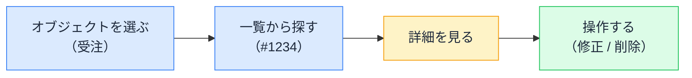

# OOUI — 名詞から画面を作る

## 今日のゴール

- 「動詞起点」と「名詞（オブジェクト）起点」の画面設計の違いを知る
- なぜ名詞起点のほうが使いやすくなるか、の構造的理由を知る
- AI への画面指示で「オブジェクト」を意識できるようになる

## 2 つのメニュー画面

同じ業務システムの設計を、2 人のデザイナーに頼んだとします。

**デザイナー A の画面**（動詞起点）

```
メインメニュー:
├─ 受注を登録する
├─ 受注を検索する
├─ 受注を修正する
├─ 顧客を登録する
├─ 顧客を検索する
├─ 顧客を修正する
├─ 商品を登録する
├─ 商品を検索する
└─ 商品を修正する
```

**デザイナー B の画面**（名詞起点）

```
メインメニュー:
├─ 受注
├─ 顧客
└─ 商品

「受注」を選ぶと → 受注の一覧が出て、
一覧から 1 件選ぶと → その受注の詳細が出て、
詳細から「修正」「削除」ができる
```

A は 9 項目、B は 3 項目。しかも B のほうが迷いにくい。この差はどこから来るのでしょうか。

## 動詞起点の問題 — 操作の数だけメニューが増える

A の設計は「**何をするか（動詞）**」を軸にメニューを並べています。対象（受注・顧客・商品）× 操作（登録・検索・修正）= 9 項目。対象や操作が増えるたび、メニューは**掛け算で膨張**します。

ユーザーは「受注を直したい」とき、まず「修正」を探し、次に対象を特定します。しかし実際の思考は逆で、「**あの受注**（名詞）を直したい（動詞）」と、対象が先に来ていることが多い。動詞起点の画面は、ユーザーの思考順序と合っていないのです。

## 名詞起点 — オブジェクトから入る

B の設計は「**何を扱うか（名詞 = オブジェクト）**」を軸にしています。

1. まず**オブジェクトを選ぶ**（「受注」を選ぶ）
2. **一覧**からインスタンスを見つける（受注番号 #1234 を選ぶ）
3. その**詳細**を見て、必要な**操作**を行う（修正、削除、ステータス変更）

この「**一覧 → 詳細 → 操作**」の流れは、ほとんどの Web アプリに共通するパターンです。



この設計思想を **OOUI**（Object-Oriented UI、オブジェクト指向 UI）と呼びます。「指向」とは「そちらを向く」の意味で、「オブジェクト（モノ）を向いた画面設計」です。

## なぜ名詞起点が使いやすいか — 構造的な理由

使いやすさには主観でない構造的な理由があります。

| | 動詞起点 | 名詞（オブジェクト）起点 |
|---|---------|---------------------|
| メニュー項目数 | 対象 × 操作（掛け算で増える） | **対象の数だけ**（足し算） |
| ユーザーの思考順序 | 操作を先に選ぶ（思考と逆） | **対象を先に選ぶ（思考と合う）** |
| 画面の共通性 | 操作ごとにバラバラの画面 | **一覧 → 詳細の共通フロー** |
| 操作の発見 | メニューに無い操作は見つからない | **詳細画面にある操作を発見できる** |

最後の「発見」が重要です。動詞起点ではメニューに載っていない操作は存在しないも同然ですが、名詞起点なら「この受注の詳細を開いたら、こんな操作もできるんだ」と、オブジェクトを起点に**操作を発見**できます。

## 身近な例で確認する

OOUI の発想は、普段使っているアプリの至るところにあります。

- **ファイルマネージャ**: フォルダ（オブジェクト）を選ぶ → ファイル一覧 → ファイルを選ぶ → 開く / 名前変更 / 削除
- **メールアプリ**: 受信トレイ → メール一覧 → 1 通を選ぶ → 返信 / 転送 / アーカイブ
- **EC サイト**: 商品カテゴリ → 商品一覧 → 1 つを選ぶ → カートに入れる / お気に入り
- **管理画面**: ユーザー → ユーザー一覧 → 1 人を選ぶ → 編集 / 権限変更 / 停止

すべて「**モノを選んでから、そのモノに対してできる操作を行う**」流れです。

## AI への画面指示に効く

AI に「受注管理の画面を作って」と頼むと、動詞起点（「登録画面」「検索画面」「修正画面」をバラバラに）で返ってくることがあります。

OOUI を知っていると、指示がこう変わります。

```
「受注」をオブジェクトとして、一覧画面 → 詳細画面の構成で作って。
一覧ではステータスでフィルタできて、1件選ぶと詳細。
詳細画面から修正・ステータス変更・削除ができる。
```

「動詞をメニューに並べないで」と言わなくても、「**オブジェクトを軸にして**」と言えば、自然と名詞起点の構成になります。この言葉を持っているかどうかが、AI の出力の構造を変えます。

## まとめ

- 動詞起点は対象 × 操作でメニューが掛け算に膨張する
- OOUI は「モノを選ぶ → 一覧 → 詳細 → 操作」の名詞起点の設計思想
- メニューが足し算で済み、思考順序に合い、操作を発見しやすい構造的利点がある
- AI への指示で「オブジェクトを軸に」と言えると、画面構成が一段良くなる
