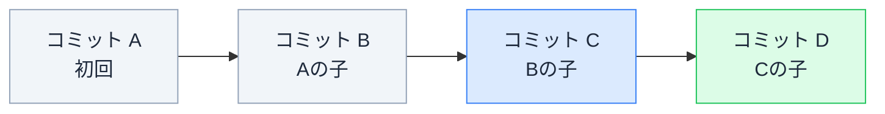
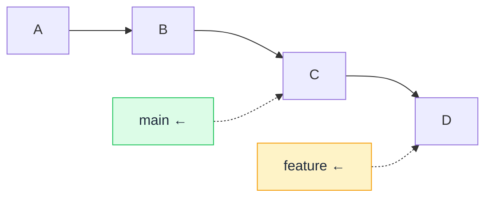

# Git のデータモデル — コミットはスナップショット、ブランチはポインタ

## 今日のゴール

- コミットが「ファイルの差分」ではなく「全ファイルのスナップショット + 親の参照」だと知る
- ブランチが「コミットを指すただのポインタ」だと知る
- この 2 つの理解で、merge や reset の動きが見えるようになる

## 毎日使うのに、中身を知らない道具

Git は毎日使います。`git commit` で保存し、`git push` で共有し、`git checkout` で切り替える。操作は覚えているのに、「コミットとは何か」「ブランチとは何か」と聞かれると、実は答えにくい。

操作だけ覚えていると、`merge` でコンフリクトが起きたとき、`reset` したとき、`rebase` と言われたとき、何が起きているか分からず怖くなります。**仕組みを知っていれば、怖さが減ります**。

## コミットの実体 — スナップショットの連なり

多くの人が「コミット = 変更した差分を保存するもの」と思っていますが、実は違います。

**コミットは、その時点のすべてのファイルの状態を丸ごと保存した「スナップショット」です。** 加えて、以下の情報を持っています。

| 情報 | 内容 |
|------|------|
| **ツリー** | その時点の全ファイル・全フォルダのスナップショット |
| **親コミット** | 直前のコミットへの参照（最初のコミットには親が無い） |
| **作者と日時** | 誰がいつ作ったか |
| **メッセージ** | 何をしたかの説明 |

「差分」は保存されていないのに、なぜ `git diff` で差分が見えるのか。それは、**2 つのスナップショットを比較して差分を計算している**からです。保存されているのはあくまで「その時点の全体像」であって、「何が変わったか」は見るたびに計算されています。

コミットが親を持つことで、**コミットは鎖のように繋がります**。



この鎖が「歴史」であり、Git が「バージョン管理」と呼ばれる所以です。

## ブランチの実体 — コミットを指すポインタ

ブランチは、多くの人が「作業の枝分かれ」のイメージで理解しています。図でも Y 字の分岐で描かれます。しかし実体は驚くほどシンプルです。

**ブランチは、特定のコミットを指す「付箋」（ポインタ）にすぎません。**



- `main` は「コミット C を指す付箋」
- `feature` は「コミット D を指す付箋」

ブランチを作るとは**付箋を 1 枚貼る**こと。ファイルのコピーは作られません。コミットを追加すると、**いま作業中のブランチの付箋が新しいコミットに移動する**だけです。

だから Git のブランチは軽い。何百本あってもコストはほぼゼロです。

### HEAD — 「いま自分がいる場所」の付箋

`HEAD` は特別なポインタで、「**いま自分がどのブランチにいるか**」を指します。

```
HEAD → feature → コミット D
```

`git checkout main` を実行すると、HEAD が main に移動し、作業ディレクトリがコミット C の状態に切り替わります。ファイルが切り替わるのは、HEAD が別のスナップショットを指すコミットに移動したからです。

## この理解で見える操作の実態

### merge — 2 つの歴史を合流させる

`main` にいる状態で `git merge feature` を実行すると、Git は「main の歴史」と「feature の歴史」を合わせた**新しいコミット**（マージコミット）を作り、main の付箋をそこに移動します。

コンフリクトが起きるのは、「2 つの歴史で同じファイルの同じ場所を別々に変更した」場合です。Git はスナップショットを比較して自動で統合しますが、人間の判断が要る部分だけ聞いてきます。

### reset — 付箋を過去のコミットに戻す

`git reset` は、ブランチの付箋を**別のコミットに移動する**操作です。「コミットを消す」のではなく、付箋の位置が変わることで「なかったことにする」のです。

- `--soft`: 付箋だけ戻す。変更はステージングに残る
- `--mixed`（既定）: 付箋とステージングを戻す。ファイルは変更されたまま
- `--hard`: 付箋もファイルも丸ごと戻す（**変更が消える**）

`--hard` は作業中の変更が復元不能になりうるので、最も慎重を要する操作です。

## AI への Git 指示に効く

「マージでコンフリクトしたんだけど」と AI に相談するとき、「同じファイルの同じ行を 2 つのブランチで変えたから、Git がどっちを採用するか決められない」と説明できると、AI は的確な解決策を出しやすくなります。

「git reset したい」も、「付箋を 3 つ前のコミットに戻したい。ファイルは残しておいて」と言えば、AI は `--mixed` を提案してくれます。

## まとめ

- コミットは差分ではなく、全ファイルのスナップショット + 親コミットへの参照
- ブランチはコミットを指す付箋（ポインタ）で、作成も切り替えも軽い
- merge は 2 つの歴史の合流で、同じ場所を両方変えたらコンフリクト
- reset は付箋の移動で、`--hard` だけが変更を消す危険な操作
