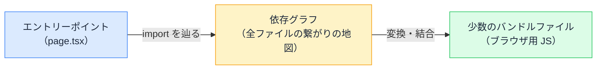

# ESM とバンドラー — import 文がブラウザに届くまで

## 今日のゴール

- ESM（import / export）がブラウザでも動く標準仕様だと知る
- それでもバンドラーが要る理由を知る
- 開発中（Vite / Turbopack）と本番でやり方が違うことを知る

## import は誰が解決しているのか

React のコードはファイル冒頭の import から始まります。

```tsx
import { useState } from "react";
import { ProductCard } from "./product-card";
```

`"react"` は `node_modules` の中、`"./product-card"` は隣のファイル。この「名前からファイルを探して繋ぐ」仕事を、誰がやっているのでしょうか。

答えは時代によって変わってきました。そして現在は「**開発中と本番で別の戦略**」という形に落ち着いています。今日はその仕組みを追いかけます。

## ESM — import / export はブラウザの標準

まず前提として、`import` / `export` の構文は **ESM**（ECMAScript Modules）という JavaScript の標準仕様です。実はブラウザはこの構文を**そのまま実行できます**。

```html
<script type="module">
  import { format } from "./format.js";
  console.log(format(1500));
</script>
```

`type="module"` を付ければ、ブラウザは `./format.js` を**ネットワーク越しに取得して**実行します。モジュールの仕組み自体は、ツール無しでも動くのです。

では、なぜ素の ESM だけでアプリを作らないのか。問題が 3 つあります。

| 問題 | 内容 |
|------|------|
| **リクエストの爆発** | import が import を呼び、100 ファイルあれば 100 回の取得が発生する |
| **裸の名前が解決できない** | `import ... from "react"` の `"react"` はパスではない。ブラウザは `node_modules` を知らない |
| **変換が必要** | JSX や TypeScript はブラウザが理解できない。取得する前に変換が要る |

## バンドラー — まとめて、繋いで、変換する

この 3 つの問題を一括で解決するのが**バンドラー**です。代表は Webpack、esbuild、Rollup、そして Next.js が使う **Turbopack** です。

バンドラーはビルド時にこう動きます。



1. **エントリーポイント**（起点のファイル）から import を再帰的に辿り、**依存グラフ**（どのファイルがどのファイルを使うかの地図）を作る
2. グラフ上の全ファイルを**変換**する（JSX → JS、TS → JS）。`"react"` のような裸の名前も `node_modules` から解決する
3. 繋がったファイルを**少数のファイルに結合**して出力する

100 ファイルの import が、数個のバンドルにまとまる。リクエストの爆発も、裸の名前も、変換も、すべてこの工程で片付きます。tree shaking（使われていないコードの除去）や code splitting（ページごとの分割）も、依存グラフがあるからこそできる芸当です。

## 開発中は「バンドルしない」という発明

ただし、バンドルには弱点があります。**1 ファイル変えただけでも、繋がっているバンドルを作り直す**必要があることです。アプリが大きくなるほどビルドが遅くなり、開発の待ち時間が伸びていきます。

そこで現代の開発サーバー（Vite や Turbopack）は発想を変えました。**開発中はバンドルを作らない（または最小限にする）**。

- ブラウザが ESM をそのまま実行できることを利用し、ファイルを**要求されたときに 1 つずつ変換して返す**
- 1 ファイルの変更は、そのファイルだけ変換し直せばよい。**アプリの規模に関係なく、更新が一瞬**で終わる

保存した瞬間に画面が変わる開発体験（HMR）の高速さは、この「必要なものだけその場で変換する」戦略に支えられています。

| | 開発中（dev） | 本番（build） |
|---|-------------|--------------|
| 戦略 | バンドルせず、要求されたファイルをその場で変換 | 全体を解析してバンドルを生成 |
| 優先するもの | **更新の速さ** | **配信の効率**（少数ファイル・最小サイズ） |

「dev では動くのに build で初めてエラーが出る」現象の一因もここにあります。dev は要求されたファイルしか見ていないので、**全体を繋いだときに初めて見つかる問題**（循環参照や解決できない import）は build まで潜伏できるのです。

## この知識が効く場面

- **「Module not found」エラー**: バンドラーが依存グラフを辿れなかったという意味。パスの綴り、パッケージのインストール忘れ、大文字小文字の不一致（手元の macOS は許すが、本番の Linux は許さない定番の罠）を疑う
- **ビルドが遅い**: 依存グラフが巨大になっている兆候。バンドル分析で重いライブラリを特定する
- **AI に「この import エラー直して」と頼むとき**: 「バンドラーが `"@/lib/utils"` を解決できていない。パスのエイリアス設定を見て」と言えれば、原因に一直線に向かえる

## まとめ

- import / export（ESM）はブラウザでも動く標準。ただし素のままでは実用に足りない
- バンドラーは依存グラフを作り、変換し、少数ファイルに結合する
- 開発中はバンドルせずその場変換（速さ優先）、本番はバンドル（効率優先）
- 「Module not found」は依存グラフを辿れなかったという悲鳴
