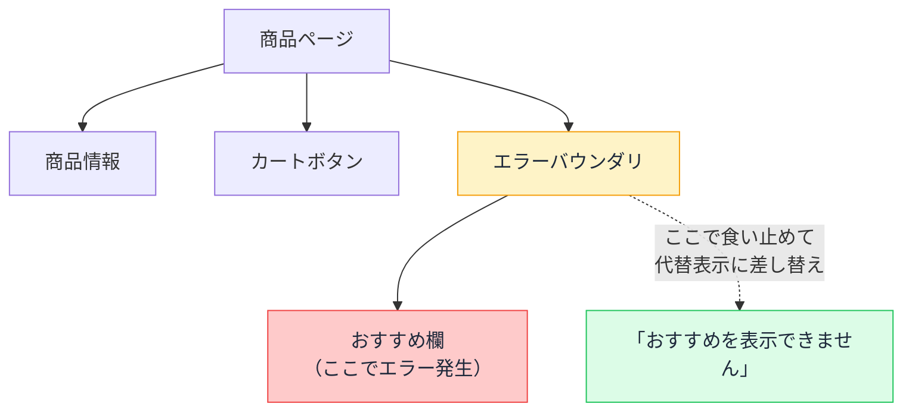

# エラーバウンダリ — 一部のエラーで画面全体が白くなる理由

## 今日のゴール

- 1 つのコンポーネントのエラーが画面全体を消す仕組みを知る
- エラーバウンダリが「エラーの延焼を止める防火壁」だと知る
- どこに防火壁を置くかという設計の考え方を知る

## おすすめ欄が壊れただけで全部消える

ある EC サイトの商品ページを想像してください。商品情報、カートボタン、レビュー、そして「おすすめ商品」欄。このうち、おすすめ欄のコンポーネントだけにバグがあり、レンダリング中にエラーを投げたとします。

直感的には「おすすめ欄だけ表示されない」となってほしいところです。しかし React の既定の動作は違います。**画面全体が真っ白になります**。

## 中途半端な画面より何も無い画面

React がたかが 1 部品のエラーでページ全体を道連れにする理由は、レンダリングの途中でエラーが起きたとき、**UI が中途半端な状態のまま画面に残るのは、消えるより危険**だからです。

例えば送金アプリで、金額表示のコンポーネントが壊れて「前の取引の金額」が表示されたままだったら。誤った情報を見せ続けるくらいなら、全部消して「壊れている」と分かるほうがまし。これが既定で全体をアンマウント（取り外し）する理由です。

とはいえ、おすすめ欄のバグで商品ページ全体が使えなくなるのは、明らかにやりすぎです。そこで「**ここから先のエラーは、ここで食い止める**」という境界を宣言する仕組みが用意されています。それが**エラーバウンダリ**（Error Boundary、エラーの境界）です。

## エラーバウンダリ — エラーの延焼を止める防火壁

エラーバウンダリは、**子孫コンポーネントのレンダリング中のエラーを捕まえて、自分の範囲だけを代替表示に差し替える**コンポーネントです。



エラーはコンポーネントツリーを**上に向かって伝わり**、最初に出会ったエラーバウンダリで止まります。バウンダリが無ければルートまで突き抜けて、全体が消える。火事が防火壁まで燃え広がって止まるイメージです。

## Next.js では error.tsx が防火壁

エラーバウンダリの仕組み自体は React のものですが、自前で実装するには古いクラス構文が必要で、現在は**フレームワークやライブラリが用意したものを使う**のが普通です。

Next.js では、フォルダに `error.tsx` を置くだけで、**そのフォルダの範囲を守るエラーバウンダリ**が設置されます。

```tsx
// app/products/error.tsx
"use client";

export default function Error({
  error,
  reset,
}: {
  error: Error;
  reset: () => void;
}) {
  return (
    <div role="alert">
      <p>商品情報の表示中に問題が発生しました。</p>
      <button onClick={() => reset()}>もう一度試す</button>
    </div>
  );
}
```

`app/products/error.tsx` を置けば、商品セクションのエラーは商品セクションの範囲で止まり、ヘッダーや他のページは無事のままです。`reset` は「壊れた範囲をもう一度レンダリングし直す」関数で、一時的なエラー（通信の失敗など）ならこれで復帰できます。

部品単位で守りたい場合は、`react-error-boundary` というライブラリの `<ErrorBoundary>` で個別に囲む方法もあります。

```tsx
import { ErrorBoundary } from "react-error-boundary";

<ErrorBoundary fallback={<p>おすすめを表示できません</p>}>
  <RecommendedProducts />
</ErrorBoundary>
```

## どこに防火壁を置くか — 設計の問い

エラーバウンダリの本質は技術ではなく、**「どこまで一緒に死んでいいか」という設計判断**です。

| 区画 | エラー時の扱い |
|------|--------------|
| ページの本体（商品情報・購入ボタン） | 壊れたらページとして成立しない。ページ単位の error.tsx に任せる |
| 周辺コンテンツ（おすすめ・広告・レビュー） | **本体を道連れにしてはいけない**。個別のバウンダリで囲い、静かに代替表示 |
| アプリ全体の枠（ヘッダー・ナビ） | 最後の砦。ルートの error.tsx で「全体エラー画面 + 再試行」を用意 |

Suspense の境界が「どこを先に見せるか」の宣言だったのと同様に、エラーバウンダリの境界は「**どこまでが運命共同体か**」の宣言です。

## 捕まえられないエラーもある

エラーバウンダリは万能ではありません。守備範囲は**レンダリング中のエラー**です。

- **イベントハンドラの中のエラー**: クリック処理の中で投げたエラーは捕まえない（画面は壊れないので、自分で try/catch して通知を出す）
- **非同期処理のエラー**: fetch の失敗などは Promise の世界の出来事。`.catch` や TanStack Query の error で処理する

「エラーバウンダリを置いたのにエラー画面にならない」と AI に相談する前に、「そのエラーはレンダリング中に起きているか？」を確認すると、原因の切り分けが速くなります。

## まとめ

- React はレンダリングエラーで全体を消す（中途半端な UI を見せないため）
- エラーバウンダリは延焼を止める防火壁で、最初に出会った境界で止まる
- Next.js では error.tsx がフォルダ単位の防火壁で、reset で復帰を試せる
- 守備範囲はレンダリング中だけで、イベントハンドラと非同期は別の手当てが要る
