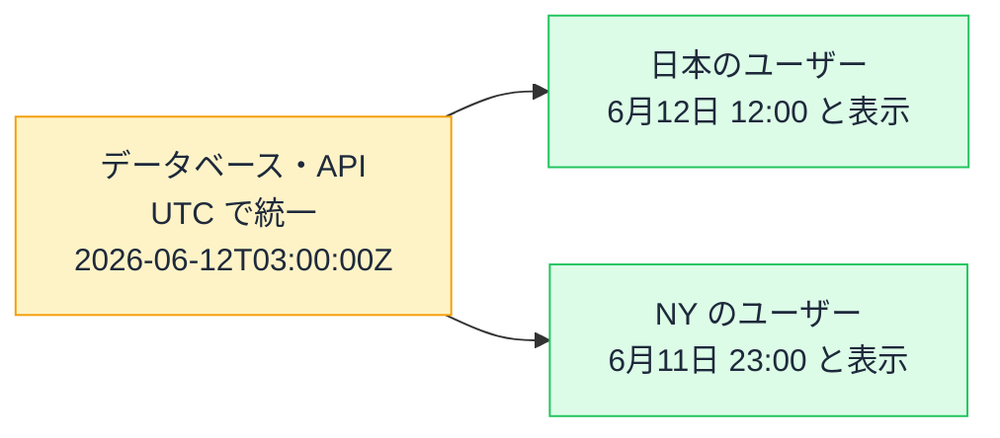

# 日付とタイムゾーンの罠 — new Date() は環境で結果が変わる

## 今日のゴール

- 日時の「保存用」と「表示用」を分ける原則を知る
- タイムゾーンとサーバー/ブラウザのズレが起こす定番バグを知る
- 日付ライブラリと Intl に任せるべき領域を知る

## 開発中は見えない日時のバグ

日時の処理は、フロントエンドでバグが多い定番の領域です。やっかいなのは、**開発中は正常に見える**ことです。

- 開発者の環境（日本時間）では正しく表示される。海外のユーザーだけ日付が 1 日ズレる
- 3 月は動いていたコードが、月末や年末年始だけ壊れる
- サーバーで作った HTML とブラウザの表示が食い違って、エラーが出る

根は共通で、「**いつ**」というひとつの情報が見る場所によって別の時刻になることを、コードが考慮していないのです。

## 大原則 — 保存は UTC・表示は現地時間

世界の各地域は、それぞれの**タイムゾーン**（時間帯）で生活しています。基準は UTC（協定世界時）で、日本は UTC より 9 時間進み、ニューヨークは 5 時間（夏は 4 時間）遅れています。

つまり**同じ瞬間でも、場所によって「何時」かは違います**。ここから、日時を扱う大原則が導かれます。

> **保存・通信は UTC（世界共通のものさし）で。表示する瞬間だけ、ユーザーのタイムゾーンに変換する。**



`2026-06-12T03:00:00Z` は **ISO 8601** という国際規格の書き方で、末尾の `Z` は「これは UTC です」という印です。API のレスポンスにタイムゾーン情報のない日時が混ざっていたら、この原則が崩れているサインです。

中身はひとつの瞬間のまま、見せ方だけを場所ごとに変える。この分離が崩れたとき、日時のバグが生まれます。

## 実行環境のタイムゾーンで動く Date

JavaScript の `Date` は、この原則を**知らないと破りやすい** API です。

```ts
const now = new Date();
console.log(now.getHours());
```

`getHours()` が返すのは「**そのコードが動いている環境の**タイムゾーンでの時刻」です。先ほどの図の瞬間（UTC の 3 時）に実行すると、同じコードでも日本のブラウザでは 12、ニューヨークのブラウザでは 23 が返ります。

Next.js では、**サーバーとブラウザが別の環境**であることが話をさらにややこしくします。

- サーバー（たいてい UTC 設定）で `new Date().getHours()` → 3
- 日本のユーザーのブラウザで同じコード → 12

Server Components で時刻を HTML に焼き込むと、ブラウザ側で計算し直した結果と食い違い、**ハイドレーションエラー**（サーバーの HTML とブラウザの描画が一致しないときに出るエラー）の定番原因になります。「時刻はサーバーで描画せず、表示後にブラウザ側で出す」が定石とされるのは、この構造のためです。

### 文字列の解釈は書き方で変わる

```ts
new Date("2026-06-12");        // UTC の 0 時として解釈 → 日本では 9 時
new Date("2026/06/12");        // 環境のローカル時刻として解釈されることが多い
```

区切り文字が違うだけで解釈が変わる、という歴史的な事情があります。とくに誕生日のような「日付だけ」のデータを Date に入れると、タイムゾーン変換のはずみで**前日にズレる**事故が起きがちです。

誕生日・記念日のような「時刻を持たない日付」は、文字列 `"2026-06-12"` のまま扱うほうが安全な場面が多くあります。

## 任せ先 — 表示は Intl・計算は日付ライブラリ

日時の計算には、うるう年・月末の繰り上がり・夏時間と、例外が山ほどあります。自力で計算せず、表示の変換はブラウザ標準の Intl に、日付の計算は日付ライブラリに任せます。

### 表示のフォーマットは Intl

ブラウザ標準の **Intl**（国際化 API）は、タイムゾーンと言語に応じた表示変換を担います。

```ts
const date = new Date("2026-06-12T03:00:00Z");

new Intl.DateTimeFormat("ja-JP", {
  dateStyle: "long",
  timeStyle: "short",
  timeZone: "Asia/Tokyo",
}).format(date);
// "2026年6月12日 12:00"
```

「3 日前」のような相対表示も `Intl.RelativeTimeFormat` でできます。ライブラリ無しでここまでできることは、意外と知られていません。

### 計算は日付ライブラリ

「30 日後」「月初から月末まで」のような計算は、date-fns などの日付ライブラリに任せます。`date.setDate(date.getDate() + 30)` のような手計算は月またぎや年またぎで間違えやすいうえ、`setDate` が元の Date を直接書き換えてしまうことも事故につながります。

::: tip Date の後継 Temporal
`Date` の問題を根本から設計し直した後継の標準 API に **Temporal** があります。2026 年に標準化が完了して正式に JavaScript の仕様に入り、Firefox と Chrome は搭載済み、Safari が追いつくのを待っている段階です。
タイムゾーンや「日付だけ」を最初から別の型として区別する設計で、いずれ日付ライブラリの役割の多くを置き換えていきます。
:::

## まとめ

- 保存・通信は UTC、表示の瞬間だけユーザーのタイムゾーンにして、中身と見せ方を分離する
- new Date() は動く環境で結果が変わり、サーバーとブラウザのズレはハイドレーションエラーの定番原因
- 表示は Intl、計算は日付ライブラリで、自力の日時計算はしない
- 時刻を持たない「日付だけ」のデータは Date に入れない
