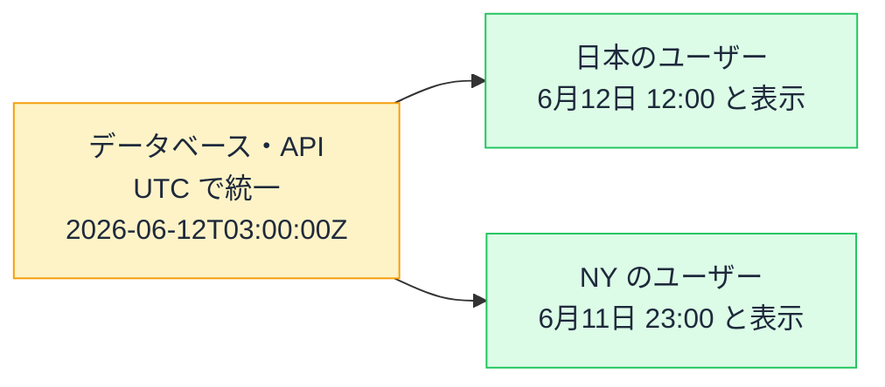

# 日付とタイムゾーンの罠 — new Date() は世界中で違う顔をする

## 今日のゴール

- 日時の「保存用」と「表示用」を分ける原則を知る
- タイムゾーンとサーバー/ブラウザのズレが起こす定番バグを知る
- 日付ライブラリと Intl に任せるべき領域を知る

## 日時のバグは、静かに発生する

日時の処理は、フロントエンドのバグの名産地です。やっかいなのは、**開発中は正常に見える**ことです。

- 開発者の環境（日本時間）では正しく表示される。海外のユーザーだけ日付が 1 日ズレる
- 3 月は動いていたコードが、月末や年末年始だけ壊れる
- サーバーで作った HTML とブラウザの表示が食い違って、ハイドレーションエラーが出る

これらの根は共通です。「**いつ**」という情報が、見る場所によって違う顔をすることを、コードが考慮していないのです。

## 大原則 — 保存は UTC、表示はユーザーの場所で

世界の各地域は、それぞれの**タイムゾーン**（時間帯）で生活しています。日本は UTC（協定世界時）+9 時間、ニューヨークは -5 時間（夏は -4 時間）。**同じ瞬間でも、場所によって「何時」かが違います**。

ここから、日時を扱う大原則が導かれます。

> **保存・通信は UTC（世界共通のものさし）で。表示する瞬間だけ、ユーザーのタイムゾーンに変換する。**



末尾の `Z` は「これは UTC です」という印（ISO 8601 形式）。**中身はひとつの瞬間、見せ方は場所ごと**。この分離が崩れたとき、日時のバグが生まれます。

## new Date() の顔は環境で変わる

JavaScript の `Date` は、この原則を**知らないと破りやすい** API です。

```ts
const now = new Date();
console.log(now.getHours());
```

`getHours()` が返すのは「**そのコードが動いている環境の**タイムゾーンでの時刻」です。同じコードでも、日本のブラウザでは 12、ニューヨークのブラウザでは 23 が返ります。

Next.js ではさらに罠が深くなります。**サーバーとブラウザは別の環境**だからです。

- サーバー（たいてい UTC 設定）で `new Date().getHours()` → 3
- 日本のユーザーのブラウザで同じコード → 12

Server Components で時刻を HTML に焼き込むと、ブラウザでの再計算と食い違って、**ハイドレーションエラーの定番原因**になります。「時刻はサーバーで描画せず、表示後にブラウザ側で出す」が定石とされるのは、この構造のためです。

### 文字列の解析にも方言がある

```ts
new Date("2026-06-12");        // UTC の 0 時として解釈 → 日本では 9 時
new Date("2026/06/12");        // 環境のローカル時刻として解釈されることが多い
```

区切り文字が違うだけで解釈が変わる、という歴史的な方言があります。「日付だけのデータ（誕生日など）」を Date で持つと、タイムゾーン変換で**前日にズレる**事故が起きがちです。誕生日・記念日のような「時刻を持たない日付」は、文字列 `"2026-06-12"` のまま扱うほうが安全な場面が多くあります。

## 自力でやらない — ライブラリと Intl

日時処理は「うるう年」「月末の繰り上がり」「夏時間」と、例外の博物館です。自力の計算は事故のもとで、任せ先が 2 つあります。

### 表示のフォーマットは Intl

ブラウザ標準の **Intl**（国際化 API）は、タイムゾーンと言語に応じた表示変換を担います。

```ts
const date = new Date("2026-06-12T03:00:00Z");

new Intl.DateTimeFormat("ja-JP", {
  dateStyle: "long",
  timeStyle: "short",
  timeZone: "Asia/Tokyo",
}).format(date);
// "2026年6月12日 12:00"
```

「3 日前」のような相対表示も `Intl.RelativeTimeFormat` でできます。ライブラリ無しでここまでできることは、意外と知られていません。

### 計算は日付ライブラリ

「30 日後」「月初から月末まで」のような計算は、date-fns などの日付ライブラリに任せます。`date.setDate(date.getDate() + 30)` のような手計算は、書き換え（ミューテーション）の罠も相まってバグの温床です。

なお、`Date` の問題を根本から設計し直した **Temporal** という新しい標準 API が登場しつつあります。「Date には設計上の問題が多く、後継が作られた」という事実を知っておくと、数年後のコードの変化にも驚かずに済みます。

## AI のコードを見るポイント

1. **サーバーで現在時刻を描画していないか**: 時刻表示はブラウザ側で。ハイドレーションエラーの予防
2. **保存・通信が UTC（ISO 8601）か**: API のレスポンスに `+09:00` 付きやタイムゾーン無しの日時が混ざっていたら要確認
3. **「日付だけ」を Date にしていないか**: 誕生日が前日にズレる定番事故
4. **手計算していないか**: 30 日後の計算を自前でやっていたら、date-fns 等への置き換えを提案

## まとめ

- 保存・通信は UTC、表示の瞬間だけユーザーのタイムゾーンへ。中身と見せ方を分離する
- new Date() は動く環境で顔が変わる。サーバーとブラウザのズレはハイドレーションエラーの定番原因
- 表示は Intl、計算は日付ライブラリ。自力の日時計算はしない
- 時刻を持たない「日付だけ」のデータは Date に入れない
