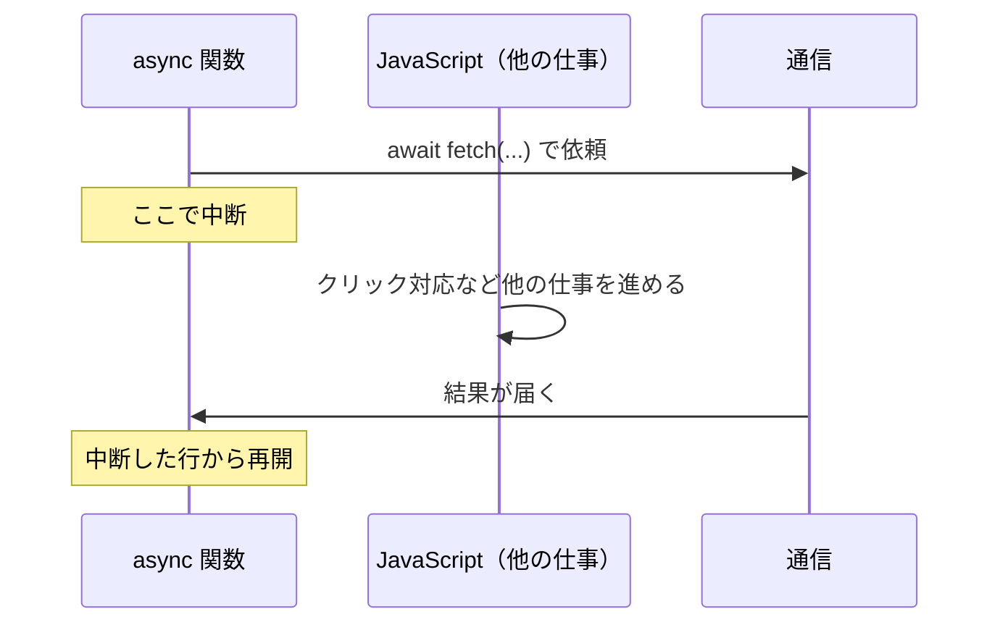

# async/await — Promise を同期処理のように読む

## 今日のゴール

- async/await が Promise の「読みやすい皮」だと知る
- 逐次 await と Promise.all の使い分けを知る
- await し忘れ（Unhandled Rejection）に気づけるようになる

## Next.js のコードに必ずいる 2 つの単語

Next.js のコードには、`async` と `await` がほぼ必ず登場します。

```tsx
export default async function UserPage() {
  const response = await fetch("https://api.example.com/user/1");
  const user = await response.json();

  return <h1>{user.name}</h1>;
}
```

この 2 つの単語の土台は **Promise**（非同期処理の結果を包む「引換券」のオブジェクト。`fetch` のような時間のかかる関数が返してくる）です。Promise の結果は本来 `.then()` で受け取りますが、チェーンが連なるコードには独特の読み癖が要ります。

**async/await** は、その Promise を**同期処理と同じ「上から下へ」の見た目で書ける構文**です。裏側の仕組みは Promise とまったく同じで、変わるのは読み書きのしやすさだけ。今日はこの構文の使い方と、よくあるミス 2 つを押さえます。

## 基本の使い方

`async` と `await` はセットで使います。

- 関数の前に `async` を付けると、その関数は**必ず Promise を返す**ようになる
- `async` 関数の中では `await` が使える
- `await` は Promise の結果が出るまで待ち、**成功した値を取り出して**くれる

```javascript
async function getProductName(userId) {
  const user = await fetchUser(userId);
  const orders = await fetchOrders(user.id);
  const product = await fetchProduct(orders[0].productId);
  console.log(product.name);
}
```

`.then()` のチェーンで書いていた「ユーザー → 注文 → 商品」が、変数に代入しながら上から下へ進む、ただの手続きに見えます。

大事なのは、`await` の行で**画面はフリーズしない**ことです。`await` に来ると関数の実行は**いったん中断**し、JavaScript はその間に他の仕事（クリックへの反応など）を進めます。結果が出ると、中断した場所から続きが再開されます。



「待っているのに固まらない」のは、この中断と再開を `await` が裏でやってくれているからです。

### エラー処理は try/catch

`.catch()` の代わりに、JavaScript 標準の `try/catch` を使います。

```javascript
async function getUser() {
  try {
    const response = await fetch("https://api.example.com/user/1");
    const user = await response.json();
    console.log(user.name);
  } catch (error) {
    console.error("エラーが発生しました:", error);
  }
}
```

`try` の中で `await` している Promise が失敗（rejected）になると、`catch` に処理が移ります。同期処理のエラー処理と同じ形で書けるのが利点です。

### await は async 関数の中でしか使えない

```javascript
// ❌ これはエラーになる
function getUser() {
  const response = await fetch("/api/user");  // SyntaxError
}

// ✅ async を付ければ OK
async function getUser() {
  const response = await fetch("/api/user");
}
```

「`await` を書いたら関数に `async` を付ける」はワンセットの作法です。

::: details トップレベル await
ES2022 以降、モジュール（`<script type="module">` や `.mjs` ファイル）ではファイルの最上位で `await` が使えます（トップレベル await）。Next.js の Server Components で `async` コンポーネントの中に `await` を直接書けるのも、コンポーネント自体が `async` 関数だからです。
:::

## 逐次 await の無駄な待ち時間

`await` を縦に並べると、**前の結果が出てから次が始まる**直列実行になります。

```javascript
// それぞれ 1 秒かかるとすると、合計 3 秒
async function loadDashboard() {
  const user = await fetchUser();
  const posts = await fetchPosts();
  const notifications = await fetchNotifications();
  return { user, posts, notifications };
}
```

この 3 つは互いに無関係なので、本来は**同時に始められる**はずです。それを書くのが `Promise.all` です。

```javascript
// 3 つ同時に走るので、合計 1 秒
async function loadDashboard() {
  const [user, posts, notifications] = await Promise.all([
    fetchUser(),
    fetchPosts(),
    fetchNotifications(),
  ]);
  return { user, posts, notifications };
}
```

ポイントは「`Promise.all` を `await` で受ける」こと。async/await の世界に居続けたまま並列化できます。

なお、1 つでも失敗すると `Promise.all` 全体が失敗扱いになります。「どれか失敗しても他の結果は欲しい」場合は `Promise.allSettled` を使い、各要素の成否を個別に見ます。

コードで `await` が縦に並んでいたら、「**これは順番に実行する必要があるか、同時にやれるか**」を一度立ち止まって考える。後の取得が前の結果を使うなら直列で正しく、無関係なら並列にできます。

## await し忘れでエラーが消える

`async` 関数を呼んだだけで、`await` も `.catch()` も付けないとどうなるか。

```javascript
async function saveUser(user) {
  const response = await fetch("/api/user", {
    method: "POST",
    body: JSON.stringify(user),
  });
  if (!response.ok) throw new Error("保存に失敗");
}

// ❌ await も .catch も無い
saveUser(user);
```

`saveUser` が失敗しても、エラーは**行き場を失って**（unhandled rejection）、コンソールに警告が出るだけで処理は素通りします。**保存できていないのに、ユーザーには成功したように見える**。発見の遅れる、嫌なタイプの事故です。

Promise を返す関数を呼ぶときは、原則 `await` するか `.then().catch()` を付ける。AI のコードでも「関数呼び出しの行に await が無い」は見つけやすいチェックポイントです。

## async/await は Promise の構文糖衣

async/await は Promise を**置き換える**ものではなく、Promise の上に乗った**構文糖衣**（シンタックスシュガー: 機能は同じだが読みやすく書ける別記法）です。

| async/await で書くと | 裏側で起きていること |
|---|---|
| `const res = await fetch(...)` | `fetch(...)` が Promise を返す → fulfilled まで待つ |
| `const user = await res.json()` | `res.json()` が Promise を返す → fulfilled まで待つ |
| `return user` | `user` を包んだ fulfilled な Promise を返す |

`async` 関数の戻り値は Promise なので `.then()` で受け取ることもでき、両者は自由に混ざります。現代の使い分けはシンプルで、**基本は async/await、並列化したいときに `Promise.all` を組み合わせる**。`.then()` チェーンを新たに書く場面は減っています。

| | コールバック | Promise チェーン | async/await |
|---|---|---|---|
| コードの形 | ネストが深くなる | `.then()` で平坦に | 上から下に読める |
| エラー処理 | 各段階で個別 | `.catch()` で一括 | `try/catch` |
| 現在の位置づけ | 一部の API に残る | 1 つだけ繋ぐとき | **主流** |

## まとめ

- async/await は Promise の構文糖衣で、上から下に読めて裏側は Promise のまま
- エラーは try/catch で受け、await は async 関数の中でだけ
- 無関係な処理の逐次 await は無駄なので、`Promise.all` を await で受けて並列に
- await し忘れはエラーが消える事故なので、Promise には await か .catch を必ず付ける
