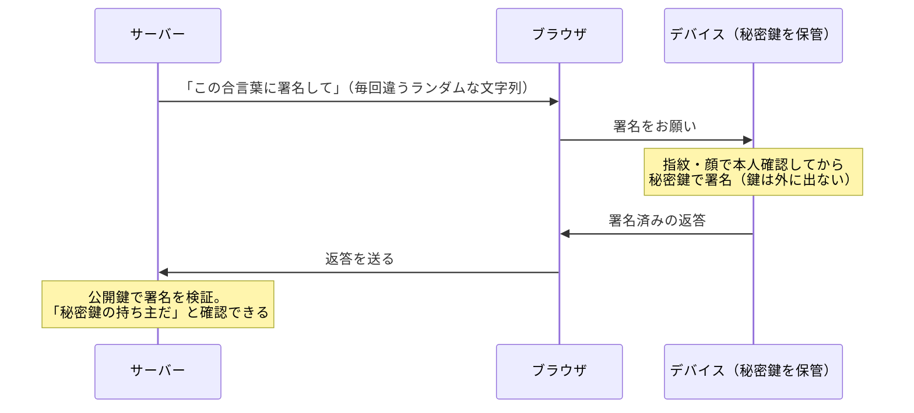

# パスキー — パスワードを使わない認証はどう成立するのか

## 今日のゴール

- パスワード方式の構造的な弱点を知る
- パスキーが「秘密を送らない」認証だと知る
- フィッシングが原理的に効かなくなる理由を説明できるようになる

## 「パスキーを作成しますか？」

最近、Google や Amazon にログインすると「パスキーを作成しますか？」と聞かれます。設定すると、次回からは**指紋や顔認証だけ**でログインできて、パスワードを打ちません。

便利ですが、不思議でもあります。パスワードを送っていないのに、なぜ本人だと分かるのか。指紋がサーバーに送られているとしたら、むしろ怖いのではないか。

この疑問を解くには、まず「パスワードの何が問題だったか」から始めるのが近道です。

## パスワードの構造的な弱点 — 秘密を「送る」

パスワード認証は、「**秘密の文字列を相手に送って、照合してもらう**」方式です。この「送る」「相手も知っている」という構造そのものが、すべての弱点の源です。

| 弱点 | 何が起きるか |
|------|------------|
| サーバーから漏れる | 照合のためにサーバー側にも保存があり、流出事件が後を絶たない |
| 使い回しで連鎖する | 1 サイトの流出が、同じパスワードを使う全サイトに波及する |
| **偽サイトに送ってしまう** | 本物そっくりのログイン画面（フィッシング）に入力したら、その瞬間に盗まれる |

特に 3 つ目のフィッシングは、ユーザーの注意力に頼る以外の対策が困難でした。**正しい秘密を、正しい手順で、間違った相手に渡してしまう**攻撃だからです。

## パスキー — 秘密を「送らない」認証

**パスキー**（passkey）は、この構造を根本から変えます。鍵となるのは**公開鍵暗号**という仕組みです。

ペアになる 2 つの鍵を作ります。

- **秘密鍵**: あなたのデバイス（スマホや PC）の中に保管され、**絶対に外に出ない**
- **公開鍵**: サーバーに渡しておく。これは**漏れても問題ない**（施錠はできるが開錠できない鍵のようなもの）

ログインの流れはこうなります。

ポイントは 3 つです。

- サーバーに送られるのは**その場限りの署名**だけ。秘密鍵もパスワードも生体情報も送られない
- 指紋や顔は「**デバイスの中で秘密鍵を使う許可**」のためだけに使われ、デバイスから出ない
- 合言葉（チャレンジ）は毎回違うので、通信を盗み見て**再利用することもできない**

パスキーは「秘密を送って照合する」方式から「**秘密は持ったまま、持っていることだけを証明する**」方式への転換です。

## フィッシングが原理的に効かない理由

パスキーの最大の強みは、フィッシング耐性です。これは「ユーザーが注意深くなる」からではなく、**仕組みとして偽サイトに署名を渡せない**からです。

パスキーは作成時に「**どのサイト用か**」（ドメイン）が紐付けられ、ブラウザがこれを強制します。`amazon.co.jp` 用のパスキーは、偽サイト `arnazon.co.jp` では**そもそも呼び出せません**。

パスワードなら「人間が見分ける」必要がありました。パスキーでは「ブラウザが機械的に照合する」ので、どれだけ精巧な偽サイトでも、人間がどれだけ騙されても、署名は出ていきません。人間の注意力に頼っていた部分が、**ブラウザによるドメイン照合という仕組みに置き換わった**ことがパスキーの最大の利点です。

## デバイスを失くしたら？ — 同期という現実解

「秘密鍵がデバイスの中にしかないなら、スマホを失くしたら終わりでは？」という疑問は当然です。

現在のパスキーは、Apple・Google などのアカウント経由で**デバイス間に同期**されます（iCloud キーチェーン、Google パスワードマネージャー）。スマホを失くしても、同じアカウントの新しいデバイスでパスキーは復元されます。

この同期があることで「鍵の保管をプラットフォームに委ねる」形にはなりますが、それと引き換えに、パスワードの「人間が覚える・人間が見分ける」という根本的な無理が解消されました。

## 開発者として知っておくこと

パスキーの裏側は **WebAuthn** というブラウザ標準 API です。とはいえ、自前で WebAuthn を実装する場面はまれで、実務はこう考えれば十分です。

- 認証ライブラリ（Auth.js など）や IDaaS（Clerk、Auth0 など）が**パスキー対応のオプション**を提供している。乗るのが基本
- 「パスワード認証を作って」と AI に頼む前に、「**パスキー対応のライブラリで**」と一言足す選択肢ができた
- 当面は「パスワード + パスキー併用」の移行期。パスキーを**追加の選択肢**として出すのが現在の定石

## まとめ

- パスワードの弱点は「秘密を送る・相手も知っている」という構造そのもの
- パスキーは秘密鍵をデバイスから出さず、署名で「持っていること」だけを証明する
- ドメイン紐付けをブラウザが強制するので、フィッシングが原理的に成立しない
- 実装はライブラリ・IDaaS のパスキー対応に乗る。生体情報はデバイスから出ない
