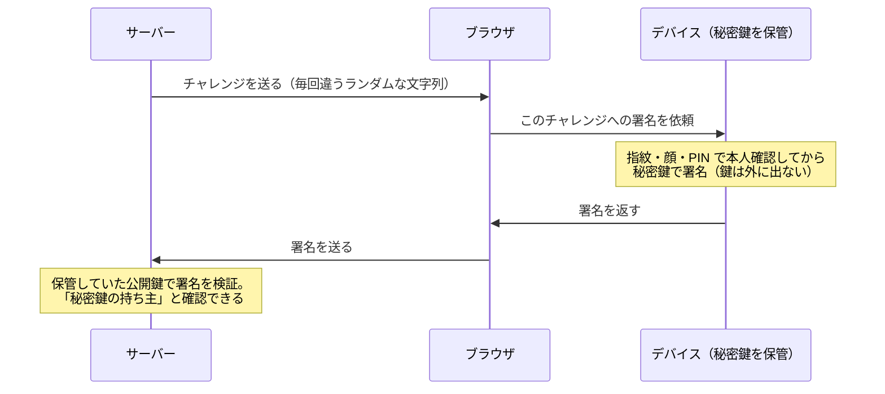
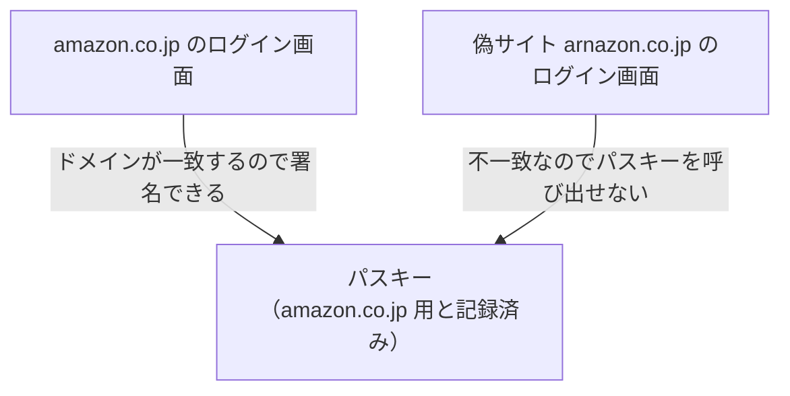

# パスキー — パスワードを使わない認証はどう成立するのか

## 今日のゴール

- パスワードの弱点が「秘密を送る」構造にあると知る
- パスキーが署名で「持っていること」だけを証明する流れを追える
- フィッシングが原理的に効かない理由を説明できる

## ログイン画面に増えたパスキーの提案

最近、Google や Amazon にログインすると「パスキーを作成しますか？」と聞かれます。設定すると、次回からは指紋や顔認証だけでログインできて、パスワードを打ちません。

便利ですが、不思議でもあります。パスワードを送っていないのになぜ本人だと分かるのか、指紋がサーバーに送られているのだとしたらむしろ怖いのではないか。

この疑問の出発点は「パスワードの何が問題だったか」です。そこから見ると、パスキーの設計は一つひとつ腑に落ちます。

## パスワードの弱点 — 秘密を送る構造

パスワード認証は、秘密の文字列を相手に送って照合してもらう方式です。この「送る」「相手も知っている」という構造そのものが、すべての弱点の源です。

| 弱点 | 何が起きるか |
|------|------------|
| サーバーから漏れる | 照合のためにサーバー側にも保存があり、流出事件が後を絶たない |
| 使い回しで連鎖する | 1 サイトの流出が、同じパスワードを使う全サイトに波及する |
| 偽サイトに送ってしまう | 本物そっくりのログイン画面に入力したら、その瞬間に盗まれる |

特に 3 つ目のフィッシングは、正しい秘密を正しい手順で間違った相手に渡してしまう攻撃です。人間の注意力に頼る以外の対策が困難でした。

## 公開鍵ペア — 秘密鍵を手元から出さない

**パスキー**（passkey）は、この構造を根本から変えます。土台は**公開鍵暗号**という仕組みで、ペアになる 2 つの鍵を使います。

- **秘密鍵**: あなたのデバイスの中に保管され、絶対に外へ出ない
- **公開鍵**: サーバーに渡しておく。こちらは漏れても問題ない

このペアには、秘密鍵でしか作れず、公開鍵で誰でも本物と確かめられる印を作れる性質があります。この印を**署名**と呼びます。

手書きのサインに似ています。書けるのは本人だけですが、見比べて本物と確認するのは誰にでもでき、見比べた人がサインを書けるようになるわけではありません。

パスキーの登録時には、デバイスがそのサイト専用の鍵ペアを新しく作ります。サーバーへ送るのは公開鍵だけで、しかもサイトごとに別のペアなので、あるサイトから何が漏れても他のサイトには波及しません。

## ログインの流れ — チャレンジと署名

ログインで証明したいのは「登録したときの秘密鍵を、いま持っていること」です。秘密鍵そのものは送らず、署名で証明します。

チャレンジというお題が毎回違うことには意味があります。固定の文字列への署名で済むなら、通信を盗み見た攻撃者が同じ署名を再送するだけで成りすませてしまいます。

毎回ランダムなお題に署名させることで、署名の使い回しが効かなくなります。サーバーへ渡るのはその場限りの署名だけで、秘密鍵もパスワードも生体情報も流れません。

パスワードが「秘密を送って照合してもらう」方式だったのに対し、パスキーは「秘密は持ったまま、持っていることだけを証明する」方式です。サーバー側に盗む価値のある秘密が残らない点まで含めて、構造が逆転しています。

## フィッシングが原理的に効かない理由

パスワードマネージャーにも、登録したサイトでしか自動入力しないという防御はありました。それでも人間が手動でコピーして偽サイトへ貼り付ければ、秘密は渡ってしまいます。

パスキーには、この「人間が手で渡す」抜け道がありません。秘密鍵はデバイスから取り出せず、人間が読める形の秘密がそもそも存在しないからです。

さらに、パスキーは作成時に「どのサイト用か」というドメインの情報と紐付けられ、ブラウザがその照合を強制します。

`amazon.co.jp` 用のパスキーは、偽サイトではそもそも候補に出てきません。どれだけ精巧な偽サイトでも、人間がどれだけ騙されても、署名は出ていきません。

人間の注意力に頼っていた見分けが、ブラウザによる機械的なドメイン照合に置き換わりました。これがパスキーがフィッシングに強い理由です。

## 生体認証の役割と同期パスキー

指紋や顔は、サーバーへの本人証明には使われていません。デバイスの中で秘密鍵を使う許可を出すための、その場かぎりのロック解除です。

- 生体情報はデバイスの外へ出ない。サーバーが受け取るのは署名だけ
- 指紋や顔が使えない環境では、PIN や画面ロックのパターンでも代用できる

「秘密鍵がデバイスの中だけなら、スマホを失くしたら終わりでは」という疑問には、同期が答えになっています。パスキーは iCloud キーチェーンや Google パスワードマネージャーを通じてデバイス間で同期され、同じアカウントの新しいデバイスで復元できます。

1Password のようなパスワードマネージャーもパスキーの保管と同期に対応しています。PC でのログイン時に QR コードを介して手元のスマホのパスキーを使う方法もあり、デバイスをまたいだ利用が前提の設計です。

鍵の保管をプラットフォームへ委ねる形にはなります。その引き換えに、覚える・見分けるという人間側の無理がなくなりました。

## 開発者として知っておくこと

パスキーを支えているのは **WebAuthn** というブラウザ標準の API です。とはいえ自前で WebAuthn を実装する場面はまれで、実務では次の整理で十分です。

- 認証ライブラリの Auth.js や、Clerk・Auth0 のような認証サービスがパスキー対応を提供している。乗るのが基本
- 当面はパスワードとパスキーの併用期で、パスキーを追加の選択肢として出すのが定石
- AI にログイン機能を頼むときも、「パスキー対応のライブラリで」と一言足せる

## まとめ

- パスワードの弱点は、秘密を送って相手にも保存させる構造にある
- パスキーは秘密鍵を外に出さず、毎回違うチャレンジへの署名で持ち主だと証明する
- ドメイン照合をブラウザが強制するため、偽サイトはパスキーを呼び出せない
- 生体情報はデバイス内のロック解除専用で、同期により紛失にも備えられる
