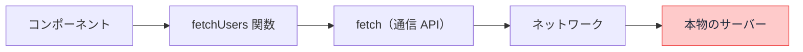

# モックと MSW — ネットワークだけ偽物にする

## 今日のゴール

- テストで「本物の API」を使えない理由を知る
- モックの層の違い（関数を差し替える vs 通信を横取りする）を知る
- MSW が「ネットワークの境界」で偽装する利点を知る

## テストと API の悪い関係

「ユーザー一覧を取得して表示する」コンポーネントをテストしたいとします。素直に実行すると、テストは本物の API にリクエストを飛ばします。これが諸悪の根源になります。

- **遅い**: テストのたびに本物の通信。数百本のテストで数分の差になる
- **不安定**: API サーバーが落ちていたらテストも落ちる。テストの失敗が「コードのバグ」か「サーバーの機嫌」か分からなくなる
- **再現できない**: 「0 件のとき」「サーバーエラーのとき」を試したいのに、本物のサーバーは都合よくエラーを返してくれない
- **危険**: テストが本物のデータを書き換えたら大惨事

そこで、**本物の代わりに偽物の応答を返す**仕掛けを使います。これを**モック**（mock = 模造品）と呼びます。

## どの層で偽物にするか

モックには「どこを差し替えるか」の選択肢があり、層によって性質が変わります。



### 選択肢 1: 関数ごと差し替える

`fetchUsers` という関数自体を、テスト中だけ偽物に入れ替える方法です（Vitest の `vi.mock` など）。

```ts
import { vi } from "vitest";

vi.mock("./api", () => ({
  fetchUsers: vi.fn().mockResolvedValue([{ id: 1, name: "田中" }]),
}));
```

手軽ですが、弱点があります。**本物の `fetchUsers` の中身が一切実行されない**ことです。URL の組み立て、`res.ok` のチェック、JSON の変換。そこにバグがあっても、関数ごと差し替えているので**素通り**します。テストしたい対象の一部を、テストの都合で無効化してしまっているのです。

### 選択肢 2: ネットワークの境界で横取りする — MSW

**MSW**（Mock Service Worker）は、差し替える場所を**ネットワークの出入り口**まで下げます。アプリのコードは 1 行も変えず、「このURL へのリクエストが来たら、この応答を返す」と宣言します。

```ts
// テスト用のハンドラ定義
import { http, HttpResponse } from "msw";

export const handlers = [
  http.get("/api/users", () => {
    return HttpResponse.json([
      { id: 1, name: "田中" },
      { id: 2, name: "鈴木" },
    ]);
  }),
];
```

アプリ側の `fetchUsers` は**本物のまま全部実行されます**。fetch も呼ばれ、`res.ok` も通り、JSON 変換も走る。偽物なのは「ネットワークの向こうから返ってくる応答」だけ。

| | 関数モック | MSW |
|---|-----------|-----|
| 差し替える場所 | 自分のコードの途中 | ネットワークの境界 |
| 自分のコードの実行範囲 | 差し替えた先は実行されない | **全部実行される** |
| テストの信頼度 | 低め（一部を無効化している） | 高め（本物に近い動き） |
| アプリのコード変更 | import の構造に依存 | **一切不要** |

「**自分の書いたコードは全部動かし、外の世界だけ偽物にする**」。これが MSW の思想で、Testing Library の「使われ方に似せるほど信頼できる」という原則のネットワーク版と言えます。

## エラーの日・0 件の日を自由に作る

MSW の真価は、**本物のサーバーでは再現しにくい状況を自在に作れる**ことです。

```ts
// このテストのときだけ、サーバーエラーを返す
server.use(
  http.get("/api/users", () => {
    return new HttpResponse(null, { status: 500 });
  }),
);
```

```ts
// 0 件の応答
http.get("/api/users", () => HttpResponse.json([]));
```

「サーバーエラーのときにエラーメッセージが出るか」「0 件のときに空状態の画面が出るか」。境界値のテストで重要なこれらのケースが、ハンドラの差し替えだけで確実に再現できます。

さらに MSW はテスト以外でも使えます。**開発中のブラウザでも同じハンドラを動かせる**ので、「API がまだできていないのに画面を作る」「エラー画面のデザインを確認する」といった場面で、バックエンドを待たずに開発を進められます。

## AI のテストコードを見るポイント

1. **本物の API を叩いていないか**: テストが外部 URL に依存していたら、モックの導入を指示する
2. **何でも `vi.mock` していないか**: 自分のコード（URL 組み立てや res.ok チェック）まで無効化しているなら、「MSW でネットワーク境界だけモックして」と言い換える
3. **正常系だけになっていないか**: 500 と 0 件のハンドラを足すよう頼む。モックの価値は「意地悪な日を自由に作れる」ことにある

## まとめ

- 本物の API に依存するテストは遅く、不安定で、異常系を再現できない
- 関数モックは手軽だが自分のコードまで無効化する。MSW はネットワーク境界だけ偽装する
- 自分のコードは全部動かし、外の世界だけ偽物に。それが信頼できるテストの形
- MSW は 500 や 0 件を自在に再現でき、開発中のブラウザでも使える
