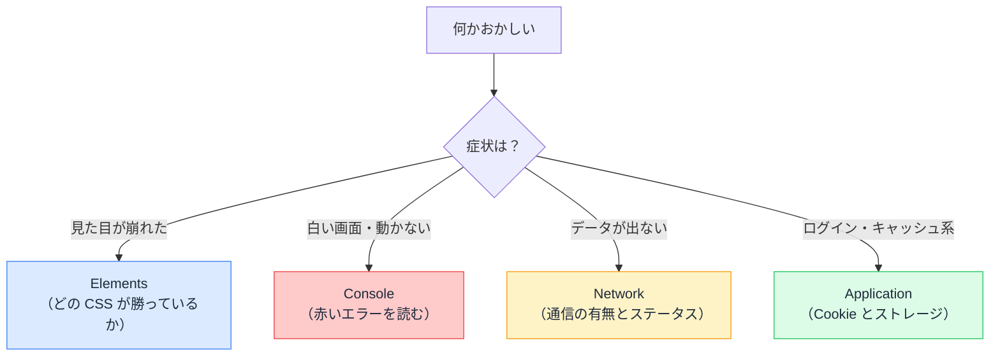

# DevTools の歩き方 — ブラウザは最強の調査ツールを内蔵している

## 今日のゴール

- 開発者ツールの主要 4 タブの役割を知る
- 「何かおかしい」の種類ごとに、どのタブを開くかが分かる
- AI への報告の質が DevTools で変わることを知る

## F12 の向こう側

ブラウザで F12（macOS は Cmd + Option + I）を押すと出てくる**開発者ツール**（DevTools）。AI 時代でも、いやむしろ AI 時代だからこそ、この道具の価値は上がっています。

理由は単純で、**AI はあなたの画面を見られない**からです。「動かない」と伝えても AI は推測しかできませんが、DevTools で拾った事実を渡せば、一直線に原因へ向かえます。DevTools は「AI に渡す事実の採集道具」です。

タブは十数個ありますが、日常で使うのは 4 つ。それぞれ「何を見る場所か」を押さえます。

## Elements — いま画面にある HTML

**Elements** タブは、**現在の DOM**（ブラウザが画面に描いている実際の構造）を表示します。

重要なのは、これは「書いた HTML」ではなく「**いまこの瞬間の結果**」だということです。React が書き換えた後の姿であり、state が変わればここも変わります。

- 要素を右クリック →「検証」で、その要素に**ジャンプ**できる
- 右側の Styles ペインで、**どの CSS が効いていて、どれが負けているか**（取り消し線）が見える
- スタイルの値はその場で書き換えて**実験**できる（リロードで元に戻る）

「CSS が効かない」「レイアウトが崩れた」は、まずここ。当てずっぽうでコードを直す前に、「誰のスタイルが勝っているのか」という事実を見ます。

## Console — エラーとログの掲示板

**Console** タブには、JavaScript のエラーと `console.log` の出力が流れます。

画面が真っ白、ボタンが効かない、という症状の第一容疑者は JavaScript のエラーです。Console を開けば、**赤い文字でエラーメッセージと発生場所**が出ています。

読み方のコツは 2 つです。

- **いちばん上（最初）のエラーを読む**。後続のエラーは最初のエラーの巻き添えであることが多い
- エラー右端のファイル名と行番号のリンクから、**発生箇所のコードに飛べる**

そして AI への報告では、「エラーが出ました」ではなく**赤い文字を全文コピーして貼る**。これだけで AI の回答の精度が段違いになります。

## Network — 通信の記録簿

**Network** タブは、ページが行ったすべての通信（HTML、CSS、JS、画像、API 呼び出し）を時系列で記録します。

「データが表示されない」系の症状は、ここで切り分けられます。

| Network での見え方 | 分かること |
|------------------|-----------|
| リクエスト自体が**無い** | フロントのコードが fetch を呼べていない |
| ステータスが**赤い**（4xx / 5xx） | リクエストは飛んだが失敗。404 なら URL、401 なら認証、500 ならサーバー側 |
| ステータス 200 なのに画面に出ない | データは届いている。**表示側のコード**が犯人 |

行をクリックすると、送ったヘッダー・ボディ、返ってきた中身まで全部見られます。「API は正しい JSON を返しているか」を**事実で**確認できるので、フロントとバックエンドのどちらを疑うべきかが一発で決まります。

## Application — ブラウザに保存されているもの

**Application** タブ（Firefox では Storage）は、ブラウザに保存されたデータの一覧です。

- **Cookie**: ログインセッションの名札。属性（HttpOnly / Secure / SameSite）もここで見える
- **Local Storage / Session Storage**: アプリが保存した値
- **Service Worker / キャッシュ**: 「更新したのに反映されない」の容疑者

「ログイン状態がおかしい」「古い画面が出続ける」系の症状は、ここを見ます。Clear site data ボタンで全部消して再現確認、もよく使う手です。

## 症状からタブへの早見表



## AI への報告テンプレート

DevTools で事実を集めると、AI への相談文はこう変わります。

```
❌ 「ユーザー一覧が表示されません。直してください」

✅ 「ユーザー一覧が表示されません。
    - Console: エラーなし
    - Network: GET /api/users は 200 で、JSON も正しく返っている
    - つまり表示側の問題のはず。UserList コンポーネントを見てください」
```

後者は、AI が調べるべき範囲を**事実で 3 分の 1 に絞って**います。原因の切り分けまで自分でできなくても、「どのタブで何が見えたか」を貼るだけで、調査の半分は終わっているのです。

## まとめ

- DevTools は「AI に渡す事実の採集道具」。画面を見られない AI の目になる
- 見た目は Elements、エラーは Console、データは Network、保存物は Application
- Network のステータスで「フロントかサーバーか」が一発で切り分かる
- エラーは全文コピー、調査結果は事実のまま貼る。報告の質が回答の質を決める
