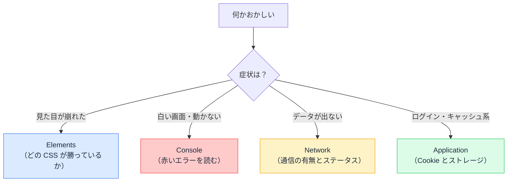

# DevTools — ブラウザは自分のすべてを観測している

## 今日のゴール

- 開発者ツールの主要 4 タブの役割を知る
- 「何かおかしい」の種類ごとに、どのタブを開くかが分かる
- 当てずっぽうでなく「事実」を見てから直せるようになる

## F12 の向こう側

ブラウザは、ページを表示するために**自分が何をしたかをすべて把握しています**。どんな DOM を組み立てたか、どの通信を行いどんな応答を受けたか、何を保存しているか。F12（macOS は Cmd + Option + I）で開く**開発者ツール**（DevTools）は、その内部状態をそのまま覗ける観測窓です。

「動かない」を直すとき、コードを当てずっぽうで書き換える前に、**まず何が起きているかの事実を見る**。その事実がここにあります。タブは十数個ありますが、日常で使うのは 4 つ。それぞれ「何を見る場所か」を押さえます。

## Elements — いま画面にある HTML

**Elements** タブは、**現在の DOM**（ブラウザが画面に描いている実際の構造）を表示します。

重要なのは、これは「書いた HTML」ではなく「**いまこの瞬間の結果**」だということです。React が書き換えた後の姿であり、state が変わればここも変わります。

- 要素を右クリック →「検証」で、その要素に**ジャンプ**できる
- 右側の Styles ペインで、**どの CSS が効いていて、どれが負けているか**（取り消し線）が見える
- スタイルの値はその場で書き換えて**実験**できる（リロードで元に戻る）

「CSS が効かない」「レイアウトが崩れた」は、まずここ。当てずっぽうでコードを直す前に、「誰のスタイルが勝っているのか」という事実を見ます。

## Console — エラーとログの掲示板

**Console** タブには、JavaScript のエラーと `console.log` の出力が流れます。

画面が真っ白、ボタンが効かない、という症状の第一容疑者は JavaScript のエラーです。Console を開けば、**赤い文字でエラーメッセージと発生場所**が出ています。

読み方のコツは 2 つです。

- **いちばん上（最初）のエラーを読む**。後続のエラーは最初のエラーの巻き添えであることが多い
- エラー右端のファイル名と行番号のリンクから、**発生箇所のコードに飛べる**

人に相談するときも AI に聞くときも、「エラーが出ました」ではなく**赤い文字を全文コピーして貼る**。メッセージそのものが、原因への最短ルートです。

## Network — 通信の記録簿

**Network** タブは、ページが行ったすべての通信（HTML、CSS、JS、画像、API 呼び出し）を時系列で記録します。

「データが表示されない」系の症状は、ここで切り分けられます。

| Network での見え方 | 分かること |
|------------------|-----------|
| リクエスト自体が**無い** | フロントのコードが fetch を呼べていない |
| ステータスが**赤い**（4xx / 5xx） | リクエストは飛んだが失敗。404 なら URL、401 なら認証、500 ならサーバー側 |
| ステータス 200 なのに画面に出ない | データは届いている。**表示側のコード**が犯人 |

行をクリックすると、送ったヘッダー・ボディ、返ってきた中身まで全部見られます。「API は正しい JSON を返しているか」を**事実で**確認できるので、フロントとバックエンドのどちらを疑うべきかが一発で決まります。

## Application — ブラウザに保存されているもの

**Application** タブ（Firefox では Storage）は、ブラウザに保存されたデータの一覧です。

- **Cookie**: ログインセッションの名札。属性（HttpOnly / Secure / SameSite）もここで見える
- **Local Storage / Session Storage**: アプリが保存した値
- **Service Worker / キャッシュ**: 「更新したのに反映されない」の容疑者

「ログイン状態がおかしい」「古い画面が出続ける」系の症状は、ここを見ます。Clear site data ボタンで全部消して再現確認、もよく使う手です。

## この窓口は、人間専用ではない

DevTools を「人間が覗くための画面」と捉えると、半分しか見ていません。ブラウザの内部状態への窓口は**プロトコル（CDP）として外部にも開かれており**、DevTools の画面はその窓口に繋がる利用者の 1 人にすぎません。

同じ窓口を使っているものが、すでに身の回りにあります。

- **E2E テストツール（Playwright など）**: 「クリックして」「DOM の状態を教えて」をこの窓口経由で送っている
- **Lighthouse**: 性能や a11y の計測も、この窓口から内部情報を引き出して行う

つまり「Elements で DOM を見る」「Network で通信を見る」という行為は、**自動化ツールがプログラムでやっていることを、人間が手と目でやっている**のと同じです。DevTools に慣れることは、ブラウザの観測という仕組みそのものに慣れることでもあります。

## 症状からタブへの早見表



## 「動かない」を事実に変える

DevTools で事実を集めると、トラブルの報告は劇的に変わります。

```
❌ 「ユーザー一覧が表示されません。直してください」

✅ 「ユーザー一覧が表示されません。
    - Console: エラーなし
    - Network: GET /api/users は 200 で、JSON も正しく返っている
    - つまり表示側の問題のはず。UserList コンポーネントが怪しい」
```

後者は、調べるべき範囲を**事実で 3 分の 1 に絞って**います。原因の切り分けまで自分でできなくても、「どのタブで何が見えたか」を言葉にできれば、調査の半分は終わっています。チームへの相談でも、AI への質問でも、この差がそのまま解決の速さになります。

## まとめ

- DevTools はブラウザの内部状態を覗く観測窓で、当てずっぽうの前に事実を見る道具
- 見た目は Elements、エラーは Console、データは Network、保存物は Application
- Network のステータスで「フロントかサーバーか」が一発で切り分かる
- 「動かない」を「どこで何が起きたか」に変えるのが、調査の半分
