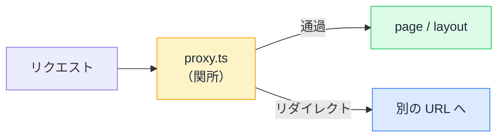

# proxy.ts — 全リクエストに割り込む層

## 今日のゴール

- proxy.ts（旧 middleware.ts）が「ページの手前の関所」だと知る
- リダイレクトと認可チェックという代表的な使い所を知る
- 関所でやるべきでないことを知る

## ページの手前に、もう 1 つの層がある

Next.js のリクエスト処理には、page や layout が動く**前**に割り込めるポイントがあります。プロジェクトのルートに `proxy.ts` というファイルを置くと、**サイトへのリクエストすべてが、ページに届く前にこの関数を通る**ようになります。

```ts
// proxy.ts（プロジェクトルート）
import { NextResponse } from "next/server";
import type { NextRequest } from "next/server";

export function proxy(request: NextRequest) {
  // すべてのリクエストがここを通る
  return NextResponse.next(); // 何もせず通過させる
}
```



なお、この機能は長らく `middleware.ts`（関数名 `middleware`）という名前でした。Next.js 16 で `proxy.ts`（関数名 `proxy`）に改名されています。AI は学習データの都合で旧名の `middleware.ts` を出してくることが多いので、「**いまは proxy.ts**」と覚えておくと、生成コードの古さに気づけます。

## 代表的な使い所 1 — ログインしていなければ入口で返す

いちばん典型的な仕事は、**認証が必要なページの門番**です。

```ts
// proxy.ts
import { NextResponse } from "next/server";
import type { NextRequest } from "next/server";

export function proxy(request: NextRequest) {
  const session = request.cookies.get("session_id");

  // 未ログインで /mypage 配下に来たら、ログイン画面へ
  if (!session && request.nextUrl.pathname.startsWith("/mypage")) {
    return NextResponse.redirect(new URL("/login", request.url));
  }

  return NextResponse.next();
}

export const config = {
  matcher: ["/mypage/:path*"], // この層を通すパスを絞る
};
```

ページごとに「ログインしてなければ弾く」コードを書く代わりに、**入口 1 か所で**まとめて守れます。`config.matcher` で対象パスを絞れば、関係ないリクエスト（画像や公開ページ）はこの層を通りません。

## 代表的な使い所 2 — リダイレクトの集中管理

URL の引っ越しや出し分けも、この層の定番の仕事です。

- 旧 URL から新 URL への恒久リダイレクト
- 未対応ブラウザや国・言語による出し分け
- メンテナンス中の全ページ → お知らせページへの誘導

「全リクエストが必ず通る」性質があるからこそ、**例外なく適用したいルール**の置き場所として機能します。

## 関所でやってはいけないこと

強力な層ですが、**全リクエストが通る = 1 ミリ秒の遅延が全ページに効く**ということでもあります。向き不向きがはっきりしています。

| 向いている | 向いていない |
|-----------|------------|
| Cookie の有無を見て**リダイレクト** | データベースへの問い合わせ（全リクエストが遅くなる） |
| ヘッダーの付け替え | 重い計算や外部 API の呼び出し |
| パスの書き換え | ページの中身の生成（それは page の仕事） |

特に注意したいのが認可の深追いです。proxy.ts でできるのは「セッションの**有無**を見て門前払いする」程度の軽いチェックで、「このユーザーはこのデータを見る権限があるか」のような**本当の認可は、データに触る場所（Server Components や Server Actions の中）で行う**のが原則です。関所を通ったあとの経路（直接の API 呼び出しなど）が存在しうる以上、関所**だけ**に頼った防御は穴になります。

## AI のコードを見るポイント

1. **middleware.ts / export function middleware を出してきたら**: Next.js 16 では proxy.ts / proxy。動かない場合は名前から疑う
2. **proxy の中で DB を叩いていたら**: 全ページの遅延要因。「ここではセッションの有無だけ見て、権限チェックはページ側で」と指示する
3. **matcher が無い、または広すぎたら**: 静的ファイルまで関所を通っていないか確認する

## まとめ

- proxy.ts はすべてのリクエストがページの前に通る関所（Next.js 16 で middleware.ts から改名）
- 使い所は門前払いのリダイレクトと、例外なく適用したいルールの集中管理
- 全リクエストに効くので軽く保つ。DB 問い合わせや本当の認可はページ側で
- AI が出す旧名 middleware.ts は、生成コードの古さに気づくサイン
