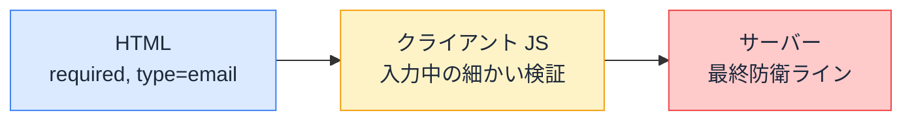

# フォームバリデーション — どこで、何を、何回検証するか

## 今日のゴール

- 検証には 3 つの段階（HTML・クライアント JS・サーバー）があると知る
- 「画面側の検証は体験のため、サーバー検証は防御のため」という役割の違いを知る
- 検証ルールの二重管理を防ぐ考え方（スキーマ共有）を知る

## 「入力チェックして」の中身は 1 つではない

「メールアドレスの形式をチェックして」と AI に頼むとき、実は場所の選択肢が 3 つあります。どこでやるかで、目的も信頼性もまったく違います。



## 1. HTML — 書くだけで効く標準検証

HTML のフォーム部品は、属性を書くだけの検証機能を最初から持っています。

```html
<label>
  メールアドレス
  <input type="email" required />
</label>
<label>
  数量
  <input type="number" min="1" max="99" required />
</label>
```

| 属性 | 検証内容 |
|------|---------|
| `required` | 空のまま送信できない |
| `type="email"` など | 形式に合わない値を弾く |
| `min` / `max` / `maxlength` | 範囲・長さの制限 |
| `pattern` | 正規表現での形式指定 |

送信時にブラウザが**自動でエラーメッセージを表示し、送信を止めて**くれます。JavaScript ゼロ行。シンプルなフォームなら、この層だけで十分なことも多いです。AI は最初から JS の検証を書きがちですが、「**まず HTML の属性で済まないか**」が最初の問いです。

## 2. クライアント JS — 体験を磨く検証

HTML の標準検証で足りないのは、メッセージの出し方やタイミングの細かい制御です。

- 入力欄からフォーカスが外れた瞬間に検証したい
- 「パスワードと確認用が一致しているか」のような**項目をまたぐ**検証
- エラーメッセージのデザインや文言を揃えたい

ここで登場するのが JavaScript での検証で、定番は **zod**（検証ルールをオブジェクトで宣言するライブラリ）と **react-hook-form**（フォームの状態管理ライブラリ）の組み合わせです。

```ts
import { z } from "zod";

export const signupSchema = z.object({
  email: z.email("メールアドレスの形式が正しくありません"),
  password: z.string().min(8, "パスワードは 8 文字以上にしてください"),
});
```

形式とエラーメッセージが**スキーマ**（ルールの宣言）として 1 か所にまとまるのがポイントです。

ただし、ここで絶対に忘れてはいけない事実があります。**HTML の検証もクライアント JS の検証も、どちらも簡単に突破できます**。ブラウザの開発者ツールで `required` を消すのも、JavaScript を無効にするのも、フォームを通さず直接リクエストを送るのも自由です。画面側の検証は**善意のユーザーの入力ミスを早く優しく教えるため**のもので、防御ではありません。

## 3. サーバー — 信頼できる唯一の検証

だから、**サーバー側の検証だけが本物の防衛ライン**です。Server Actions なら、アクションの中で検証します。

```ts
"use server";

import { signupSchema } from "./schema"; // クライアントと同じスキーマを使う

export async function signup(prevState: FormState, formData: FormData) {
  const result = signupSchema.safeParse({
    email: formData.get("email"),
    password: formData.get("password"),
  });

  if (!result.success) {
    return { message: result.error.issues[0].message };
  }

  // result.data は検証済み（型も付いている）
  await createUser(result.data);
  return { message: "登録しました" };
}
```

`safeParse` は「検証して、成功か失敗かを返す」メソッドです。成功時の `result.data` は**検証済みかつ型付き**のデータとして安全に使えます。

ここで効いてくるのが、**クライアントとサーバーで同じスキーマを import している**ことです。検証ルールを画面用とサーバー用に二重に書くと、片方だけ直して食い違う事故が必ず起きます。**ルールは 1 か所（スキーマ）に書き、両方から使う**。これが zod のようなスキーマライブラリが支持される最大の理由です。

## 3 層の役割まとめ

| 層 | 目的 | 突破されるか |
|----|------|------------|
| HTML 属性 | 最速のフィードバック。JS ゼロで効く | される |
| クライアント JS | きめ細かい体験（タイミング・文言・項目間） | される |
| **サーバー** | **防御。信頼できる唯一の検証** | **ここで止める** |

「画面で弾いているから大丈夫」は、定番の脆弱性の入口です。逆に「サーバーで検証しているから画面側は不要」も、ユーザーに「送信して初めてエラーが分かる」苦痛を強います。**体験のために手前で、防御のために奥で**。両方やるのが正解で、スキーマ共有が二重管理を防ぎます。

## AI のコードを見るポイント

1. **サーバー側に検証があるか**: 画面側だけなら「Server Action の中でも検証して」と指示。required は防御ではない
2. **ルールが二重に書かれていないか**: 画面用とサーバー用で別々の検証コードがあったら、スキーマ共有への統合を頼む
3. **HTML 属性が省略されていないか**: JS 検証があっても `required` や `type="email"` は併記する。JS が読み込まれる前でも効く、最速の層

## まとめ

- 検証は 3 層: HTML 属性（最速）、クライアント JS（体験）、サーバー（防御）
- 画面側の検証はすべて突破できるので、信頼できるのはサーバーだけ
- ルールはスキーマ（zod）に 1 か所で書き、画面とサーバーの両方から使う
- まず HTML 属性で済むか、を最初に問う
