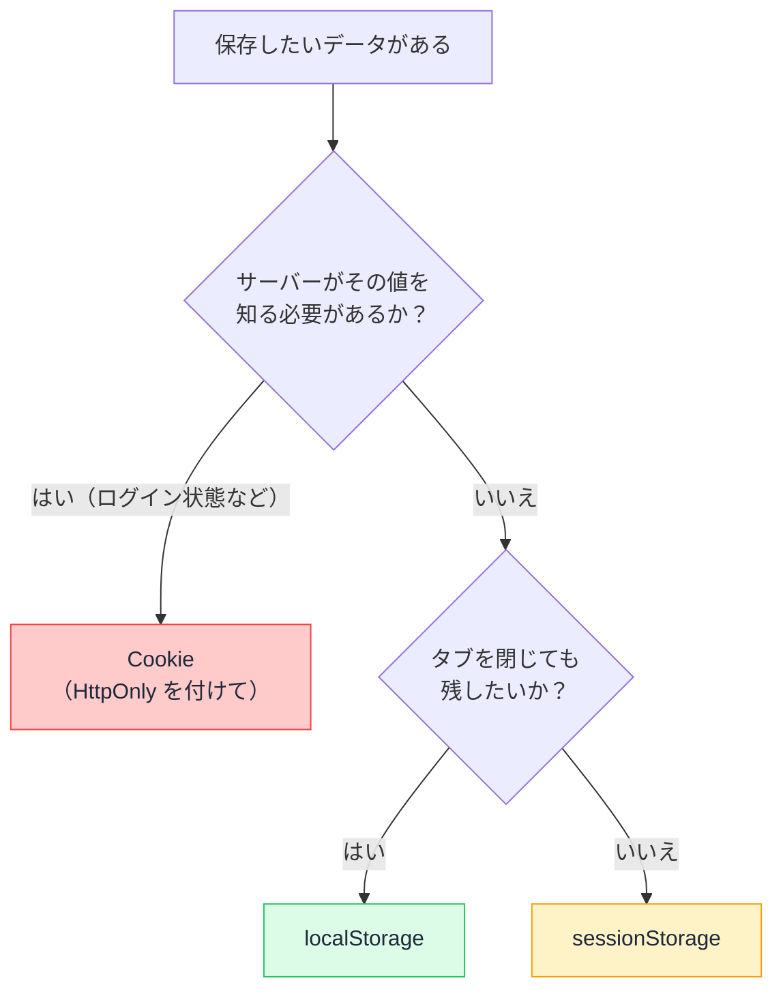

# Web Storage — リロードしても残るデータはどこにいるのか

## 今日のゴール

- localStorage / sessionStorage / Cookie の 3 つの置き場の違いを知る
- 「サーバーに送られるか」「いつ消えるか」という 2 軸の整理を持つ
- localStorage に置いてはいけないものを知る

## ブラウザの中の「引き出し」

ダークモードの設定、最近見た商品、閉じたお知らせバナー。リロードしても、ブラウザを閉じて開き直しても覚えられているこれらの情報は、**ブラウザの中の保存領域**に入っています。

代表的な引き出しは 3 つあります。AI のコードには `localStorage.setItem(...)` が頻出するので、それぞれの性質を知っておくと「この引き出しでいいのか」を判断できます。

## 3 つの引き出しの性質

| | localStorage | sessionStorage | Cookie |
|---|--------------|----------------|--------|
| 消えるタイミング | **消さない限り残る** | **タブを閉じたら消える** | 期限指定どおり |
| サーバーに送られるか | 送られない | 送られない | **毎リクエストに自動添付** |
| 容量の目安 | 5MB 程度 | 5MB 程度 | 4KB 程度 |
| JS から読めるか | 読める | 読める | 読める（**HttpOnly なら読めない**） |

### localStorage — 永続する置き場

```ts
localStorage.setItem("theme", "dark");   // 保存
const theme = localStorage.getItem("theme"); // 取得（無ければ null）
localStorage.removeItem("theme");        // 削除
```

保存できるのは**文字列だけ**です。オブジェクトを入れたいときは JSON にします。

```ts
localStorage.setItem("recent", JSON.stringify(recentItems));
const recent = JSON.parse(localStorage.getItem("recent") ?? "[]");
```

向いているのは、**消えても実害がない、ユーザーの好み**です。テーマ設定、表示の並び順、チュートリアルを見たかどうか。

### sessionStorage — タブ限りの置き場

API は localStorage と同じで、寿命だけが違います。**そのタブを閉じたら消える**ので、「複数ステップのフォームの途中状態」のような、その場限りの作業データに向いています。タブごとに独立しているのも特徴です（同じサイトを 2 タブで開くと別の引き出し）。

### 触って確かめる

2 つのカウンターは、どちらもボタンを押すたびに保存領域の値を +1 して表示します。**このページをリロードしてから、もう一度押してみてください**。localStorage 側は続きから増え（残っている）、sessionStorage もリロードでは残りますが、**新しいタブでこのページを開くと 0 からになります**（タブ限り）。

<div class="c96-demo">
  <div class="c96-box">
    <p class="c96-name">localStorage</p>
    <button type="button" class="c96-btn" onclick="
      var v = Number(localStorage.getItem('c96-count') || 0) + 1;
      localStorage.setItem('c96-count', String(v));
      document.getElementById('c96-local').textContent = String(v);
    ">+1 して保存</button>
    <p class="c96-value">保存中の値: <span id="c96-local" aria-live="polite">?</span></p>
  </div>
  <div class="c96-box">
    <p class="c96-name">sessionStorage</p>
    <button type="button" class="c96-btn" onclick="
      var v = Number(sessionStorage.getItem('c96-count') || 0) + 1;
      sessionStorage.setItem('c96-count', String(v));
      document.getElementById('c96-session').textContent = String(v);
    ">+1 して保存</button>
    <p class="c96-value">保存中の値: <span id="c96-session" aria-live="polite">?</span></p>
  </div>
  <p class="c96-note">「?」は未読み込みの印です。ボタンを押すと保存領域の現在値 +1 が表示されます。開発者ツールの Application タブで、実際に保存されている様子も見られます。</p>
</div>

### Cookie — サーバーに届く唯一の置き場

3 つの中で Cookie だけが、**リクエストのたびにサーバーへ自動で送られます**。サーバーが値を知る必要があるもの、つまり**ログインセッション**のための置き場です。容量が小さく、毎回の通信に乗るため、大きなデータには向きません。

## どれを使うかの判断フロー



## localStorage に置いてはいけないもの

ここが今日いちばん大事な注意です。**localStorage は JavaScript から誰でも読めます**。ページ内で動くスクリプトなら、どれでも全部読めます。

つまり、XSS（スクリプトの注入）が一発でも成立すると、**localStorage の中身は全部盗まれる**ということです。

| localStorage に置いてよい | 置いてはいけない |
|--------------------------|----------------|
| テーマ・言語などの好み | **認証トークン**（盗まれたらなりすまし） |
| 閲覧履歴・下書き | **個人情報**（メール、住所など） |
| UI の状態 | **秘密の値全般** |

AI は「ログイン状態を保存して」という依頼に対して `localStorage.setItem("token", ...)` を出してくることがあります。動きますが、安全な置き場ではありません。「**トークンは HttpOnly Cookie に**」が正解です。HttpOnly 付きの Cookie は JavaScript から読めないため、同じ XSS が起きても直接は盗めません。

## Next.js で使うときの注意 — サーバーには存在しない

もう 1 つの定番の罠が、**localStorage はブラウザにしか無い**ことです。

```tsx
// ❌ Server Component やレンダリング中に直接触ると壊れる
const theme = localStorage.getItem("theme"); // サーバーでは ReferenceError
```

サーバーで実行されるコードに `localStorage` は存在しません。Client Components でも、サーバーでの 1 回目の描画時にレンダリング中に触ればエラーや表示のズレ（ハイドレーション不一致）の原因になります。

定石は「**描画後に読む**」。つまり useEffect の中で触ることです。

```tsx
"use client";

import { useEffect, useState } from "react";

export function ThemeLabel() {
  const [theme, setTheme] = useState<string | null>(null);

  useEffect(() => {
    setTheme(localStorage.getItem("theme")); // 描画後、ブラウザでだけ実行される
  }, []);

  if (theme === null) return null; // 読み込むまでは何も出さない
  return <p>現在のテーマ: {theme}</p>;
}
```

「localStorage is not defined というエラーが出た」は Next.js 初心者の定番のつまずきで、原因はこの「サーバーには無い」に尽きます。

## まとめ

- 引き出しは 3 つ: localStorage（永続）、sessionStorage（タブ限り）、Cookie（サーバーに届く）
- 判断軸は「サーバーが知る必要があるか」と「いつまで残すか」
- localStorage は XSS で全部読まれる。トークンや個人情報は置かない（HttpOnly Cookie へ）
- localStorage はサーバーに存在しない。触るのは useEffect の中で

<style>
.c96-demo {
  display: flex;
  flex-wrap: wrap;
  gap: 12px;
  border: 1px solid #e2e8f0;
  border-radius: 10px;
  padding: 16px;
  margin: 1.2em 0;
  background: #f8fafc;
  color: #1e293b;
}
.c96-box {
  flex: 1 1 200px;
  border: 1px dashed #cbd5e1;
  border-radius: 8px;
  padding: 12px;
  background: #ffffff;
  color: #1e293b;
}
.c96-name {
  font-weight: 700;
  font-family: monospace;
  font-size: 14px;
  margin: 0 0 8px;
}
.c96-btn {
  padding: 8px 14px;
  font-size: 14px;
  border: 1px solid #cbd5e1;
  border-radius: 6px;
  background: #f1f5f9;
  color: #1e293b;
  cursor: pointer;
}
.c96-btn:hover { background: #e2e8f0; }
.c96-btn:focus-visible { outline: 2px solid #2563eb; outline-offset: 2px; }
.c96-value {
  font-size: 14px;
  margin: 8px 0 0;
}
.c96-note {
  flex-basis: 100%;
  font-size: 13px;
  color: #475569;
  margin: 4px 0 0;
}
</style>
