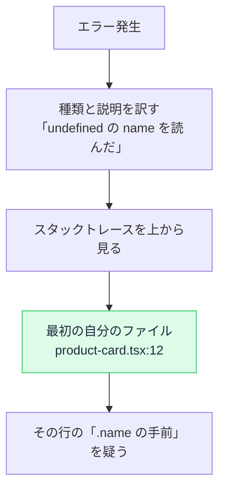

# エラーの読み方 — スタックトレースは下から上に物語を語る

## 今日のゴール

- エラーメッセージの 3 つの部品（種類・説明・スタックトレース)を知る
- スタックトレースが「呼び出しの足跡」だと知る
- 「自分のコードの行」を見つける読み方を知る

## 赤い文字の壁を、全部コピペする前に

開発中、コンソールに赤いエラーが数十行出ます。AI に全部貼れば解決することも多い時代ですが、**自分で 30 秒読めるかどうか**で大きな差がつきます。原因の場所に当たりを付けてから聞けば AI の回答は速く正確になり、そもそも読めば一瞬で分かるエラーも多いからです。

エラーは長く見えて、実は**たった 3 つの部品**でできています。

```
TypeError: Cannot read properties of undefined (reading 'name')
    at ProductCard (product-card.tsx:12:25)
    at renderWithHooks (react-dom.development.js:15486:18)
    at mountIndeterminateComponent (react-dom.development.js:20103:13)
    at beginWork (react-dom.development.js:21626:16)
    ...
```

| 部品 | 上の例 | 意味 |
|------|--------|------|
| **種類** | `TypeError` | エラーの分類 |
| **説明** | `Cannot read properties of undefined (reading 'name')` | 何が起きたか |
| **スタックトレース** | `at ...` の行の列 | **どこで**起きたか |

## 種類と説明は定型文

エラーの種類は数えるほどしかなく、頻出はこの 3 つです。

| 種類 | 意味 | 典型的な原因 |
|------|------|------------|
| `TypeError` | その型にはできない操作をした | **undefined のプロパティを読んだ**（圧倒的最多） |
| `ReferenceError` | 存在しない名前を参照した | 変数名のタイポ、import 忘れ、サーバーに無い API（localStorage など）に触った |
| `SyntaxError` | 文法が壊れている | 括弧の閉じ忘れ。実行前に検出される |

説明文も定型です。最頻出の `Cannot read properties of undefined (reading 'name')` は、「**undefined になっている何かの `.name` を読もうとした**」と訳せます。つまり `xxx.name` の **xxx が undefined** だった。「name が無い」のではなく「**name の手前が無い**」と読むのがコツです。データがまだ届いていない、API の形が想定と違う、配列が空だった、が三大原因です。

## スタックトレースは「呼び出しの足跡」

`at ...` の行の列が**スタックトレース**です。これは「エラーが起きた瞬間、**どの関数がどの関数を呼んでいる途中だったか**」の記録で、読み方には明確なルールがあります。

> **いちばん上の行が、エラーが起きたその場所。下に行くほど「呼び出した側」へ遡る。**

```
    at ProductCard (product-card.tsx:12:25)   ← ここで事件が起きた
    at renderWithHooks (react-dom...)          ← それを呼んだのは React
    at mountIndeterminateComponent (react-dom...) ← さらにその呼び出し元
```

`product-card.tsx の 12 行目 25 文字目`。事件現場の住所まで書いてあります。

### 読み方の実践 — 自分のファイルを探す

スタックトレースの大部分は、React やライブラリの内部関数（`react-dom` など）で埋まっています。これらは**事件の通り道であって、犯人ではありません**。

実践的な読み方は 1 つだけです。

> **上から見ていって、最初に出てくる「自分のプロジェクトのファイル」の行を見る。**

上の例なら `product-card.tsx:12`。ライブラリの行は読み飛ばして構いません。ライブラリのバグである可能性より、**自分のコードがライブラリに変な値を渡した**可能性のほうが圧倒的に高いからです。



## Next.js ならではの読み分け

Next.js のエラーには、**どこで起きたか**の区別がもう 1 段あります。

| エラーの出る場所 | 起きた場所 | よくある原因 |
|----------------|-----------|------------|
| ブラウザのコンソール・画面のオーバーレイ | クライアント | undefined 参照、ハイドレーション不一致 |
| **ターミナル**（npm run dev の画面） | **サーバー** | Server Components 内のエラー、ビルドエラー |

「画面には何も出ないのにおかしい」ときは、**ターミナルのほうに赤い文字が出ている**ことがよくあります。Server Components のエラーはサーバーで起きるので、ブラウザだけ見ていても見つかりません。両方を見る習慣が、Next.js のデバッグの基本です。

## AI への聞き方が変わる

30 秒の読解で、AI への相談はこう変わります。

```
❌ 「エラーが出ました」（スクショだけ）

✅ 「ProductCard（product-card.tsx:12）で
    product.name を読むときに TypeError。
    product が undefined になるケースがあるようです。
    呼び出し元の products 配列の中身を確認してもらえますか」
```

エラーの全文を貼るのは引き続き有効です。そこに**自分の読解を 1 行添える**だけで、AI は裏取りから始められ、回答の精度が上がります。30 秒の読解ができれば、エラーメッセージは**原因の場所と内容が記された報告書**として読めるようになります。

## まとめ

- エラーは種類・説明・スタックトレースの 3 部品。説明は定型文として訳せる
- 最頻出は「undefined の手前が無い」。name ではなく xxx.name の xxx を疑う
- スタックトレースは上が現場、下が呼び出し元。最初の自分のファイルを見る
- Next.js はブラウザとターミナルの両方を見る。読解 1 行を添えて AI に渡す
