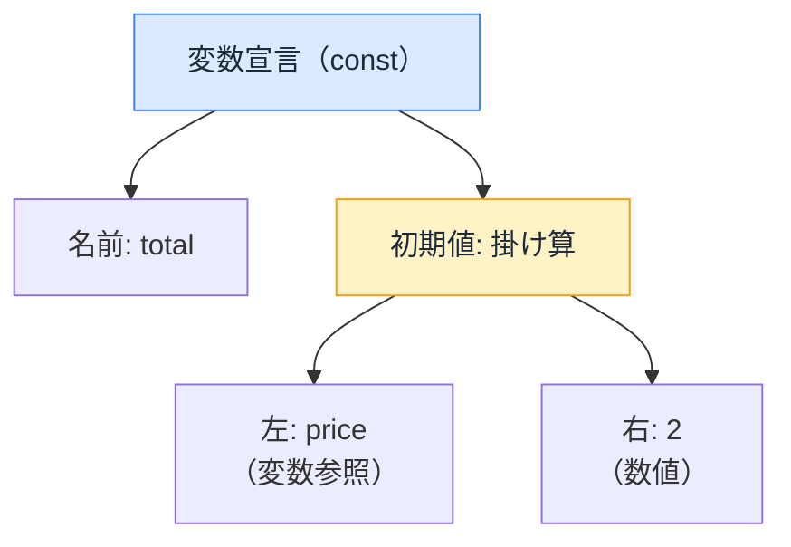

# ツールがコードを読む仕組み — AST という共通言語

## 今日のゴール

- Lint・コンパイラ・フォーマッタ・バンドラが AST という同じ仕組みでコードを読んでいると知る
- AST が「コードを木構造に変換したもの」だと知る
- バラバラだったツールが、高速パーサの共有で統合に向かっていると知る

## コードに触るツールの多さ

開発中、コードはいくつものツールに処理されています。

- **Lint**: 「この変数は使われていません」と波線を出す
- **コンパイラ**: JSX を関数呼び出しに変換する。React Compiler がメモ化を自動挿入する
- **フォーマッタ**: 保存した瞬間にインデントやクォートが揃う
- **バンドラ**: 使われていないコードを振り落とす（tree shaking）

検査、変換、整形、削除。やることはバラバラなのに、どのツールもコードの**意味**を理解しているように見えます。その共通の仕組みが **AST** です。

## AST — コードを「木」として読む

ツールにとって、コードはただの文字列ではありません。解析（パース）すると、**入れ子の構造を持った木**に変換できます。これを **AST**（Abstract Syntax Tree、抽象構文木）と呼びます。

```js
const total = price * 2;
```

この 1 行は、おおよそこんな木になります。



文字列だった瞬間に消えていた「これは変数宣言」「これは掛け算」「price は変数の参照」という**意味の構造**が、木の形で機械に見えるようになります。

この木があれば、ツールはコードを実行しなくても構造を理解できます。

## ツールごとの木の使い方

| ツール | 木をどう使うか | 例 |
|--------|--------------|-----|
| Lint（ESLint, Biome） | 木を**検査**する | 「宣言があるのに参照がない → 未使用変数」 |
| コンパイラ（SWC, React Compiler） | 木を**変換**する | 「JSX のノードを関数呼び出しのノードに置き換える」 |
| フォーマッタ（Prettier, Biome） | 木から**整形して書き戻す** | 「構造は変えず、インデントとクォートだけ統一」 |
| バンドラ（Turbopack, Rolldown） | 木を**たどって不要な枝を削る** | 「import されているが使われていない関数を除去」 |

**どれも、コードを実行せずに処理している**点は同じです。AST があれば構造が完全に見えるので、実行しなくても判断できます。

一方、**実行しないと分からないこと**（この計算結果は正しいか、API は本当に動くか）は AST ベースのツールの守備範囲外です。構造の問題はツール、振る舞いの問題はテスト、という分担になっています。

## バラバラだったツールの統合

従来の JavaScript 開発では、ツールがバラバラでした。

- Lint は ESLint、整形は Prettier、コンパイルは Babel、バンドルは Webpack

それぞれが独自に AST をパースしていて、同じコードを何度も木に変換する無駄がありました。設定ファイルも `.eslintrc` / `.prettierrc` / `babel.config.js` / `webpack.config.js` と散らばります。

今、この断片化が **Rust 製の高速パーサを共有する** 形で統合に向かっています。

- **Biome**: Lint と整形を 1 つのツールに統合。1 回のパースで検査と整形を両方やる
- **OXC**: 高速パーサを核に、Linter（oxlint）・トランスパイラ・リゾルバを提供。バンドラの **Rolldown**（Vite の次期エンジン）もこのパーサを使う

| | 従来（JS 製・個別） | 新世代（Rust 製・共有） |
|---|---|---|
| Lint | ESLint | Biome, oxlint |
| 整形 | Prettier | Biome |
| コンパイル | Babel | SWC, oxc-transform |
| バンドル | Webpack | Turbopack, Rolldown |

ツールの名前は入れ替わっていきますが、**AST という共通言語は変わりません**。むしろ「同じパーサ、同じ AST を使い回す」方向に進んでいるので、個々のツール名を覚えるより AST の仕組みを知っておく方が長持ちします。

## まとめ

- Lint・コンパイラ・フォーマッタ・バンドラは、すべてコードを AST（構文の木）にしてから処理する
- 検査・変換・整形・削除と目的は違うが、コードを実行せず構造で判断する点は共通
- ツール名は世代交代しても AST は変わらない。パーサ共有で統合が進んでいる
