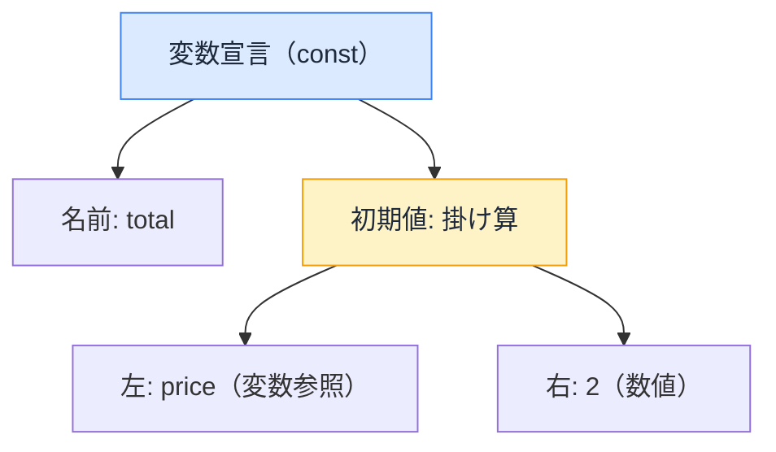

# ツールがコードを読む仕組み — AST という共通言語

## 今日のゴール

- Lint・コンパイラ・フォーマッタ・バンドラが同じ仕組み（AST）でコードを読んでいると知る
- AST が「コードを木構造に変換したもの」だと知る
- ツールごとに「検査する」「変換する」「整形する」「削る」と用途が違うだけだと知る

## エディタの波線、ビルドの変換、保存時の整形

開発中、いろんなツールがコードに触ります。

- **Lint**: 保存する前から「この変数は使われていません」と波線が出る
- **コンパイラ**: JSX を関数呼び出しに変換する。React Compiler がメモ化を自動挿入する
- **フォーマッタ**: 保存した瞬間にインデントやクォートが揃う
- **バンドラ**: 使われていないコードを振り落とす（tree shaking）

バラバラに見えますが、全部が同じ入口から始まります。**コードを木にする**。

## AST — コードを「木」として読む

ツールにとって、コードはただの文字列ではありません。解析（パース）すると、**入れ子の構造を持った木**に変換できます。これを **AST**（Abstract Syntax Tree、抽象構文木）と呼びます。

```js
const total = price * 2;
```

この 1 行は、おおよそこんな木になります。



文字列だった瞬間に消えていた「これは変数宣言」「これは掛け算」「price は変数の参照」という**意味の構造**が、木の形で機械に見えるようになります。

ここから先は、ツールによって「木をどう使うか」が違うだけです。

## 木の使い方が、ツールの違い

| ツール | 木をどう使うか | 例 |
|--------|--------------|-----|
| Lint（ESLint, Biome, oxlint） | 木を**検査**する | 「宣言があるのに参照がない → 未使用変数」 |
| コンパイラ（SWC, React Compiler） | 木を**変換**する | 「JSX → 関数呼び出し」「依存関係を追跡してメモ化を挿入」 |
| フォーマッタ（Prettier, Biome） | 木から**整形して書き戻す** | 「構造は変えず、インデントとクォートだけ統一」 |
| バンドラ（Webpack, Turbopack） | 木を**たどって不要な枝を削る** | 「import されているが使われていない関数を除去」 |

**実行せずに分かる**のは、すべてこの仕組みのおかげです。実行はしていないが、構造は完全に見えている。だから「使われていない」「抜けている」「ここにメモ化が要る」という判断が、ビルド時やエディタの保存時に機械的にできます。

逆に、**実行しないと分からないこと**（この計算結果は正しいか、API は本当に動くか）は AST ベースのツールの守備範囲外です。構造の問題はツール、振る舞いの問題はテスト、という分担になっています。

## ツールの統合が進んでいる

従来の JavaScript 開発では、ツールがバラバラでした。

- Lint は ESLint
- 整形は Prettier
- コンパイルは Babel
- バンドルは Webpack

それぞれが独自に AST をパースしていて、同じコードを何度も木に変換する無駄がありました。設定ファイルも `.eslintrc` / `.prettierrc` / `babel.config.js` / `webpack.config.js` と散らばります。

今、この断片化が **Rust 製の高速パーサを共有する** 形で統合に向かっています。

- **Biome**: Lint と整形を 1 つのツールに統合。1 回のパースで両方やる
- **OXC**: 高速パーサを核に、Linter（oxlint）・トランスパイラ・リゾルバを提供。バンドラの **Rolldown**（Vite の次期エンジン）もこのパーサを使う
- **SWC**: Rust 製コンパイラ。Next.js が Babel の代わりに採用

| | 従来（JS 製・個別） | 新世代（Rust 製・統合） |
|---|---|---|
| Lint | ESLint | Biome, oxlint |
| 整形 | Prettier | Biome |
| コンパイル | Babel | SWC, oxc-transform |
| バンドル | Webpack | Turbopack, Rolldown |

ツールの名前は入れ替わっていきますが、**AST という共通の仕組みは変わりません**。むしろ「同じ AST を使い回す」方向に進んでいるので、AST の理解はますます効いてきます。

## Next.js プロジェクトでの実態

Next.js のプロジェクトでは、これらのツールが最初から組み込まれています。

- **ESLint**: `eslint-plugin-react-hooks`（依存配列の抜け検出）、`eslint-plugin-jsx-a11y`（alt 欠落の検出）、`@next/eslint-plugin-next`（Next.js 固有のルール）がセットアップ済み
- **SWC**: TypeScript や JSX の変換を高速に行うコンパイラ。Babel の代替
- **React Compiler**: 有効にすれば、SWC の変換に加えてメモ化の自動挿入も行う

「依存配列が抜けてますよ」とエディタが言ってくれるのは、Lint が AST 上で「useEffect の関数内で参照している変数が、第 2 引数の配列にない」というパターンを検出しているからです。

## まとめ

- Lint・コンパイラ・フォーマッタ・バンドラは、すべてコードを AST（構文の木）にしてから処理する
- 検査・変換・整形・削除と用途が違うだけで、入口は同じ
- ツールの名前は世代交代しても、AST という仕組みは変わらない
