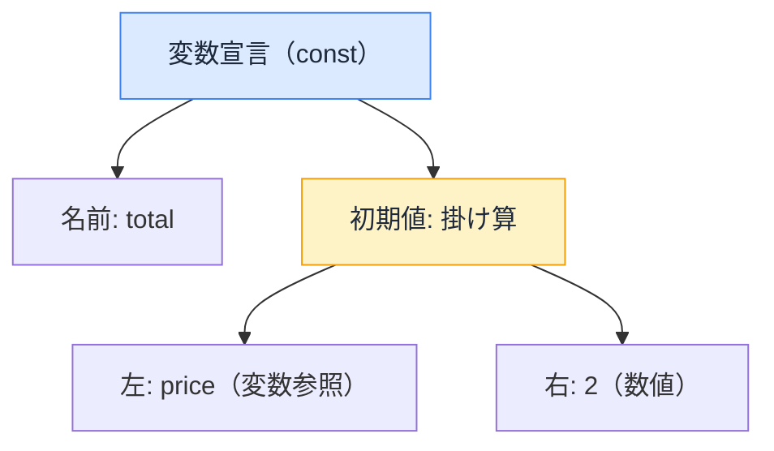

# ESLint の仕組み — 機械はなぜコードの「悪い書き方」に気づけるのか

## 今日のゴール

- ESLint が AST（構文の木）を見てルールを照合していると知る
- ルール・プラグイン・自動修正の関係を知る
- 「Lint エラーは敵ではなく、最速のレビュアー」という位置づけを知る

## 実行していないのに、なぜ分かる？

エディタでコードを書いていると、実行する前から波線が出ます。

- 「この変数は使われていません」
- 「useEffect の依存配列に query が抜けています」
- 「img 要素には alt 属性が必要です」

実行していないのに、なぜ「使われていない」と分かるのか。文章のスペルチェックとは訳が違います。「依存配列の抜け」のような **React 固有の意味**まで検出してくるのは、いったい何を見ているのでしょうか。

この裏側にいるのが **ESLint** で、見ているのは **AST** という木です。

## AST — コードを「木」として読む

機械にとって、コードはただの文字列ではありません。解析（パース）すると、**入れ子の構造を持った木**に変換できます。これを **AST**（Abstract Syntax Tree、抽象構文木）と呼びます。

```js
const total = price * 2;
```

この 1 行は、おおよそこんな木になります。



文字列だった瞬間に消えていた「これは変数宣言」「これは掛け算」「price は変数の参照」という**意味の構造**が、木の形で機械に見えるようになります。

実は AST は、すでに何度も登場している縁の下の主役です。JSX を関数呼び出しに変換するコンパイラも、使われていないコードを振り落とす tree shaking も、**コードを AST にしてから操作しています**。ESLint はその AST を「検査」に使う道具です。

## ルール = 木に対するパターン照合

ESLint の**ルール**は、「AST にこういう形があったら報告する」というパターン照合のプログラムです。

| ルール | AST で何を見ているか |
|--------|--------------------|
| 未使用変数（no-unused-vars） | 「宣言」のノードがあるのに、同じ名前の「参照」ノードがどこにも無い |
| 依存配列の抜け（exhaustive-deps） | useEffect の関数の中で参照している変数が、第 2 引数の配列に無い |
| alt の欠落（jsx-a11y/alt-text) | img という JSX 要素のノードに、alt という属性ノードが無い |
| デバッグ消し忘れ（no-console） | console のプロパティ呼び出しのノードがある |

「実行せずに分かる」のからくりはこれです。**実行はしていないが、構造は完全に見えている**。だから「使われていない」「抜けている」という構造の問題は、書いたその場で機械的に判定できます。

逆に、**実行しないと分からないこと**（この計算結果は正しいか、API は本当に動くか）は ESLint の守備範囲外です。構造の問題は Lint、振る舞いの問題はテスト、という役割分担になっています。

## プラグイン — ルールは拡張できる

ESLint 本体が持つのは JavaScript 一般のルールだけです。React の hooks のルールや、アクセシビリティのルールは**プラグイン**として配布されています。

| プラグイン | 検出するもの |
|-----------|------------|
| eslint-plugin-react-hooks | hook を条件分岐で呼んでいる、依存配列の抜け |
| eslint-plugin-jsx-a11y | alt 欠落、ラベルの無い入力欄、div への onClick |
| @next/eslint-plugin-next | next/image を使わず img を使っている、など Next.js 固有 |

Next.js のプロジェクトには、これらが最初から組み込まれています。「依存配列が抜けてますよ」とエディタが言ってくれるのは、フレームワークの選定時点でこの検査網に乗っているおかげです。

チーム独自の決まり（「この古い関数はもう使わない」など）も、ルールとして書けば**全員のエディタと CI で自動的に強制される**ようになります。口頭の注意は忘れられますが、ルールは忘れません。

## 自動修正 — 直し方まで分かるなら、直させる

ルールの中には `--fix` で**自動修正**できるものがあります。AST 上で「この形をこの形に書き換えればよい」と機械的に決まるルール（インデント、クォートの統一、import の並びなど)は、指摘ではなく修正までやらせるのが現代の運用です。

ここで関連ツールの位置づけも整理できます。**Prettier**（コード整形ツール）は「見た目の統一」を AST ベースで全自動で行う専門ツールで、ESLint は「問題の検出」に集中させ、整形は Prettier に任せる分担が定番です。

## AI 時代の ESLint — 最速・最安のレビュアー

AI がコードを量産する時代、ESLint の位置づけはむしろ重くなっています。

- AI の生成コードにも、未使用 import・依存配列の抜け・a11y 欠落は普通に混ざる
- 人間がレビューで拾うより、**保存した瞬間に機械が拾う**ほうが速くて漏れがない
- AI 自身に「ESLint のエラーを直して」と渡せば、検出と修正のループが閉じる

Lint エラーを「うるさい警告」として無効化（`eslint-disable`）で黙らせるコードを AI が出してくることがありますが、それは**火災報知器の電池を抜く**行為です。「このルールを無効化する正当な理由はある？」が、見るべきポイントです。

## まとめ

- ESLint はコードを AST（構文の木）にして、ルール = 木のパターン照合で検査する
- 実行せず構造を見る。構造の問題は Lint、振る舞いの問題はテストの分担
- React / a11y / Next.js のルールはプラグイン。チームの決まりもルール化できる
- eslint-disable の安易な追加は報知器の電池抜き。理由を問う
