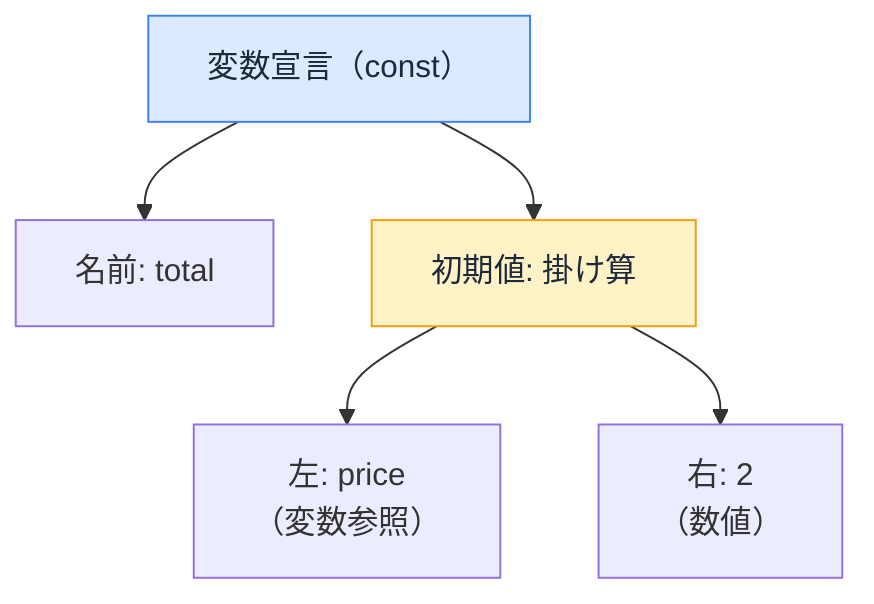

# ツールがコードを読む仕組み — AST という共通言語

## 今日のゴール

- Lint・コンパイラ・フォーマッタ・バンドラが AST という同じ仕組みでコードを読んでいると知る
- AST が「コードを木構造に変換したもの」だと知る
- バラバラだったツールが、高速パーサの共有で統合に向かっていると知る

## コードに触るツールたち

開発中、コードはいくつものツールを通ります。

- **Lint**: 「この変数は使われていません」と波線を出す
- **コンパイラ**: JSX を関数呼び出しに変換する。React Compiler がメモ化を自動挿入する
- **フォーマッタ**: 保存した瞬間にインデントやクォートが揃う
- **バンドラ**: 使われていないコードを振り落とす（tree shaking）

検査、変換、整形、削除。やることはバラバラなのに、どのツールもコードの**意味**を理解しているように見えます。その共通の仕組みが **AST** です。

## AST — コードを「木」として読む

ツールにとって、コードはただの文字列ではありません。解析（パース）すると、**入れ子の構造を持った木**に変換できます。これを **AST**（Abstract Syntax Tree、抽象構文木）と呼びます。

```js
const total = price * 2;
```

この 1 行は、おおよそこんな木になります。



実際にパーサが出力する AST は、こんな JSON です。

```json
{
  "type": "VariableDeclaration",
  "kind": "const",
  "declarations": [{
    "type": "VariableDeclarator",
    "id": { "type": "Identifier", "name": "total" },
    "init": {
      "type": "BinaryExpression",
      "operator": "*",
      "left": { "type": "Identifier", "name": "price" },
      "right": { "type": "Literal", "value": 2 }
    }
  }]
}
```

全部読む必要はありません。`"type": "VariableDeclaration"` や `"name": "price"` が目に入れば十分です。コードの各部分が `type` と値のペアで構造化されていて、ツールはこの構造をたどって処理しています。

文字列のままでは見えなかった「これは変数宣言」「これは掛け算」「price は変数の参照」という**意味の構造**が、木の形で機械に見えるようになります。

この木があれば、ツールはコードを実行しなくても構造を理解できます。

## ツールごとの木の使い方

| ツール | 木をどう使うか | 例 |
|--------|--------------|-----|
| Lint（ESLint, Biome, oxlint） | 木を**検査**する | 「宣言があるのに参照がない → 未使用変数」 |
| コンパイラ（Babel, SWC, React Compiler） | 木を**変換**する | 「JSX のノードを関数呼び出しのノードに置き換える」 |
| フォーマッタ（Prettier, Biome） | 木から**整形して書き戻す** | 「構造は変えず、インデントとクォートだけ統一」 |
| バンドラ（Webpack, Turbopack, Rolldown） | 木を**たどって不要な枝を削る** | 「import されているが使われていない関数を除去」 |

**どれもコードを実行せずに処理している**点は同じです。AST があれば構造が完全に見えるので、実行しなくても判断できます。

一方、**実行しないと分からないこと**（この計算結果は正しいか、API は本当に動くか）は AST ベースのツールの守備範囲外です。構造の問題はツール、振る舞いの問題はテスト、という分担になっています。

## バラバラだったツールの統合

従来の JavaScript 開発では、ツールがバラバラでした。

- Lint は ESLint、整形は Prettier、コンパイルは Babel、バンドルは Webpack

それぞれが独自に AST をパースしていて、同じコードを何度も木に変換する無駄がありました。設定ファイルも `.eslintrc` / `.prettierrc` / `babel.config.js` / `webpack.config.js` と散らばります。

<figure class="d098-fig">
<svg class="d098-svg" viewBox="0 0 520 370" role="img" aria-label="従来はツールごとに毎回パースしていたが、新世代は1回パースして使い回す対比図">
  <!-- 従来 -->
  <text x="260" y="20" class="d098-title">従来: ツールごとに毎回パース</text>
  <rect x="10" y="35" width="100" height="130" rx="8" class="d098-src"/>
  <text x="60" y="80" class="d098-src-label">ソース</text>
  <text x="60" y="100" class="d098-src-label">コード</text>
  <!-- 4本の矢印とパース -->
  <line x1="110" y1="60" x2="200" y2="45" class="d098-arrow"/>
  <line x1="110" y1="80" x2="200" y2="75" class="d098-arrow"/>
  <line x1="110" y1="105" x2="200" y2="105" class="d098-arrow"/>
  <line x1="110" y1="130" x2="200" y2="135" class="d098-arrow"/>
  <text x="155" y="38" class="d098-parse">パース</text>
  <text x="155" y="68" class="d098-parse">パース</text>
  <text x="155" y="100" class="d098-parse">パース</text>
  <text x="155" y="132" class="d098-parse">パース</text>
  <!-- AST x4 -->
  <rect x="200" y="30" width="60" height="26" rx="4" class="d098-ast"/>
  <text x="230" y="48" class="d098-ast-label">AST</text>
  <rect x="200" y="62" width="60" height="26" rx="4" class="d098-ast"/>
  <text x="230" y="80" class="d098-ast-label">AST</text>
  <rect x="200" y="94" width="60" height="26" rx="4" class="d098-ast"/>
  <text x="230" y="112" class="d098-ast-label">AST</text>
  <rect x="200" y="126" width="60" height="26" rx="4" class="d098-ast"/>
  <text x="230" y="144" class="d098-ast-label">AST</text>
  <!-- 矢印 → ツール -->
  <line x1="260" y1="43" x2="310" y2="43" class="d098-arrow"/>
  <line x1="260" y1="75" x2="310" y2="75" class="d098-arrow"/>
  <line x1="260" y1="107" x2="310" y2="107" class="d098-arrow"/>
  <line x1="260" y1="139" x2="310" y2="139" class="d098-arrow"/>
  <!-- ツール名 -->
  <rect x="310" y="30" width="100" height="26" rx="4" class="d098-tool"/>
  <text x="360" y="48" class="d098-tool-label">ESLint 検査</text>
  <rect x="310" y="62" width="100" height="26" rx="4" class="d098-tool"/>
  <text x="360" y="80" class="d098-tool-label">Prettier 整形</text>
  <rect x="310" y="94" width="100" height="26" rx="4" class="d098-tool"/>
  <text x="360" y="112" class="d098-tool-label">Babel 変換</text>
  <rect x="310" y="126" width="100" height="26" rx="4" class="d098-tool"/>
  <text x="360" y="144" class="d098-tool-label">Webpack バンドル</text>
  <!-- ×4 強調 -->
  <text x="460" y="100" class="d098-count">×4</text>

  <!-- 区切り線 -->
  <line x1="20" y1="190" x2="500" y2="190" class="d098-divider"/>

  <!-- 新世代 -->
  <text x="260" y="215" class="d098-title-new">新世代: 1 回パースして使い回す</text>
  <rect x="10" y="235" width="100" height="100" rx="8" class="d098-src"/>
  <text x="60" y="275" class="d098-src-label">ソース</text>
  <text x="60" y="295" class="d098-src-label">コード</text>
  <!-- 1本の矢印 -->
  <line x1="110" y1="285" x2="175" y2="285" class="d098-arrow-new"/>
  <text x="142" y="275" class="d098-parse-new">パース</text>
  <!-- AST 1つ（大きめ） -->
  <rect x="175" y="260" width="70" height="50" rx="8" class="d098-ast-new"/>
  <text x="210" y="290" class="d098-ast-label-new">AST</text>
  <!-- 4本の矢印 -->
  <line x1="245" y1="272" x2="310" y2="248" class="d098-arrow-new"/>
  <line x1="245" y1="280" x2="310" y2="278" class="d098-arrow-new"/>
  <line x1="245" y1="290" x2="310" y2="308" class="d098-arrow-new"/>
  <line x1="245" y1="298" x2="310" y2="338" class="d098-arrow-new"/>
  <!-- ツール名 -->
  <rect x="310" y="235" width="100" height="26" rx="4" class="d098-tool-new"/>
  <text x="360" y="253" class="d098-tool-label-new">Lint 検査</text>
  <rect x="310" y="265" width="100" height="26" rx="4" class="d098-tool-new"/>
  <text x="360" y="283" class="d098-tool-label-new">整形</text>
  <rect x="310" y="295" width="100" height="26" rx="4" class="d098-tool-new"/>
  <text x="360" y="313" class="d098-tool-label-new">変換</text>
  <rect x="310" y="325" width="100" height="26" rx="4" class="d098-tool-new"/>
  <text x="360" y="343" class="d098-tool-label-new">バンドル</text>
  <!-- ×1 強調 -->
  <text x="460" y="295" class="d098-count-new">×1</text>
</svg>
</figure>

<style>
.d098-fig { margin: 16px 0; text-align: center; background: #f8fafc; border-radius: 8px; padding: 12px; }
.d098-svg { width: 100%; max-width: 540px; height: auto; }
.d098-title { font-size: 13px; font-weight: bold; fill: #92400e; text-anchor: middle; }
.d098-title-new { font-size: 13px; font-weight: bold; fill: #166534; text-anchor: middle; }
.d098-src { fill: #e2e8f0; stroke: #64748b; }
.d098-src-label { font-size: 13px; fill: #1e293b; text-anchor: middle; font-weight: bold; }
.d098-arrow { stroke: #d97706; stroke-width: 1.5; marker-end: url(#d098-head); }
.d098-arrow-new { stroke: #16a34a; stroke-width: 2; marker-end: url(#d098-head-new); }
.d098-parse { font-size: 10px; fill: #92400e; text-anchor: middle; }
.d098-parse-new { font-size: 11px; fill: #166534; text-anchor: middle; font-weight: bold; }
.d098-ast { fill: #fef3c7; stroke: #d97706; }
.d098-ast-label { font-size: 11px; fill: #78350f; text-anchor: middle; font-weight: bold; }
.d098-ast-new { fill: #bbf7d0; stroke: #16a34a; stroke-width: 2; }
.d098-ast-label-new { font-size: 14px; fill: #14532d; text-anchor: middle; font-weight: bold; }
.d098-tool { fill: #fecaca; stroke: #dc2626; }
.d098-tool-label { font-size: 11px; fill: #7f1d1d; text-anchor: middle; }
.d098-tool-new { fill: #bfdbfe; stroke: #2563eb; }
.d098-tool-label-new { font-size: 11px; fill: #1e3a5f; text-anchor: middle; }
.d098-count { font-size: 28px; fill: #dc2626; font-weight: bold; text-anchor: middle; }
.d098-count-new { font-size: 28px; fill: #16a34a; font-weight: bold; text-anchor: middle; }
.d098-divider { stroke: #cbd5e1; stroke-width: 1; stroke-dasharray: 6 4; }
</style>

<svg style="position:absolute;width:0;height:0">
  <defs>
    <marker id="d098-head" markerWidth="8" markerHeight="6" refX="8" refY="3" orient="auto">
      <path d="M0,0 L8,3 L0,6" fill="none" stroke="#d97706" stroke-width="1.2"/>
    </marker>
    <marker id="d098-head-new" markerWidth="8" markerHeight="6" refX="8" refY="3" orient="auto">
      <path d="M0,0 L8,3 L0,6" fill="none" stroke="#16a34a" stroke-width="1.2"/>
    </marker>
  </defs>
</svg>

今、このバラバラな状態が **Rust 製の高速パーサを共有する** 形で統合に向かっています。

- **Biome**: Lint と整形を 1 つのツールに統合。1 回のパースで検査と整形を両方やる
- **OXC**: 高速パーサを核に、Linter（oxlint）・トランスパイラ・リゾルバを提供。バンドラの **Rolldown**（Vite の次期エンジン）もこのパーサを使う

| | 従来（JS 製・個別） | 新世代（Rust 製・共有） |
|---|---|---|
| Lint | ESLint | Biome, oxlint |
| 整形 | Prettier | Biome |
| コンパイル | Babel | SWC, oxc-transform |
| バンドル | Webpack | Turbopack, Rolldown |

ツールの名前は入れ替わっていきますが、**AST という共通言語は変わりません**。むしろ「同じパーサ、同じ AST を使い回す」方向に進んでいるので、個々のツール名を覚えるより AST の仕組みを知っておく方が長持ちします。

## まとめ

- Lint・コンパイラ・フォーマッタ・バンドラは、すべてコードを AST（構文の木）にしてから処理する
- 検査・変換・整形・削除と目的は違うが、コードを実行せず構造で判断する点は共通
- ツール名は世代交代しても AST は変わらない。パーサ共有で統合が進んでいる
