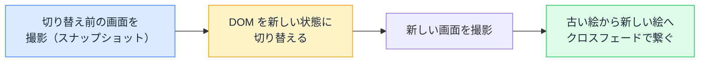

# View Transitions — 画面の切り替えが「ぬるっ」と繋がる新標準

## 今日のゴール

- View Transitions が「前後の画面を撮影して繋ぐ」仕組みだと知る
- CSS だけでページ遷移にアニメーションが付く時代になったと知る
- 使いどころと使いすぎの境界を知る

## アプリのような画面切り替え

ネイティブアプリでは、一覧の写真をタップすると、その写真が**滑らかに拡大しながら**詳細画面に変わる演出が当たり前です。Web では長らく、ページが切り替わる瞬間は「パッ」と入れ替わるだけでした。

この差を埋める仕組みがブラウザ標準に入りました。**View Transitions API** です。うまく使うと、Web のページ遷移がアプリのような連続感を持ちます。

## 仕組み — 前後のスクリーンショットを繋ぐ

View Transitions の発想は、拍子抜けするほど率直です。



1. ブラウザが**切り替え前の見た目**を画像として保持する
2. DOM が新しい状態に切り替わる（ここは一瞬で完了している）
3. **古い絵と新しい絵の間**を、アニメーションで繋いで見せる

つまりアニメーションしているのは DOM そのものではなく、**前後のスナップショット**です。切り替え処理自体は普通に終わっていて、見せ方だけが滑らかになる。既存のページ構造を壊さずに後付けできるのは、この設計のおかげです。

## 同じ要素を「同一人物」として繋ぐ

既定のクロスフェードに加えて、この API の見せ場が**要素単位の繋がり**です。

前の画面のサムネイル画像と、次の画面の大きな画像に、CSS で**同じ名前**を付けます。

```css
/* 一覧のサムネイルにも、詳細の大きな画像にも、同じ名前を付ける */
.product-photo {
  view-transition-name: product-42;
}
```

すると、切り替え時にブラウザが「**この 2 つは同一人物だ**」と認識し、**位置とサイズの変化を自動で補間**してくれます。サムネイルがぬるっと拡大して詳細画像になる、あのアプリ的な演出が、CSS の 1 行で実現します。

「同じ名前 = 同一人物として扱う」という発想は、React の key が「同じ key = 同じもの」として状態を引き継ぐのとよく似ています。画面をまたぐ「これは同じものですよ」の宣言です。

## ページ遷移にも、ページ内にも

View Transitions には 2 つの使い方があります。

| 種類 | 対象 | 有効化 |
|------|------|--------|
| ページ内（Same-Document） | SPA の画面切り替え、並べ替え、タブ | JS で `document.startViewTransition(() => {...})` |
| **ページ間（Cross-Document）** | **通常のページ遷移（MPA）** | **CSS を書くだけ** |

ページ間のほうは、遷移の双方のページにこの CSS があれば有効になります。

```css
@view-transition {
  navigation: auto;
}
```

「JavaScript ゼロで、リンククリックの遷移がクロスフェードになる」。かつて SPA の専売特許だった滑らかな遷移が、普通のリンクでも手に入る時代になりつつあります。なお対応ブラウザは広がっている途中の機能なので、**未対応ブラウザでは単に今まで通りパッと切り替わる**だけです。アニメーションは無くても機能は完全に動く、という安全な後方互換の形（プログレッシブエンハンスメント）になっています。

## 使いどころと、使いすぎ

動きの設計には、アニメーション一般と同じ規律が要ります。

- **向いている**: 一覧 → 詳細の連続性（どれを開いたかが視覚的に分かる）、並べ替え（どこへ移動したか追える）。**動きが情報を持つ**場面
- **向いていない**: すべての遷移に長いアニメーション。毎回 0.5 秒待たされる演出は、2 回目から邪魔になる

また、動きに酔いやすい人のための OS 設定（「視差効果を減らす」）を尊重するのが作法です。CSS の `prefers-reduced-motion` でアニメーションを無効化する分岐を入れます。

```css
@media (prefers-reduced-motion: reduce) {
  ::view-transition-group(*),
  ::view-transition-old(*),
  ::view-transition-new(*) {
    animation: none !important;
  }
}
```

「見せ方の話にもアクセシビリティの配慮がある」と知っていることが、演出の提案を一段プロフェッショナルにします。

::: tip React にも統合が進んでいる
この API はブラウザ標準ですが、React 19.2 以降では React 側からの統合サポートも追加されています。フレームワークのアップデート情報で「View Transitions 対応」という言葉を見かけたら、今日のこの仕組みのことです。
:::

## まとめ

- View Transitions は前後のスナップショットを繋いで見せる標準 API
- view-transition-name で「同一人物」を宣言すると、位置とサイズが自動補間される
- ページ間は CSS だけで有効化できる。未対応ブラウザでは普通の遷移に戻るだけ
- 動きが情報を持つ場面に絞る。prefers-reduced-motion への配慮が作法
