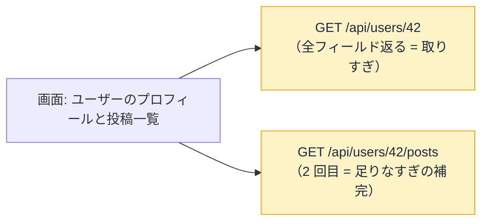

# REST と GraphQL — API の「形」はなぜ 2 派あるのか

## 今日のゴール

- REST の「リソース × メソッド」という設計を知る
- GraphQL が「必要なものだけ指定して取る」仕組みだと知る
- 「取りすぎ・足りなすぎ」問題が GraphQL を生んだ構造的理由を知る

## API にも「形」がある

アプリがサーバーからデータを取るとき、「どの URL に、どんな形式でリクエストを送り、どんな形式で返ってくるか」の約束事が要ります。この約束事の設計スタイルが、大きく 2 派に分かれています。

## REST — リソースに URL を付ける

**REST**（Representational State Transfer）は、**データの種類（リソース）ごとに URL を割り当て、HTTP メソッドで操作を区別する**スタイルです。

| やりたいこと | メソッド | URL |
|------------|--------|-----|
| ユーザー一覧を取得 | GET | `/api/users` |
| ユーザー 1 人を取得 | GET | `/api/users/42` |
| ユーザーを作成 | POST | `/api/users` |
| ユーザーを更新 | PATCH | `/api/users/42` |
| ユーザーを削除 | DELETE | `/api/users/42` |

URL が「**何を**」、メソッドが「**どうする**」を表す。この組み合わせで API の全操作が設計されます。

REST の強みは**シンプルさと予測可能性**です。「商品の API はたぶん `/api/products` だろう」「1 件取るなら `/api/products/123` だろう」と、パターンから URL が推測できます。ブラウザのアドレスバーに URL を打つだけでデータが見られるのも、GET が「何も変えない」約束だからです。

### REST の「取りすぎ・足りなすぎ」問題

ところが REST にはアプリが複雑になるほど効いてくる構造的な問題があります。

**取りすぎ（over-fetching）**: ユーザーの名前とアイコンだけ欲しいのに、`/api/users/42` は住所も設定も全部返す。不要なデータの転送が積み上がります。

**足りなすぎ（under-fetching）**: ユーザー情報と、そのユーザーの投稿一覧を 1 画面に出したい。REST では `/api/users/42` と `/api/users/42/posts` の**2 回のリクエスト**が必要で、画面が増えるほどリクエスト数が増えます。



## GraphQL — 必要なものだけ指定して取る

**GraphQL**（Graph Query Language）は、2015 年に Facebook（現 Meta）が公開した、この問題に対する構造的な回答です。

設計の核心は 1 つ。「**何が欲しいかを、クライアントが宣言する**」。

```graphql
query {
  user(id: 42) {
    name
    avatarUrl
    posts(first: 5) {
      title
      publishedAt
    }
  }
}
```

このクエリは「ユーザー 42 の名前とアイコン、そして投稿の最初の 5 件のタイトルと日付」を**1 回のリクエストで**宣言しています。サーバーは**宣言された分だけ**を返します。

```json
{
  "data": {
    "user": {
      "name": "田中",
      "avatarUrl": "https://...",
      "posts": [
        { "title": "初めての記事", "publishedAt": "2026-06-01" },
        ...
      ]
    }
  }
}
```

- 住所や設定は返ってこない（取りすぎが消える）
- ユーザーと投稿が 1 回で届く（足りなすぎが消える）

URL はエンドポイント 1 つ（`/graphql`）で、何を取るかは URL ではなくクエリの中身で決まります。REST の「URL = リソース」とは発想が根本的に違います。

## ではどちらを使うのか

「GraphQL のほうが良いなら全部 GraphQL では」とならないのは、**GraphQL にもコストがある**からです。

| | REST | GraphQL |
|---|------|---------|
| 学習コスト | URL + メソッドで直感的 | クエリ言語の学習が要る |
| キャッシュ | URL ベースで HTTP キャッシュが自然に効く | クエリの中身に依存するため、キャッシュ戦略が複雑 |
| セキュリティ | エンドポイントごとに制御しやすい | 「任意のクエリを投げられる」ための保護が追加で要る |
| 向いている規模 | 小〜中規模、単純な CRUD | **複数の画面が異なるデータの組み合わせを求める大規模アプリ** |

多くのプロジェクトでは REST で十分であり、Next.js の配属先でもまず REST の API を扱うことになる可能性が高い。GraphQL は「取りすぎ・足りなすぎが構造的に頻発する規模」で本領を発揮します。

## 知っていると効く場面

どちらの設計かは**会話で当然のように出てくる**ので、「聞いたことがある」だけで参加力が変わります。

- チームの会話で「うちは REST」「GraphQL に移行したい」と聞いたとき、違いが分かる
- AI に API を作らせるとき、「REST の `/api/products` で」と指定できる
- 取りすぎ・足りなすぎのパターンを言葉にできると、「BFF（Backend for Frontend）を挟むか」「GraphQL にするか」というアーキテクチャの話についていける

## まとめ

- REST は「リソース × メソッド」。URL がリソース、HTTP メソッドが操作。シンプルで予測可能
- GraphQL は「欲しいものをクエリで宣言」。取りすぎ・足りなすぎを構造的に解消
- REST で十分な規模がほとんど。GraphQL は画面ごとに異なるデータの組み合わせが頻発する場面
