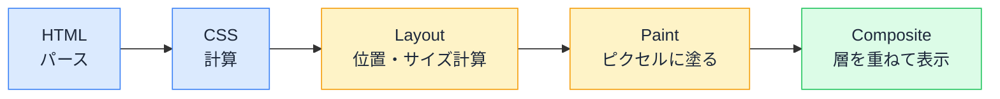

# ブラウザレンダリングパイプライン — HTML が画面の絵になるまで

## 今日のゴール

- ブラウザが HTML を画面に変える 5 つのステップを知る
- 「レイアウトが走る操作」と「そうでない操作」の違いを知る
- 画面のカクつきを「reflow / repaint」の言葉で説明できるようになる

## HTML は、そのまま見えているわけではない

ブラウザは HTML を受け取ったらすぐ画面に出す、と思われがちですが、実際には**5 つの工程**を経て「絵」に変換しています。この変換の流れを**レンダリングパイプライン**と呼びます。

パイプラインの全体像を先に見ます。

### 1. HTML パース → DOM ツリー

HTML をタグの入れ子構造（DOM ツリー）に変換します。JavaScript が操作する DOM は、このステップで作られます。

### 2. CSS 計算 → CSSOM + スタイル付きツリー

すべての CSS ルール（外部ファイル、style タグ、インライン）を読み込み、各要素に「最終的にどのスタイルが適用されるか」を確定します（カスケードと詳細度の勝負が起きるのはここです）。

### 3. Layout（レイアウト / reflow）

スタイルが確定したら、各要素の**位置とサイズ**を計算します。「この div は画面の左上から何 px の位置に、幅何 px で」。ここが**いちばん重い**工程です。1 つの要素のサイズが変わると、周囲の要素の位置も連鎖して再計算されるからです。この再計算を **reflow** と呼びます。

### 4. Paint（ペイント / repaint）

位置が決まったら、各要素を**ピクセルに塗ります**。テキストの描画、背景色の塗り、枠線、影。色や背景だけの変更ならレイアウトは不要で、ここから始まります。この再塗りを **repaint** と呼びます。

### 5. Composite（合成）

複数の層（レイヤー）を重ね合わせて最終的な画面を作ります。`transform` や `opacity` のアニメーションが軽いのは、**レイアウトもペイントもスキップして、この合成だけで済む**からです。GPU が担当するため非常に高速です。

## 変更の種類で、走る工程が違う

重要なのは、**何を変えたかによって、パイプラインのどこから再実行されるかが変わる**ことです。

| 変更内容 | 走る工程 | 重さ |
|---------|---------|------|
| 要素の追加・削除、幅・高さ・位置の変更 | **Layout → Paint → Composite** | **重い** |
| 色、背景、影の変更 | **Paint → Composite** | 中 |
| `transform`、`opacity` の変更 | **Composite のみ** | **軽い** |

「アニメーションは `transform` を使え」という定石の理由はこれです。`left` や `top` をアニメーションすると毎フレーム Layout が走りますが、`transform: translateX(...)` なら Composite だけで済む。同じ「左に動く」でも、**パイプラインのどこから始まるかでコストが桁違いに変わる**のです。

## 画面のカクつきが起きる仕組み

スクロールやアニメーションがカクつく原因の多くは、**Layout が毎フレーム走っている**ことです。ブラウザは 1 秒間に 60 回画面を更新しようとしますが（60fps）、1 回の更新に使える時間は約 16 ミリ秒しかありません。その中で Layout が走ると、16ms に収まらずフレームが落ちます。

DevTools の Performance タブで録画すると、各フレームで Layout / Paint / Composite にどれだけ時間がかかっているかを可視化できます。紫色の「Layout」が大きいフレームが、カクつきの犯人です。

## React と reflow

React は仮想 DOM を使って「変わった部分だけを実際の DOM に反映する」ことで、**不要な reflow を最小化**しています。DOM の操作回数が減れば、Layout が走る回数も減る。仮想 DOM の恩恵がパフォーマンスとして現れるのは、このパイプラインの上での話です。

ただし React を使っていても、**CSS の書き方で reflow を引き起こす**ことはあります。たとえばスクロールイベントで要素の高さを読み取り直後に書き換える、という操作は「強制レイアウト」と呼ばれ、ブラウザに毎回 Layout を強制します。

## AI のコードを見るポイント

- アニメーションが `left` / `top` / `width` で動いていたら → 「**`transform` で書き直せない？**」と提案する
- CSS transitions で画面がカクつくなら → 「**Layout を走らせるプロパティをアニメーションしていないか**」を DevTools の Performance で確認する
- 一覧表示が重いなら → 「**DOM 要素の数が多すぎてLayout のコストが膨張していないか**」（仮想スクロールの検討）

「reflow がボトルネックかもしれない」と言えるだけで、パフォーマンス改善の的を絞れます。

## まとめ

- ブラウザは HTML を 5 ステップ（パース → CSS 計算 → Layout → Paint → Composite）で画面に変える
- 何を変えたかで再実行の起点が変わり、Layout は重く Composite は軽い
- `transform` / `opacity` のアニメーションが軽い理由は Composite だけで済むから
- 画面のカクつきは Layout の重さで、「reflow がボトルネック」と言えると改善の的が絞れる
