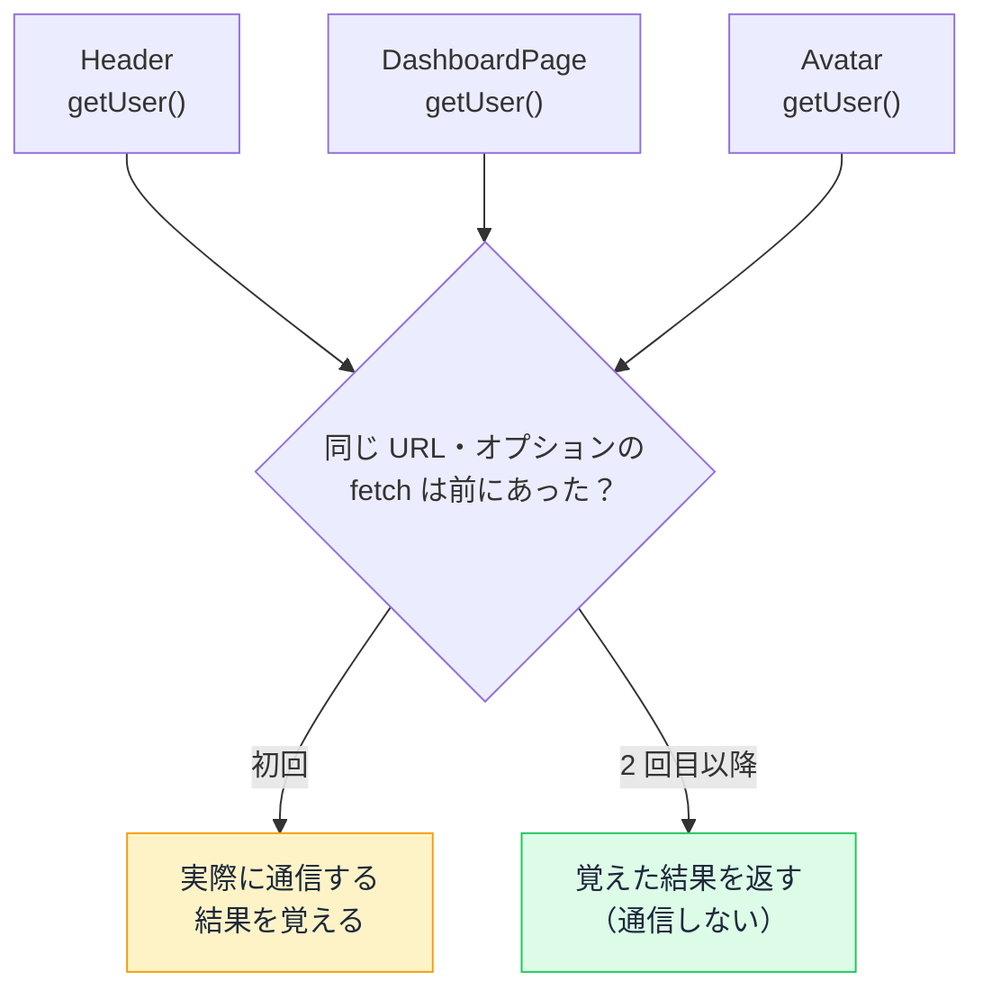

# Request Memoization — 1 回の描画で同じ取得を何度も走らせない仕組み

## 今日のゴール

- 1 つの画面の中で同じ取得が何度も走る状況があると知る
- Next.js が `fetch` を自動でまとめ、`fetch` 以外は `cache()` で包むと知る
- 重複排除（cache）と使い回し（"use cache"）が別物だと区別できる

## あちこちで同じデータが要る

App Router の画面は、レイアウト・ページ・その中の複数のコンポーネントが組み合わさってできています。問題は、それぞれが**同じデータを独立して必要とする**ことがある点です。

たとえば「ログイン中のユーザー情報」を考えます。

- ヘッダー（レイアウト）はユーザー名を出したい
- ページ本体は権限を見て表示を切り替えたい
- サイドバーのアバターもユーザー情報がいる

各コンポーネントがそれぞれログインユーザーを取得すると、こうなります。素直に書くと、どれも自分で取得処理を呼びます。

```tsx
// app/components/Header.tsx
async function Header() {
  const user = await getUser(); // ← 取得
  return <header>こんにちは、{user.name} さん</header>;
}

// app/dashboard/page.tsx
async function DashboardPage() {
  const user = await getUser(); // ← また取得
  return user.isAdmin ? <AdminPanel /> : <UserPanel />;
}

// app/components/Avatar.tsx
async function Avatar() {
  const user = await getUser(); // ← さらに取得
  return ;
}
```

`getUser()` が 3 回呼ばれています。素朴に実装すれば、**1 つの画面を描くだけで同じ問い合わせが 3 回**取得元に飛ぶことになります。

## バケツリレーを避けると重複が生まれる

「だったら 1 回だけ取って props で渡せばいい」と思うかもしれません。それが昔ながらの解決策、**バケツリレー**（一番上で取得して、子へ props（親から子に渡す値）で順に渡す）です。

```tsx
// 一番上で取得して、下へ下へと渡していく
async function Layout() {
  const user = await getUser();
  return (
    <>
      <Header user={user} />
      <Main user={user} />
    </>
  );
}
```

ただし App Router の設計思想は逆方向です。**各コンポーネントが必要なデータを自分で取りに行く**ほうが、依存関係がそのコンポーネント内に閉じて読みやすくなります。

中継するだけの親に `user` を持たせずに済みます。

つまり「自分で取りに行く設計」と「重複させたくない」は、普通ならぶつかります。この矛盾を消すのが **Request Memoization（リクエストメモ化）** です。

## fetch は自動でまとまる

Next.js は、`fetch` で同じデータを取りに行くコードを**自動でまとめます**。同じ URL・同じオプションの `fetch`（GET / HEAD）なら、1 回の描画の中で実際の通信は **1 回だけ**走り、残りはその結果を共有します。

```tsx
// lib/user.ts
export async function getUser() {
  // この fetch を何回呼んでも、1 回の描画では通信は 1 回にまとまる
  const res = await fetch("https://api.example.com/me");
  if (!res.ok) throw new Error("ユーザー情報の取得に失敗しました");
  return res.json();
}
```

先ほどの `Header` / `DashboardPage` / `Avatar` は、この `getUser()` を呼ぶだけで構いません。**3 回呼んでも通信は 1 回**になります。



これを成立させるのに、**特別な記述は何もいりません**。Next.js が `fetch` を拡張していて、同じ呼び出しを覚えておく仕組みが最初から組み込まれています。

普段どおり `fetch` を書くだけで、重複は勝手に消えます。

## fetch 以外は cache() で包む

自動でまとまるのは `fetch` だけです。たとえば Redis などの専用クライアントを使う取得は、`fetch` を経由しないので**自動メモ化が効きません**。

ログインユーザーの情報を Redis に置いていて、そこから読むケースを考えます。

```ts
// lib/user.ts
import { Redis } from "ioredis";

const redis = new Redis();

// fetch を使わないので、このままだと呼ぶたびに Redis へ問い合わせる
export async function getUser(id: string) {
  const data = await redis.get(`user:${id}`);
  return data ? JSON.parse(data) : null;
}
```

ここで使うのが React の **`cache()`** 関数です。取得関数を `cache()` で包むと、`fetch` と同じ重複排除が手に入ります。

同じ引数で呼ばれた 2 回目以降は、実際の問い合わせをせずに結果を共有します。

```ts
// lib/user.ts
import { cache } from "react";
import { Redis } from "ioredis";

const redis = new Redis();

// cache() で包むと、同じ引数の呼び出しは 1 回にまとまる
export const getUser = cache(async (id: string) => {
  const data = await redis.get(`user:${id}`);
  return data ? JSON.parse(data) : null;
});
```

これで `getUser(userId)` を各コンポーネントが何度呼んでも、1 回の描画では Redis への問い合わせは 1 回です。

`fetch` の自動メモ化と、`cache()` による手動の重複排除は、**やっていることが同じ**（1 回の描画で重複を消す）です。違いは、Next.js が勝手にやってくれるか、自分で包むかだけです。

| 取得の手段 | 重複排除のしかた |
|-----------|-----------------|
| `fetch`（GET / HEAD） | 自動。何も書かなくてよい |
| Redis などの専用クライアント | `cache()` で関数を包む |

## cache() と "use cache" は別物

ここで混同しやすい注意点があります。名前のよく似た 2 つのキャッシュは、**目的も寿命も全く別**です。

| | React の `cache()` | Next.js の `"use cache"` |
|---|---|---|
| 目的 | 1 回の描画の中で**重複を消す** | リクエストをまたいで結果を**使い回す** |
| 寿命 | その 1 リクエストが終われば消える | リクエストをまたいで残る（永続） |
| 鮮度との関係 | 無関係 | あり（古い/新しいを管理する） |

`cache()` は「いま描いているこの 1 枚の画面の中だけ」で効きます。画面を描き終われば中身は捨てられ、次のアクセスはまっさらな状態から始まります。

あくまで重複を消すための、その場限りの仕組みです。

一方の `"use cache"` は、一度作った結果をリクエストをまたいで保存し、次のアクセスでも使い回すためのものです。こちらは「保存した結果が古くなる」問題と向き合う必要があり、鮮度を管理する道具（`fetch` の `next: { revalidate }` や `cacheLife` など）とセットで使います。

名前が似ているせいで AI も人間も取り違えますが、**重複排除なら `cache()`、使い回しなら `"use cache"`** と覚えておけば区別できます。

## 鮮度の話には絡まない

Request Memoization でよくある誤解が「これもキャッシュなら、古いデータが出続けるのでは」というものです。ですが、**Request Memoization は鮮度の問題に一切絡みません**。

理由は寿命にあります。

- 効くのは 1 回の描画（1 リクエスト）の中だけ
- 描き終われば中身は消える
- 次のアクセスは、また最初の 1 回から取得し直す

つまり「古い結果が残って次に出てしまう」ことが構造上起きません。`revalidate`（保存したキャッシュを更新する仕組み）の対象にもなりません。

Request Memoization がしているのは、**1 枚の画面を組み立てる間に同じ取得が重複しないようにまとめる**、ただそれだけです。

「速くするために古さを我慢する」というキャッシュ特有のトレードオフは、ここにはありません。

## まとめ

- 1 枚の画面で同じ取得が複数箇所から走ることがある
- `fetch` は自動で、それ以外は `cache()` で 1 回にまとめる
- `cache()` は重複排除、`"use cache"` は使い回し（別物）
- 1 リクエストで消えるので、鮮度・revalidate には絡まない
