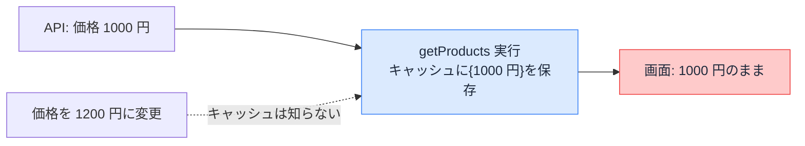

# データキャッシュ — 取得したデータを使い回す

## 今日のゴール

- データキャッシュが「取得結果をサーバーに保存する仕組み」だと知る
- キャッシュなし（毎回新しい）とあり（速いが古びる）の違いを知る
- 再検証でキャッシュを捨てると、次のアクセスで取り直されると知る

## 毎回データを取りに行くページ

商品一覧のように、外部の API やデータベースからデータを取って表示するページを考えます。AI に作らせると、こういうコードが返ってきます。

```tsx
// app/products/page.tsx
export default async function ProductsPage() {
  const res = await fetch("https://api.example.com/products");
  const products = await res.json();
  return <ProductList products={products} />;
}
```

最新の Next.js（`next.config.ts` で `cacheComponents: true`）では、このページは**アクセスのたびに毎回 API を叩きます**。表示は常に最新ですが、見る人が増えるほど API へのリクエストも増えます。人気のページほど、データ元への負荷が積み上がります。

データが頻繁には変わらないのに毎回取りに行くのは無駄です。ここで使うのが**キャッシュ**、「一度取った結果を保存して使い回す」仕組みです。

## "use cache" — 取得結果を保存する

キャッシュしたい処理に `"use cache"` と書きます。

```tsx
// app/products/page.tsx
async function getProducts() {
  "use cache"; // この関数の結果は保存して使い回してよい
  const res = await fetch("https://api.example.com/products");
  if (!res.ok) throw new Error("取得に失敗しました");
  return res.json();
}

export default async function ProductsPage() {
  const products = await getProducts();
  return <ProductList products={products} />;
}
```

`"use cache"` を付けると、Next.js は次のように動きます。

1. 最初の 1 回だけ API を叩く
2. その結果を**サーバーに保存する**（これがデータキャッシュ）
3. 次からは API を叩かず、保存した結果を返す

保存されるのは「ある時点で取得した結果のスナップショット」です。2 回目以降は API を経由しないので、ページは速くなり、データ元の負荷も減ります。

## 保存期間を宣言する

保存しっぱなしだと永遠に古いままになります。「どれくらい新しければよいか」を `cacheLife` で宣言します。

```tsx
import { cacheLife } from "next/cache";

async function getProducts() {
  "use cache";
  cacheLife("hours"); // 数時間は使い回してよい
  const res = await fetch("https://api.example.com/products");
  if (!res.ok) throw new Error("取得に失敗しました");
  return res.json();
}
```

`"seconds"` / `"minutes"` / `"hours"` / `"days"` といった**業務的な鮮度**で指定します。「在庫数は秒単位で正確に」「会社概要は日単位でいい」という要件が、そのままコードになります。期限が切れると、次のアクセスのタイミングで取り直されます。

## キャッシュは古くなる

`cacheLife` は時間で区切る方法ですが、弱点があります。`cacheLife("hours")` の商品一覧で価格を変更しても、**最悪数時間、古い価格が表示され続けます**。



「更新したのに画面が変わらない」の正体がこれです。データ元は新しくなっているのに、保存済みのスナップショットが古いまま返り続けています。

## 再検証 — 変えた瞬間に捨てる

時間切れを待たず、**データを変えた側からキャッシュを捨てる**のが再検証です。価格を更新する処理（Server Action、サーバー側で動く関数）の中で `revalidatePath` を呼びます。

```ts
// app/admin/actions.ts
"use server";

import { revalidatePath } from "next/cache";

export async function updatePrice(formData: FormData) {
  await fetch("https://api.example.com/products/price", {
    method: "POST",
    body: formData,
  });

  revalidatePath("/products"); // /products のキャッシュを捨てる
}
```

`revalidatePath("/products")` で、`/products` のために保存していたデータキャッシュが捨てられます。次に `/products` が開かれたとき、`getProducts()` が実行し直され、新しい価格で保存し直されます。時間切れを待つ必要はありません。

> パスではなく**名札**で捨てる `revalidateTag` もあります。`cacheTag("products")` で取得側に名札を付けておき、更新側で `revalidateTag("products")` と呼ぶと、その名札の付いたキャッシュだけを捨てられます。複数のページで同じデータを使っているときに便利です。

## なし・あり・再検証

このレッスンで見た 3 つの状態を並べます。

| 状態 | 動き | 鮮度 | 速さ |
|------|------|------|------|
| キャッシュなし | 毎回 API を叩く | 常に最新 | 遅い・負荷大 |
| `"use cache"` あり | 保存した結果を使い回す | 古びる | 速い |
| 再検証 | 捨てて次回取り直す | 変えた直後に最新へ | 速さは維持 |

「速さ」と「新しさ」は引っ張り合いです。`"use cache"` で速くした分を、再検証で「変わったときだけ最新に戻す」のが基本の組み立てです。

なお、Next.js にはここで扱ったデータの保存以外にも、組み立てた HTML の保存やブラウザ側の保存など、段階の違うキャッシュがあります。このレッスンでは「取得したデータの箱」に絞っています。

## まとめ

- データキャッシュは取得結果のスナップショットをサーバーに保存する仕組み
- 速くなる代わりに、保存中に元データが変わると古びる
- `cacheLife` は時間で、`revalidatePath` は変えた瞬間に捨てる
- 速さ（キャッシュ）と新しさ（再検証）はセットで設計する
