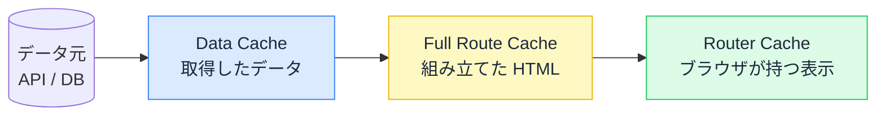

# キャッシュと再検証 — 「更新したのに画面が変わらない」を直す

## 今日のゴール

- 速さのために結果が使い回され、古い表示が残ることがあると知る
- `revalidatePath` が複数のキャッシュをまとめて捨てていると知る
- 「更新したのに反映されない」をキャッシュの言葉で説明できる

## カートに追加したのに、件数が増えない

買い物サイトで商品を「カートに追加」したのに、画面右上のカートの件数バッヂが「2」のまま変わらない。リロードすると「3」になる。こういう挙動を見たことがあるはずです。

データ（カートの中身）は確かに増えているのに、画面の表示が追いついていません。なぜ「速いはずのサイト」で、こんな食い違いが起きるのか。原因は**キャッシュ**です。

このレッスンは Next.js（App Router）を題材にしますが、「一度作った結果を使い回すと古くなる」という問題と、それを直す考え方は、どんな仕組みでも共通します。

## キャッシュは速さの代償

毎回データ元（API やデータベース）に問い合わせてページを組み立てると、アクセスが増えるほど遅くなります。そこで使うのが**キャッシュ**、つまり「一度作った結果を保存して使い回す」仕組みです。

ただしキャッシュには宿命の問題があります。

- 使い回している間に元のデータが変わると、**古い結果が残り続ける**
- カートに追加しても、保存済みの「2件」の表示がそのまま出る

「速さ」と「新しさ」は引っ張り合いです。Next.js では、この綱引きを**コードで宣言する**設計になっています。

## "use cache" — 結果を保存してよい、の宣言

最新の Next.js（`next.config.ts` で `cacheComponents: true`）では、**デフォルトでは何もキャッシュされません**。アクセスのたびに毎回作り直します。常に新しいですが、その分コストがかかります。

キャッシュしたい処理には、`"use cache"` と書いて明示的に宣言します。

```ts
// app/posts/page.tsx
async function getPosts() {
  "use cache"; // この関数の結果は保存して使い回してよい
  const res = await fetch("https://api.example.com/posts");
  if (!res.ok) throw new Error("取得に失敗しました");
  return res.json();
}

export default async function PostsPage() {
  const posts = await getPosts();
  return <PostList posts={posts} />;
}
```

`"use cache"` を付けると、Next.js は次のように動きます。

1. 最初の 1 回だけ API を叩く
2. その結果を**保存する**
3. 次からは API を叩かず、保存した結果を返す

保存されるのは「ある時点で取得した結果のスナップショット」です。これがキャッシュの実体です。だから元データが変わっても、スナップショットは古いまま返り続けます。

## 保存されるのは 1 種類ではない

ここが「更新したのに変わらない」を分かりにくくしている点です。Next.js が保存している結果は、**段階の違う 3 つ**があります。



| 保存場所 | 何が入っているか | どこにあるか |
|---------|----------------|------------|
| **Data Cache** | 取得した**データ**そのもの | サーバー |
| **Full Route Cache** | データで組み立てた**HTML** | サーバー |
| **Router Cache** | 画面遷移を速くするための**表示の控え** | ブラウザ |

3 つは加工の段階が違うだけで、上流が古ければ下流も古くなる**連鎖**の関係です。データが古ければ HTML も古い。HTML が古ければブラウザの表示も古い。

つまり「カートの件数が変わらない」とき、どれか 1 つを直しても足りないことがあります。3 つまとめて「古いよ」と伝える必要があります。

## revalidatePath — まとめて捨てる

データを更新した後に、「このキャッシュはもう古い」と伝えるのが `revalidatePath` です。Server Action（サーバー側で動く関数）の中で呼びます。

```ts
// app/posts/actions.ts
"use server";

import { revalidatePath } from "next/cache";

export async function createPost(formData: FormData) {
  await fetch("https://api.example.com/posts", {
    method: "POST",
    body: formData,
  });

  revalidatePath("/posts"); // /posts のキャッシュを捨てる
}
```

`revalidatePath("/posts")` の 1 行が、`/posts` に関する**3 つのキャッシュをまとめて**面倒を見ます。

1. `/posts` の **Data Cache** を捨てる（次は API を叩き直す）
2. それに依存する **Full Route Cache** も連動して捨てられる（次は HTML を組み立て直す）
3. ブラウザの **Router Cache** にも「古いよ」と伝わる（次の遷移で取り直す）

開発者は 3 層を個別に意識せず、「このパスのデータを更新した」とだけ伝えればよい。これが `revalidatePath` の役割です。投稿を追加した直後から、一覧に新しい投稿が出るようになります。

## page と layout — どこまで捨てるか

`revalidatePath` には第 2 引数があります。これが冒頭のカートのバッヂに効いてきます。

```ts
revalidatePath(path: string, type?: "page" | "layout"): void
```

| 指定 | 捨てる範囲 |
|------|----------|
| `"page"`（既定） | そのページだけ |
| `"layout"` | そのレイアウト + **配下の全ページ** |

投稿一覧の例は `revalidatePath("/posts")`（既定の `"page"`）で十分でした。一覧ページだけ新しくなればよいからです。

一方、カートの件数バッヂは**ヘッダー（レイアウト）**に置かれます。レイアウトは全ページ共通なので、バッヂの表示はどのページでも使い回されています。

```tsx
// app/layout.tsx
async function getCartCount() {
  "use cache";
  const res = await fetch("https://api.example.com/cart/count");
  const { count } = await res.json();
  return count;
}

export default async function RootLayout({
  children,
}: {
  children: React.ReactNode;
}) {
  const count = await getCartCount();
  return (
    <html lang="ja">
      <body>
        <header>
          <a href="/cart" aria-label={`カート（${count}件）`}>
            <span aria-hidden="true">🛒</span>
            <span>{count}</span>
          </a>
        </header>
        {children}
      </body>
    </html>
  );
}
```

ここで「カートに追加」したときに `"page"` で今いる商品ページだけを捨てても、レイアウトのバッヂは別のページに移ると古いままです。レイアウト共有のデータなので、**レイアウト単位**で捨てる必要があります。

```ts
// app/products/actions.ts
"use server";

import { revalidatePath } from "next/cache";

export async function addToCart(productId: string) {
  await fetch("https://api.example.com/cart", {
    method: "POST",
    body: JSON.stringify({ productId }),
  });

  revalidatePath("/", "layout"); // ルートレイアウト配下すべてのバッヂを更新
}
```

`revalidatePath("/", "layout")` で、ルートレイアウトを共有する全ページのバッヂが最新化されます。冒頭の「件数が増えない」は、ここを `"page"` で済ませていたり、再検証自体を呼んでいなかったりするのが原因です。

> パスに動的な部分（`/products/[id]` など）を含む場合、第 2 引数は必須です。`/products/123` のような実際の値ではなく `/products/[id]` という**ルートの形**を渡すため、ページ単位かレイアウト単位かを Next.js が判断できないからです。

## 従来の書き方との対応

`cacheComponents` を有効にしていないプロジェクト（現状はこちらも多い）では、キャッシュの指定を `"use cache"` ではなく **`fetch` のオプション**で書きます。AI が生成するコードでもよく見る形です。

| やりたいこと | 従来（fetch オプション） | 新（"use cache"） |
|------------|----------------------|------------------|
| 時間で再検証 | `fetch(url, { next: { revalidate: 60 } })` | `cacheLife("minutes")` |
| キャッシュしない | `fetch(url, { cache: "no-store" })` | そもそも `"use cache"` を書かない |

捨てる道具（`revalidatePath`）はどちらのモデルでも共通です。違うのは「箱の作り方」だけです。

なお、従来モデルで `cache: "no-store"` をあちこちに付けると、データが毎回新しくなる代わりに、そのページは**静的な事前生成をやめて毎回サーバーで組み立て直す**動作になります。鮮度は得られますが、静的化による速さを失います。「念のため」で付けると速さだけ削る結果になりがちです。

## 「反映されない」と言われたら

この知識は、定番のトラブル対応でそのまま効きます。「更新したのに画面が変わらない」と言われたとき、見る場所が決まります。

1. その表示の元の処理に `"use cache"`（または `fetch` のキャッシュ指定）はあるか。無ければそもそも毎回新しいので、別の原因
2. 更新処理は `revalidatePath` を呼んでいるか。パスは正しいか
3. その表示はレイアウト共有か。共有なら `"layout"` で捨てているか

「このデータ、更新したら誰がキャッシュを捨てるの？」という問いが、レビューでの一言になります。

## まとめ

- キャッシュは速さの代償。使い回す間に古い表示が残る
- 保存先は Data Cache / Full Route Cache / Router Cache の 3 段で連鎖する
- `revalidatePath` はその 3 つをまとめて捨てる
- レイアウト共有のデータ（カートのバッヂ等）は `"layout"` で配下ごと捨てる
