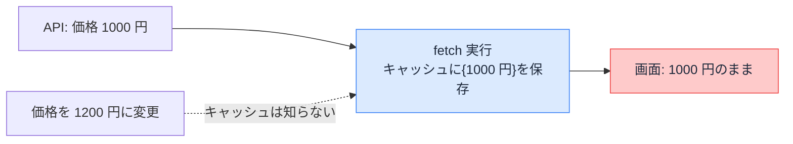

# データキャッシュ — 取得したデータを使い回す

## 今日のゴール

- データキャッシュが「取得結果をサーバーに保存する仕組み」だと知る
- `fetch` のオプションでキャッシュを宣言することを知る
- 再検証でキャッシュを捨てると、次のアクセスで取り直されると知る

## 毎回データを取りに行くページ

商品一覧のように、外部の API からデータを取って表示するページを考えます。AI に作らせると、こういうコードが返ってきます。

```tsx
// app/products/page.tsx
export default async function ProductsPage() {
  const res = await fetch("https://api.example.com/products");
  const products = await res.json();
  return <ProductList products={products} />;
}
```

このページは**アクセスのたびに毎回 API を叩きます**。表示は常に最新ですが、見る人が増えるほど API へのリクエストも増えます。人気のページほど、データ元への負荷が積み上がります。

データが頻繁には変わらないのに毎回取りに行くのは無駄です。ここで使うのが**キャッシュ**、「一度取った結果を保存して使い回す」仕組みです。

## fetch のオプションでキャッシュする

Next.js は `fetch` を拡張していて、キャッシュの指定を**オプションで宣言**できます。今の Next.js では `fetch` はデフォルトではキャッシュされないので、キャッシュしたいときに明示します。

```tsx
async function getProducts() {
  // 1 時間は保存した結果を使い回す
  const res = await fetch("https://api.example.com/products", {
    next: { revalidate: 3600 },
  });
  if (!res.ok) throw new Error("取得に失敗しました");
  return res.json();
}
```

`next: { revalidate: 3600 }` は「この結果は 3600 秒（1 時間）使い回してよい」という宣言です。最初の 1 回だけ API を叩き、その結果を**サーバーに保存**します。次からは保存した結果を返し、1 時間たったら次のアクセスで取り直します。

時間で区切らず、ずっと使い回したいときは `cache: "force-cache"` を指定します。

```tsx
const res = await fetch("https://api.example.com/products", {
  cache: "force-cache",
});
```

保存されるのは「ある時点で取得した結果のスナップショット」です。これがデータキャッシュの実体です。2 回目以降は API を経由しないので、ページは速くなり、データ元の負荷も減ります。

## キャッシュは古くなる

保存した結果はスナップショットなので、元のデータが変わっても古いまま返り続けます。`next: { revalidate: 3600 }` の商品一覧で価格を変更しても、**最悪 1 時間、古い価格が表示され続けます**。



「更新したのに画面が変わらない」の正体がこれです。データ元は新しくなっているのに、保存済みのスナップショットが古いまま返り続けています。

## 再検証 — 変えた瞬間に捨てる

時間切れを待たず、**データを変えた側からキャッシュを捨てる**のが再検証です。まず取得側のキャッシュに名札（タグ）を付けます。

```tsx
async function getProducts() {
  const res = await fetch("https://api.example.com/products", {
    next: { tags: ["products"] }, // この結果に「products」という名札を付ける
  });
  if (!res.ok) throw new Error("取得に失敗しました");
  return res.json();
}
```

価格を更新する処理（Server Action、サーバー側で動く関数）の中で、その名札のキャッシュを捨てます。

```ts
// app/admin/actions.ts
"use server";

import { revalidateTag } from "next/cache";

export async function updatePrice(formData: FormData) {
  await fetch("https://api.example.com/products/price", {
    method: "POST",
    body: formData,
  });

  revalidateTag("products"); // 名札「products」のキャッシュを捨てる
}
```

`revalidateTag("products")` で、その名札の付いたキャッシュが捨てられます。次にそのデータが必要になったとき、`getProducts()` が実行し直され、新しい価格で保存し直されます。時間切れを待つ必要はありません。

名札ではなくパスで捨てる `revalidatePath("/products")` もあります。「このページのキャッシュをまとめて捨てたい」ときに使い、タグの設計が不要な分、手軽です。

> `fetch` を使わず、データベースから直接取得する場合は、`fetch` のオプションが使えません。その場合は取得処理を `unstable_cache` で包んでキャッシュします（役割は同じで、保存と再検証ができます）。

## なし・あり・再検証

このレッスンで見た 3 つの状態を並べます。

| 状態 | 動き | 鮮度 | 速さ |
|------|------|------|------|
| キャッシュなし | 毎回 API を叩く | 常に最新 | 遅い・負荷大 |
| キャッシュあり | 保存した結果を使い回す | 古びる | 速い |
| 再検証 | 捨てて次回取り直す | 変えた直後に最新へ | 速さは維持 |

「速さ」と「新しさ」は引っ張り合いです。キャッシュで速くした分を、再検証で「変わったときだけ最新に戻す」のが基本の組み立てです。

なお、ここで扱ったのは「取得したデータの箱」です。組み立てた HTML の保存や、ブラウザ側の保存は、段階の違う別のキャッシュです。このレッスンではデータの箱に絞っています。

## まとめ

- データキャッシュは取得結果のスナップショットをサーバーに保存する仕組み
- `fetch` のオプション（`revalidate` / `force-cache` / `tags`）でキャッシュを宣言する
- 速くなる代わりに、保存中に元データが変わると古びる
- `revalidateTag` / `revalidatePath` で変えた瞬間に捨て、速さと新しさを両立する
