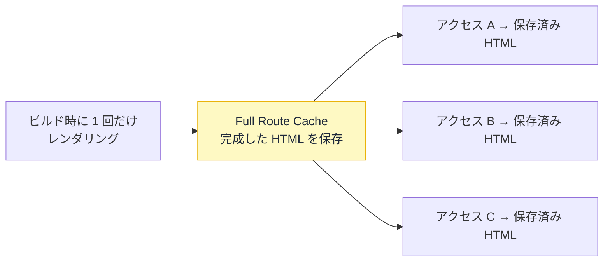
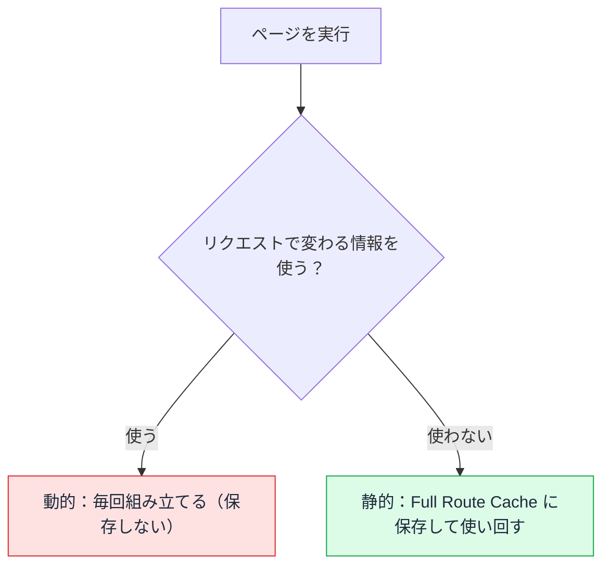
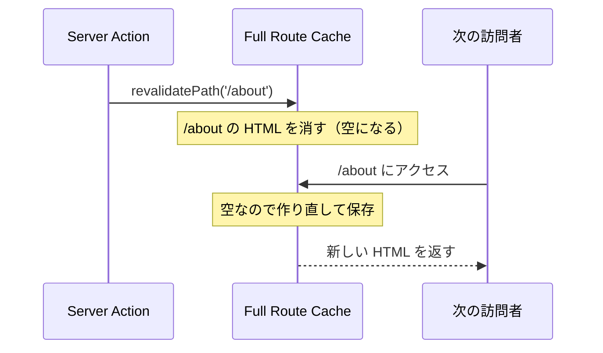

# Full Route Cache — 組み立てた HTML を使い回す

## 今日のゴール

- Full Route Cache が「ページの HTML をサーバーに保存する仕組み」だと知る
- 静的レンダリングと動的レンダリングの違いを知る
- 保存した HTML を再検証で作り直せることを知る

::: info このレッスンは従来モデル
`cacheComponents` を有効にしていない従来モデルの書き方です。有効にした新モデルでは、ページの自動静的化はなくなり、`"use cache"` で明示する形に変わります。これは別レッスンで扱います。
:::

## ページの HTML はどう作られるか

サーバーは、リクエストを受けるとデータを取り、コンポーネントを実行して、最終的な HTML を組み立てて返します。この「組み立て」を**レンダリング**と呼びます。

```tsx
// app/about/page.tsx
export default async function AboutPage() {
  const res = await fetch("https://api.example.com/company");
  const company = await res.json();
  return (
    <main>
      <h1>{company.name}</h1>
      <p>{company.description}</p>
    </main>
  );
}
```

問題は、この組み立てを**いつやるか**です。アクセスのたびに毎回やるのか、一度だけやって結果を使い回すのか。

ここを決めるのが Full Route Cache です。

## 動的 — 毎回組み立てる

リクエストごとに毎回レンダリングして HTML を作るのが**動的レンダリング**です。

- 毎回最新のデータで作られる
- リクエストのたびにサーバーが計算するので、コストがかかる

ログイン中のユーザー名を出すページのように、「人によって・その瞬間によって中身が変わる」ものは動的でなければなりません。

## 静的 — 一度組み立てて保存する

中身が誰に対しても同じなら、毎回組み立てる必要はありません。**ビルド時に一度だけレンダリングして、できた HTML を保存し、全員に使い回す**のが**静的レンダリング**です。

この保存先が **Full Route Cache** です。



会社概要やブログ記事のように「誰が見ても同じ」ページは、静的にして保存した HTML を返すだけにできます。サーバーは毎回組み立てないので、非常に速く、負荷も小さくなります。

では、どのページが静的になり、どのページが動的になるのか。Next.js はページを上から実行していき、その中で何が使われているかを見て決めます。決め手は、そのページが**リクエストによって変わる情報を使うか**どうかです。

`cookies()` でログイン情報を読む、`headers()` を見る、URL の `searchParams` を使う、といった「人やアクセスごとに変わるもの」に触れると、そのページは動的になります。触れなければ静的になり、HTML が Full Route Cache に保存されます。



さきほどの `/about` は `cookies()` のようなものを使っていないので、静的になります。ビルド時に一度だけ組み立てて、あとは保存した HTML を返すだけです。

`fetch` の `cache` や `revalidate` の指定は、取ってきたデータをどれだけ新しく保つかを決めるもので、静的か動的かを切り替えるものではありません。ここは混同しやすいところです。

::: details 静的にせず動的にしたいとき
`cookies()` などを使えば自然に動的になりますが、データに関係なく明示的に動的化したいときは、ファイルの先頭で指定します。

```tsx
// app/dashboard/page.tsx
export const dynamic = "force-dynamic";
```

これで、そのページは毎回サーバーで組み立て直されます。在庫やレートのように毎回最新が要るページで使います。
:::

## 再検証 — 保存した HTML を作り直す

静的化すると速いですが、保存した HTML はビルドした時点のものなので、後でデータが変わっても古いままです。これを作り直すのが**再検証**です。

データを更新する Server Action の中で `revalidatePath` を呼びます。Server Action は、サーバー側で動く関数です。

```ts
// app/admin/actions.ts
"use server";

import { revalidatePath } from "next/cache";

export async function updateCompany(formData: FormData) {
  await fetch("https://api.example.com/company", {
    method: "POST",
    body: formData,
  });

  revalidatePath("/about"); // /about の保存済み HTML を消す
}
```

`revalidatePath("/about")` で、保存していた `/about` の HTML が消されます。次に誰かが `/about` を開いたとき、レンダリングし直され、新しい HTML が保存し直されます。

`revalidatePath` がするのは、Full Route Cache という保存場所から `/about` の HTML を消すことだけです。新しい HTML は、次に誰かがアクセスしたときに作られて、また同じ場所に保存されます。時間の流れで見ると次のようになります。



## page と layout — どこまで作り直すか

`revalidatePath` には第 2 引数があります。

```ts
revalidatePath(path: string, type?: "page" | "layout"): void
```

| 指定 | 作り直す範囲 |
|------|------------|
| `"page"`（デフォルト） | そのページの HTML だけ |
| `"layout"` | そのレイアウトと**配下の全ページ**の HTML |

ヘッダーやナビゲーションのように、**レイアウトに置かれていて全ページで共通の表示**を更新したいときは `"layout"` を使います。たとえばヘッダーのカート件数バッヂを更新したいなら、こうします。

```ts
revalidatePath("/", "layout"); // ルートレイアウト配下すべてを作り直す
```

`"page"` で 1 ページだけ作り直しても、レイアウト共有の表示は別ページに移ると古いままです。共有部分はレイアウト単位で作り直す必要があります。

> パスに `/blog/[slug]` のような動的な部分を含む場合、第 2 引数は必須です。実際の値ではなく `/blog/[slug]` という**ルートの形**を渡すため、ページ単位かレイアウト単位かを Next.js が判断できないからです。

## 書き方ごとの違い

ページの書き方で、静的か動的か、そして速さと鮮度がどう変わるかを並べます。

| ページの書き方 | レンダリング | 速さ | 鮮度 |
|------|------------|------|------|
| cookies など、リクエストで変わる情報を使う | 動的（毎回組み立てる） | その都度かかる | 常に最新 |
| リクエストで変わる情報を使わない（デフォルト） | 静的（保存した HTML を返す） | 速い | ビルド時のまま |
| 静的なページに `revalidate` や `revalidatePath` を足す | 静的のまま作り直す | 速い | 時間ごと・変更後に最新 |

「誰が見ても同じページ」なら静的にして速くできます。人によって変わるページや常に最新が要るページは、動的が正しい選択です。どちらかが偉いのではなく、ページの性質で選びます。

ここで保存しているのは、組み立てた HTML です。その手前で取得したデータの保存や、ブラウザ側の保存は、これとは別のキャッシュです。

## まとめ

- Full Route Cache はレンダリング済みの HTML をサーバーに保存する仕組み
- 中身が共通なら静的化して使い回せる。動的は毎回組み立てる
- デフォルトは静的。`cookies` などリクエスト依存のものを使うと動的になる
- `revalidatePath` で保存した HTML を作り直す。共有部分は `"layout"` で
