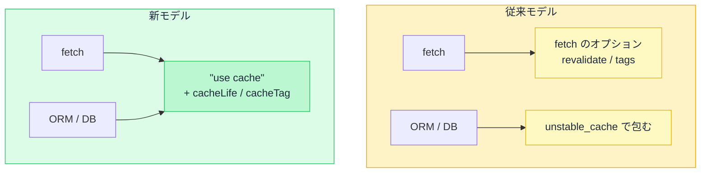

# キャッシュモデルの比較 — cacheComponents: true と false の違い

## 今日のゴール

- Next.js のキャッシュに「従来モデル」と「新モデル」の 2 つがあると知る
- 同じ要件を両モデルで書いたとき、コードがどう変わるかを読み取れる
- `next.config.ts` の `cacheComponents` で切り替わることを知る

## 2 つのキャッシュモデル

Next.js 16 には、キャッシュの仕組みが 2 つあります。`next.config.ts` の設定 1 行で、アプリ全体のキャッシュモデルが切り替わります。

```ts
// next.config.ts
import type { NextConfig } from "next";

const nextConfig: NextConfig = {
  cacheComponents: true,  // true: 新モデル / false: 従来モデル（既定）
};

export default nextConfig;
```

`cacheComponents` が `false`（既定）なら従来モデル、`true` にすると新モデルが有効になります。

この 2 つは対等な選択肢ではありません。

- Next.js チームは「Our Journey with Caching」というブログ記事で、従来モデルの暗黙的なキャッシュを設計上の失敗と振り返っている
- 公式ドキュメントでも従来モデルは「Caching (Previous Model)」と改名され、新モデルへの移行が推奨されている

ただし従来モデルの削除時期は決まっておらず、既存プロジェクトの多くはまだ従来モデルで動いています。AI が生成するコードも、どちらのモデルで書かれているかが混在します。

今の時点では、両方のコードを読めることが必要です。

## 従来モデルの考え方

従来モデル（`cacheComponents: false`）は、`fetch` のオプションでキャッシュを制御します。

- `fetch` にオプションを渡してキャッシュの有無や鮮度を指定する
- `fetch` を使わないデータ取得（ORM（データベース操作ライブラリ）など）は `unstable_cache` で包む
- Next.js 14 では `fetch` がデフォルトでキャッシュされていたが、15 以降はデフォルトでキャッシュされなくなった

キャッシュの単位は **fetch の呼び出し**です。「この fetch の結果を何秒間使い回す」「この fetch の結果にタグを付けて、あとから捨てる」という制御をします。

従来モデルでは、キャッシュが段階ごとに 4 つに分かれています。

| キャッシュ | 何を保存するか | どこにあるか |
|-----------|--------------|------------|
| **Request Memoization** | 同じ `fetch` の重複を 1 回にまとめた結果 | サーバー（1 リクエスト限り） |
| **Data Cache** | `fetch` で取得したデータ | サーバー（永続） |
| **Full Route Cache** | データで組み立てた HTML | サーバー（永続） |
| **Router Cache** | 画面遷移用の表示データ | ブラウザ |

上から下へ加工の段階が進み、上流が古ければ下流も古くなる連鎖の関係です。`revalidatePath` / `revalidateTag` は Data Cache を捨て、それに連動して Full Route Cache と Router Cache も最新化されます。

Request Memoization は 1 リクエストで消えるため、再検証の対象にはなりません。

## 新モデルの考え方

新モデル（`cacheComponents: true`）は、`"use cache"` ディレクティブ（目印の宣言）でキャッシュを制御します。

- 関数やコンポーネントの先頭に `"use cache"` と書くと、その出力がキャッシュされる
- `cacheLife()` で鮮度を、`cacheTag()` でタグを宣言する
- 宣言がなければ何もキャッシュされない（明示的オプトイン）

キャッシュの単位は **関数やコンポーネント**です。`fetch` に限らず、データベースクエリでも計算処理でも、関数に `"use cache"` を付ければキャッシュの対象になります。

## 同じ要件での比較

「商品一覧を取得してキャッシュし、価格を変えたらキャッシュを捨てる」という同じ要件を、2 つのモデルで並べます。

### キャッシュの宣言

**従来モデル: fetch のオプションで宣言**

```tsx
// app/products/page.tsx（従来モデル）
export default async function ProductsPage() {
  const res = await fetch("https://api.example.com/products", {
    next: { revalidate: 3600 },       // 1 時間キャッシュ
  });
  if (!res.ok) throw new Error("取得に失敗しました");
  const products = await res.json();

  return (
    <main>
      <h1>商品一覧</h1>
      <ul>
        {products.map((p: { id: string; name: string; price: number }) => (
          <li key={p.id}>{p.name}: {p.price}円</li>
        ))}
      </ul>
    </main>
  );
}
```

`fetch` の第 2 引数に `next: { revalidate: 3600 }` を渡し、「この取得結果は 1 時間使い回す」と宣言しています。

**新モデル: "use cache" で宣言**

```tsx
// app/products/page.tsx（新モデル）
import { cacheLife } from "next/cache";

export default async function ProductsPage() {
  "use cache";
  cacheLife("hours");  // 鮮度は「時間」単位

  const res = await fetch("https://api.example.com/products");
  if (!res.ok) throw new Error("取得に失敗しました");
  const products = await res.json();

  return (
    <main>
      <h1>商品一覧</h1>
      <ul>
        {products.map((p: { id: string; name: string; price: number }) => (
          <li key={p.id}>{p.name}: {p.price}円</li>
        ))}
      </ul>
    </main>
  );
}
```

`"use cache"` をコンポーネントの先頭に書き、`cacheLife("hours")` で鮮度を宣言しています。`fetch` のオプションは不要です。

| | 従来モデル | 新モデル |
|---|---|---|
| キャッシュの宣言 | `fetch` のオプション | `"use cache"` ディレクティブ |
| 鮮度の指定 | `next: { revalidate: 秒数 }` | `cacheLife("hours")` 等の名前で指定 |
| キャッシュの単位 | fetch の呼び出し | 関数・コンポーネント |

### 再検証（キャッシュの無効化）

価格を更新したときに、キャッシュを捨てて取り直させる処理です。更新処理は Server Action（サーバー側で動く関数）に書きます。

**従来モデル: fetch にタグを付け、revalidateTag で捨てる**

```tsx
// app/products/page.tsx（従来モデル）
export default async function ProductsPage() {
  const res = await fetch("https://api.example.com/products", {
    next: { tags: ["products"] },  // タグを付ける
  });
  if (!res.ok) throw new Error("取得に失敗しました");
  const products = await res.json();

  return (
    <main>
      <h1>商品一覧</h1>
      <ul>
        {products.map((p: { id: string; name: string; price: number }) => (
          <li key={p.id}>{p.name}: {p.price}円</li>
        ))}
      </ul>
    </main>
  );
}
```

```ts
// app/admin/actions.ts（従来モデル）
"use server";

import { revalidateTag } from "next/cache";

export async function updatePrice(formData: FormData) {
  await fetch("https://api.example.com/products/price", {
    method: "POST",
    body: formData,
  });

  revalidateTag("products"); // タグ「products」のキャッシュを捨てる
}
```

**新モデル: "use cache" + cacheTag で宣言し、revalidateTag で捨てる**

```tsx
// app/products/page.tsx（新モデル）
import { cacheLife, cacheTag } from "next/cache";

export default async function ProductsPage() {
  "use cache";
  cacheLife("hours");
  cacheTag("products");  // タグを付ける

  const res = await fetch("https://api.example.com/products");
  if (!res.ok) throw new Error("取得に失敗しました");
  const products = await res.json();

  return (
    <main>
      <h1>商品一覧</h1>
      <ul>
        {products.map((p: { id: string; name: string; price: number }) => (
          <li key={p.id}>{p.name}: {p.price}円</li>
        ))}
      </ul>
    </main>
  );
}
```

```ts
// app/admin/actions.ts（新モデル）
"use server";

import { revalidateTag } from "next/cache";

export async function updatePrice(formData: FormData) {
  await fetch("https://api.example.com/products/price", {
    method: "POST",
    body: formData,
  });

  revalidateTag("products"); // タグ「products」のキャッシュを捨てる
}
```

更新側の `revalidateTag` は両モデルで同じです。違うのは取得側の宣言方法です。

| | 従来モデル | 新モデル |
|---|---|---|
| タグの付け方 | `fetch` のオプション `next: { tags: [...] }` | `cacheTag("名前")` |
| キャッシュの無効化 | `revalidateTag("名前")` | `revalidateTag("名前")` |

### キャッシュなしの場合

キャッシュしないときは、両モデルとも**何も指定しない**だけです。コードは同じになります。

```tsx
// app/dashboard/page.tsx
export default async function DashboardPage() {
  const res = await fetch("https://api.example.com/dashboard");
  if (!res.ok) throw new Error("取得に失敗しました");
  const data = await res.json();

  return <Dashboard data={data} />;
}
```

結果は同じですが、そこに至る経緯が違います。

- 従来モデル: 元々デフォルトでキャッシュされていた（Next.js 14）のを、15 で「デフォルトでキャッシュしない」に変更した
- 新モデル: 最初から「`"use cache"` を書かなければキャッシュしない」設計

## fetch 以外のデータ取得

従来モデルと新モデルの差が大きく出るのが、`fetch` を使わないデータ取得です。データベースに直接アクセスする ORM のような場合を比べます。

**従来モデル: unstable_cache で包む**

```ts
// lib/products.ts（従来モデル）
import { unstable_cache } from "next/cache";
import { db } from "@/lib/db";

export const getProducts = unstable_cache(
  async () => {
    return db.product.findMany();
  },
  ["products"],              // キャッシュキー（結果を区別する名前）
  {
    tags: ["products"],      // タグ
    revalidate: 3600,        // 1 時間
  }
);
```

`unstable_cache` は関数を丸ごと包んでキャッシュする API です。キャッシュキーや `tags` / `revalidate` を、`fetch` のオプションとは別の書き方で指定します。

名前に付く `unstable_` は「動作が不安定」という意味ではなく、「今後 API が変わるかもしれない」という Next.js の印です。新モデルの `"use cache"` がこの置き換え先にあたります。

**新モデル: "use cache" を書くだけ**

```ts
// lib/products.ts（新モデル）
import { cacheLife, cacheTag } from "next/cache";
import { db } from "@/lib/db";

export async function getProducts() {
  "use cache";
  cacheLife("hours");
  cacheTag("products");

  return db.product.findMany();
}
```

新モデルでは、`fetch` でもデータベースでも同じ `"use cache"` で統一されています。キャッシュの書き方が取得手段に依存しません。

| | 従来モデル | 新モデル |
|---|---|---|
| `fetch` のキャッシュ | `fetch` のオプション | `"use cache"` |
| ORM / DB のキャッシュ | `unstable_cache` で包む | `"use cache"` |
| 統一性 | 手段ごとに書き方が違う | 同じ書き方で統一 |

## モデル変更の背景

Next.js チームがモデルを変えた理由は、従来モデルで起きた 2 つの問題にあります。

**暗黙のキャッシュが混乱を生んだ**

Next.js 14 では `fetch` がデフォルトでキャッシュされていたため、「更新したのに画面が変わらない」というトラブルが多発しました。15 でデフォルトを `no-store` に変更しましたが、`fetch` 以外の `unstable_cache` には別の仕組みが必要なままでした。

新モデルは `"use cache"` という明示的な宣言がなければ何もキャッシュされない設計で、「書かなければキャッシュされない」を最初から徹底しています。

**fetch と fetch 以外でキャッシュの書き方が違った**

従来モデルでは、`fetch` は `next: { revalidate, tags }` で、ORM は `unstable_cache` で包むという、取得手段ごとに別の仕組みが必要でした。

新モデルは `"use cache"` 1 つに統一しています。取得手段が何であっても、同じ書き方でキャッシュを宣言できます。



## 健在な仕組み: Request Memoization と Router Cache

モデルが変わっても、変わらずに動いている仕組みが 2 つあります。

- **Request Memoization**: 1 回の描画の中で同じ `fetch` が重複しないようにまとめる仕組み。`fetch` は自動、それ以外は React の `cache()` で手動。どちらのモデルでも同じ
- **Router Cache**: ブラウザ側で画面遷移を速くするための保持データ。レイアウトや先読みした内容を持っておく。どちらのモデルでも同じ

これらはリクエスト間のキャッシュとは別の仕組みなので、モデルの選択に影響されません。

## まとめ

- 従来モデルは `fetch` のオプション、新モデルは `"use cache"` でキャッシュを宣言する
- 新モデルは取得手段によらず書き方が統一され、暗黙のキャッシュがない
- `cacheComponents: true / false` の 1 行でアプリ全体のモデルが切り替わる
