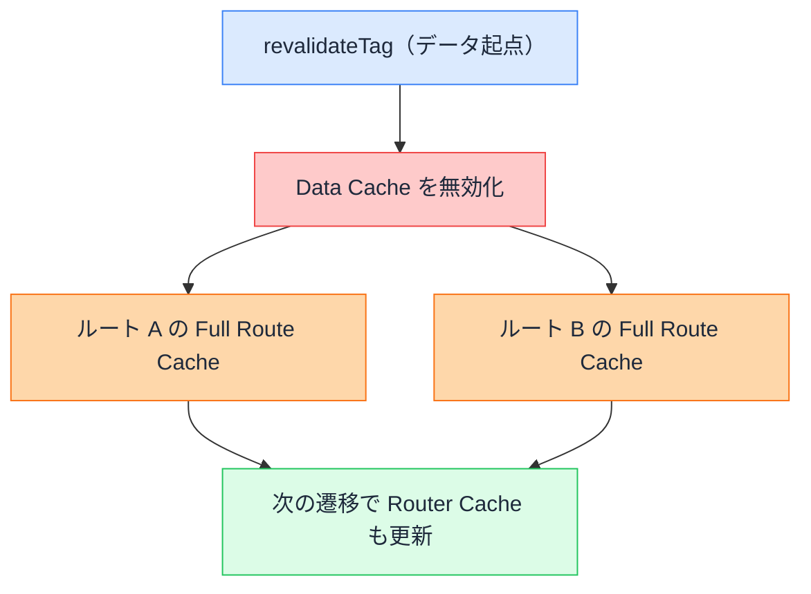

# revalidate でどのキャッシュが作り直されるか

## 今日のゴール

- `revalidateTag` はデータ起点、`revalidatePath` はパス起点、`router.refresh` はブラウザ起点だと整理する
- サーバー側の無効化は「次のアクセスで作り直す」遅延式だと知る
- 1 つの操作が複数のキャッシュを芋づる式に作り直すことを知る

::: info このレッスンは従来モデル
`cacheComponents` を有効にしていない従来モデルの書き方です。有効にした新モデルでは `revalidateTag` の引数や `updateTag` が変わります。これは別レッスンで扱います。
:::

## 3 つのキャッシュ

Next.js には保存場所の違うキャッシュがいくつもあります。revalidate の話をするうえで関わるのは次の 3 つです。

| キャッシュ | 置き場所 | 何を保存するか |
|----------|---------|--------------|
| Data Cache | サーバー | `fetch` などで取ったデータの結果 |
| Full Route Cache | サーバー | レンダリングして組み立てたルートの HTML |
| Router Cache | ブラウザ | 画面遷移を速くするための表示の保持 |

データを取って、それでルートの HTML を組み立てて、ブラウザがそれを保持する。上から順に積み重なっています。

もう 1 つ Request Memoization という仕組みもありますが、これは 1 回のリクエストの中で同じ `fetch` を 1 回にまとめるだけのものです。リクエストが終われば消えるので、revalidate で作り直す対象には入りません。

データを更新したのに画面が古いままなのは、このどれかに古い保存が残っているからです。`revalidateTag` / `revalidatePath` / `router.refresh` は、それぞれ違う場所を起点にして、この保存を作り直します。

## revalidateTag — データ起点

`revalidateTag` は、データに付けたタグを目印にして無効化します。

まず、`fetch` でデータを取るときにタグを付けておきます。

```tsx
// app/products/page.tsx
export default async function ProductsPage() {
  const res = await fetch("https://api.example.com/products", {
    next: { tags: ["products"] },
  });
  const products = await res.json();
  return (
    <ul>
      {products.map((p) => (
        <li key={p.id}>{p.name}</li>
      ))}
    </ul>
  );
}
```

データを更新する Server Action の中で、このタグを指定して `revalidateTag` を呼びます。Server Action は、サーバー側で動く関数です。

```ts
// app/products/actions.ts
"use server";

import { revalidateTag } from "next/cache";

export async function addProduct(formData: FormData) {
  await fetch("https://api.example.com/products", {
    method: "POST",
    body: formData,
  });

  revalidateTag("products"); // products タグの付いたデータを無効化
}
```

`revalidateTag("products")` を呼ぶと、起点は Data Cache です。`products` タグの付いた Data Cache が無効になります。

ここから芋づる式に広がります。そのデータを使って組み立てた HTML は古くなるので、`products` を使っている全ルートの Full Route Cache も無効になります。トップページと一覧ページの両方で同じデータを出していれば、両方が対象です。こうして 1 つのタグで複数ページをまとめて無効にできます。



無効化しても、その場で作り直すわけではありません。古い保存に「もう古い」と印を付けるだけで、実際に作り直すのは次に誰かがそのページを開いたときです。サーバー側の無効化はこの遅延式だと覚えておくと、挙動を読み違えずに済みます。

## revalidatePath — パス起点

`revalidatePath` は、ルートのパスを目印にして無効化します。

```ts
// app/admin/actions.ts
"use server";

import { revalidatePath } from "next/cache";

export async function updateCompany(formData: FormData) {
  await fetch("https://api.example.com/company", {
    method: "POST",
    body: formData,
  });

  revalidatePath("/about"); // /about を無効化
}
```

起点は指定したパスです。`/about` の Full Route Cache と、そのページで使っていた Data Cache がまとめて無効になります。次に `/about` を開いたとき、データを取り直してレンダリングし直し、新しい HTML が保存されます。ブラウザ側の Router Cache にも「`/about` の保持は古い」と伝わるので、遷移で表示し直したときも新しくなります。

`revalidateTag` がデータを目印にして複数ページを横断するのに対し、`revalidatePath` は「このパスを丸ごと作り直す」と指定するイメージです。どのデータが絡んでいるかを気にせず、ページ単位で更新したいときに向きます。

### page と layout

`revalidatePath` には第 2 引数があります。

```ts
revalidatePath(path: string, type?: "page" | "layout"): void
```

| 指定 | 作り直す範囲 |
|------|------------|
| `"page"`（デフォルト） | そのページだけ |
| `"layout"` | そのレイアウトと配下の全ページ |

ヘッダーのように全ページ共通の表示を更新したいときは `"layout"` を使います。

```ts
revalidatePath("/", "layout"); // ルートレイアウト配下すべて
```

> パスに `/blog/[slug]` のような動的な部分を含むときは、第 2 引数が必須です。実際の値ではなくルートの形を渡すため、ページ単位かレイアウト単位かを Next.js が判断できないからです。

## router.refresh — ブラウザ起点

`router.refresh()` は、ブラウザが持っている今の画面を捨てて、サーバーにページを要求し直す**ブラウザ側だけの操作**です。クライアントコンポーネントから呼びます。

```tsx
"use client";

import { useRouter } from "next/navigation";

export function RefreshButton() {
  const router = useRouter();
  return (
    <button type="button" onClick={() => router.refresh()}>
      最新の状態に更新
    </button>
  );
}
```

起点はブラウザの Router Cache です。今のルートの保持を捨ててサーバーに取り直しに行きますが、**サーバー側の Data Cache と Full Route Cache には触れません**。なので、サーバーに古い保存が残っていれば、取り直しても結局その古い保存が返ってきます。

`router.refresh` が向くのは、自分が更新したわけではないのに画面が古いときです。別の管理画面で在庫が変わった、他の人が情報を更新した、といった場合に、ブラウザ側で取り直しをかけます。サーバー側のデータを自分で書き換えたなら、`revalidateTag` か `revalidatePath` の出番です。

## 3 つの起点

同じ「作り直す」でも、起点とどこまで届くかが違います。3 つのキャッシュ（上ほどサーバー寄り、下がブラウザ）に、それぞれの操作がどこまで届くかを並べると次のようになります。

<svg viewBox="0 0 640 250" role="img" aria-label="3 つの操作がどのキャッシュに届くかの一覧。revalidateTag はデータキャッシュを起点に、フルルートキャッシュ、ルーターキャッシュまで波及する。revalidatePath はフルルートキャッシュを起点に、データキャッシュとルーターキャッシュに波及する。router.refresh はブラウザのルーターキャッシュだけを取り直し、サーバー側のデータキャッシュとフルルートキャッシュには触れない。" style="width:100%;height:auto;max-width:640px;display:block;margin:16px auto;">
  <rect x="0" y="0" width="640" height="250" rx="10" fill="#f8fafc"/>
  <text x="221" y="34" text-anchor="middle" font-family="sans-serif" font-size="12" font-weight="700" fill="#1e293b">revalidateTag</text>
  <text x="384" y="34" text-anchor="middle" font-family="sans-serif" font-size="12" font-weight="700" fill="#1e293b">revalidatePath</text>
  <text x="547" y="34" text-anchor="middle" font-family="sans-serif" font-size="12" font-weight="700" fill="#1e293b">router.refresh</text>
  <text x="16" y="72" font-family="sans-serif" font-size="12" font-weight="700" fill="#1e293b">Data Cache</text>
  <text x="16" y="88" font-family="sans-serif" font-size="10" fill="#475569">サーバー</text>
  <text x="16" y="128" font-family="sans-serif" font-size="12" font-weight="700" fill="#1e293b">Full Route Cache</text>
  <text x="16" y="144" font-family="sans-serif" font-size="10" fill="#475569">サーバー</text>
  <text x="16" y="184" font-family="sans-serif" font-size="12" font-weight="700" fill="#1e293b">Router Cache</text>
  <text x="16" y="200" font-family="sans-serif" font-size="10" fill="#475569">ブラウザ</text>

  <rect x="142" y="50" width="159" height="52" rx="6" fill="#dbeafe" stroke="#3b82f6"/>
  <text x="221" y="80" text-anchor="middle" font-family="sans-serif" font-size="12" fill="#1e293b">◎ 起点・無効化</text>
  <rect x="305" y="50" width="159" height="52" rx="6" fill="#dcfce7" stroke="#22c55e"/>
  <text x="384" y="80" text-anchor="middle" font-family="sans-serif" font-size="12" fill="#1e293b">○ 無効化</text>
  <rect x="468" y="50" width="158" height="52" rx="6" fill="#e2e8f0" stroke="#94a3b8"/>
  <text x="547" y="80" text-anchor="middle" font-family="sans-serif" font-size="12" fill="#475569">× 触れない</text>

  <rect x="142" y="106" width="159" height="52" rx="6" fill="#dcfce7" stroke="#22c55e"/>
  <text x="221" y="136" text-anchor="middle" font-family="sans-serif" font-size="12" fill="#1e293b">○ 作り直す</text>
  <rect x="305" y="106" width="159" height="52" rx="6" fill="#dbeafe" stroke="#3b82f6"/>
  <text x="384" y="136" text-anchor="middle" font-family="sans-serif" font-size="12" fill="#1e293b">◎ 起点・無効化</text>
  <rect x="468" y="106" width="158" height="52" rx="6" fill="#e2e8f0" stroke="#94a3b8"/>
  <text x="547" y="136" text-anchor="middle" font-family="sans-serif" font-size="12" fill="#475569">× 触れない</text>

  <rect x="142" y="162" width="159" height="52" rx="6" fill="#dcfce7" stroke="#22c55e"/>
  <text x="221" y="192" text-anchor="middle" font-family="sans-serif" font-size="12" fill="#1e293b">○ 更新</text>
  <rect x="305" y="162" width="159" height="52" rx="6" fill="#dcfce7" stroke="#22c55e"/>
  <text x="384" y="192" text-anchor="middle" font-family="sans-serif" font-size="12" fill="#1e293b">○ 更新</text>
  <rect x="468" y="162" width="158" height="52" rx="6" fill="#dbeafe" stroke="#3b82f6"/>
  <text x="547" y="192" text-anchor="middle" font-family="sans-serif" font-size="12" fill="#1e293b">◎ 起点・取り直す</text>

  <rect x="142" y="226" width="12" height="12" rx="2" fill="#dbeafe" stroke="#3b82f6"/>
  <text x="159" y="236" font-family="sans-serif" font-size="11" fill="#1e293b">◎ 起点</text>
  <rect x="205" y="226" width="12" height="12" rx="2" fill="#dcfce7" stroke="#22c55e"/>
  <text x="222" y="236" font-family="sans-serif" font-size="11" fill="#1e293b">○ 波及して作り直す・更新</text>
  <rect x="405" y="226" width="12" height="12" rx="2" fill="#e2e8f0" stroke="#94a3b8"/>
  <text x="422" y="236" font-family="sans-serif" font-size="11" fill="#1e293b">× 触れない</text>
</svg>

一番の違いは、`router.refresh` だけがサーバー側（Data Cache と Full Route Cache）に届かないことです。ブラウザの表示を取り直すだけなので、サーバーの保存が古ければ古いまま返ってきます。

| 操作 | 起点 | 無効化する範囲 | タイミング |
|------|------|--------------|----------|
| `revalidateTag` | データ | タグの付いた Data Cache から、それを使う全ルートの Full Route Cache | 次のアクセスで作り直し |
| `revalidatePath` | パス | そのパスの Full Route Cache と紐づく Data Cache | 次のアクセスで作り直し |
| `router.refresh` | ブラウザ | 今のルートの Router Cache だけ | その場で取り直し |

迷ったときは、こう選びます。

- 複数ページに出ている同じデータを更新した → `revalidateTag`
- 特定のページを丸ごと新しくしたい → `revalidatePath`
- サーバーのデータはそのままで、画面だけ取り直したい → `router.refresh`

サーバー側の 2 つは遅延式なので、呼んだ直後にサーバーで何かが起きるわけではありません。実際に作り直されるのは次のアクセスのとき、という点を押さえておくと、「revalidate したのに変わらない」で慌てずに済みます。

## まとめ

- `revalidateTag` はデータ起点、`revalidatePath` はパス起点、`router.refresh` はブラウザ起点
- サーバー側の無効化は遅延式で、次のアクセスで作り直す
- `revalidateTag` は Data Cache から Full Route Cache へ芋づる式、複数ページ横断
- `router.refresh` はブラウザだけ、サーバーのキャッシュには触れない
