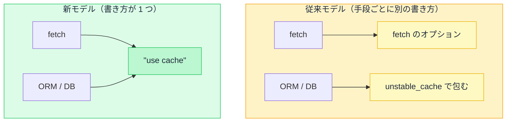

# キャッシュの全体像 — 4 つの場所と 2 つのモデル

## 今日のゴール

- Next.js のキャッシュが 4 種類あると知る
- それを制御するモデルに従来と新の 2 つがあると知る
- 違いが「暗黙か明示か」「どの単位で指定するか」にあると知る

## 4 種類のキャッシュ

「Next.js のキャッシュ」と一口に言っても、実際には**役割の違う 4 種類**があります。先に全体を押さえておくと、一つひとつの話が分かりやすくなります。

| キャッシュ | 何を保存するか | どこにあるか |
|-----------|--------------|------------|
| **Request Memoization** | 同じ取得の重複を 1 回にまとめた結果 | サーバー（1 リクエスト限り） |
| **Data Cache** | 取得したデータ | サーバー（永続） |
| **Full Route Cache** | データで組み立てた HTML | サーバー（永続） |
| **Router Cache** | 画面遷移用の表示データ | ブラウザ |

上から下へ、データを取る → HTML を組み立てる → ブラウザが持つ、と加工の段階が進みます。上流が古ければ下流も古くなる連鎖の関係です。

Request Memoization だけは 1 リクエストで消える別物で、残り 3 つが「古くなる/再検証する」の対象です。

## 制御するモデルが 2 つある

この 4 つのうち、サーバー側のキャッシュ（Data Cache・Full Route Cache）を**どう宣言して制御するか**に、考え方の異なる 2 つのモデルがあります。`next.config.ts` の 1 行で、アプリ全体がどちらで動くかが決まります。

```ts
// next.config.ts
import type { NextConfig } from "next";

const nextConfig: NextConfig = {
  cacheComponents: true, // true: 新モデル / false: 従来モデル（既定）
};

export default nextConfig;
```

両者は対等な選択肢ではありません。Next.js は従来モデルを「Caching (Previous Model)」と改名し、新モデルへの移行を推奨しています。

ただし従来モデルの削除時期は未定で、既存プロジェクトの多くはまだ従来モデルで動いています。

AI が生成するコードもどちらの書き方か混在します。違いは大きく 2 つです。

## 違い 1: 暗黙か、明示か

1 つ目は、**何もしないときにキャッシュされるかどうか**です。

- **従来モデル**: 既定でキャッシュが効く方向だった。Next.js 14 では取得結果が黙ってキャッシュされ、「更新したのに画面が変わらない」というトラブルが多発した（15 で既定をキャッシュなしに変更）
- **新モデル**: 既定では何もキャッシュしない。`"use cache"` と書いたものだけがキャッシュされる

新モデルは「書かなければキャッシュされない」を徹底し、暗黙のキャッシュによる事故をなくす設計です。

## 違い 2: どの単位で指定するか

2 つ目は、キャッシュを**どこに書くか**です。同じ「商品一覧をキャッシュする」を最小のコードで並べます。

```tsx
// 従来モデル: fetch のオプションでキャッシュを指定する
async function getProducts() {
  const res = await fetch("https://api.example.com/products", {
    next: { revalidate: 3600 }, // 1 時間キャッシュ
  });
  return res.json();
}
```

```tsx
// 新モデル: 関数の先頭で "use cache" を宣言する
async function getProducts() {
  "use cache";
  cacheLife("hours"); // 鮮度は「時間」単位
  const res = await fetch("https://api.example.com/products");
  return res.json();
}
```

キャッシュの指示が、`fetch` のオプションから関数の先頭へ移っています。

従来モデルは `fetch` の呼び出し単位なので、`fetch` を使わない取得（データベースに直接アクセスする ORM など）は `unstable_cache` という別の仕組みが必要でした。新モデルは関数・コンポーネント単位なので、`fetch` でもデータベースでも同じ `"use cache"` で済みます。



## 共通している部分

モデルが変わっても、再検証（キャッシュを捨てて取り直させる操作）の入口は共通です。データを更新したあとに `revalidateTag` や `revalidatePath` を呼んでキャッシュを捨てる、という流れはどちらでも同じです。

違うのは「キャッシュをどう宣言するか」だけで、「どう捨てるか」は揃っています。

## まとめ

- キャッシュは 4 種類ある（Memoization / Data / Full Route / Router）
- 制御モデルは従来（暗黙・`fetch` 単位）と新（明示・`"use cache"`）の 2 つ
- `cacheComponents` の 1 行で切り替わる。両方のコードを読めることが今は必要
