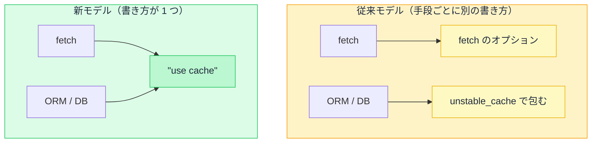

# キャッシュの全体像 — 4 種類のキャッシュと 2 つのモデル

## 今日のゴール

- Next.js のキャッシュが 4 種類あると知る
- 制御モデルに従来と新の 2 つがあり、コードを読み分けられる
- 新モデルの背景に「ページ単位からコンポーネント単位へ」という流れがあると知る

## 4 種類のキャッシュ

Next.js のキャッシュは、役割の違う 4 種類に分かれています。まず、それぞれが何を保存するのかを見ておきます。

| キャッシュ | 何を保存するか | どこにあるか |
|-----------|--------------|------------|
| **Request Memoization** | 同じ取得の重複を 1 回にまとめた結果 | サーバー（1 リクエスト限り） |
| **Data Cache** | 取得したデータ | サーバー（永続） |
| **Full Route Cache** | データで組み立てた HTML | サーバー（永続） |
| **Router Cache** | 画面遷移用の表示データ | ブラウザ |

この 4 つは順番につながっています。データを取り、それを使って HTML を組み立て、できた画面をブラウザが持つ、という流れです。

前の段階が古ければ、その後ろも古くなります。

Request Memoization だけは 1 回の表示が終わると消えるので、古くなる心配がありません。残りの 3 つが、古くなったら捨てて取り直す対象になります。

## 従来モデルと新モデル

このうちサーバー側のキャッシュ（Data Cache と Full Route Cache）について、書き方の考え方が違う 2 つのモデルがあります。どちらで動くかは、`next.config.ts` の 1 行で決まります。

```ts
// next.config.ts
import type { NextConfig } from "next";

const nextConfig: NextConfig = {
  cacheComponents: true, // true: 新モデル / false: 従来モデル（既定）
};

export default nextConfig;
```

この 2 つは対等ではありません。Next.js は従来モデルを「Caching (Previous Model)」と呼び、新しいモデルへ移ることをすすめています。

とはいえ従来モデルがなくなる時期は決まっておらず、今動いているプロジェクトの多くは従来モデルのままです。AI が生成するコードもどちらの書き方かはまちまちなので、両方を読めるようにしておきます。

## 何も指定しないときの挙動

まず、何も指定しないときにキャッシュされるかどうかが違います。

- **従来モデル**: Next.js が自動で判断する部分が残っています。条件がそろえばページを自動で静的化するなど、書かなくてもキャッシュが効くことがあります
- **新モデル**: 自動では何もキャッシュしません。`"use cache"` と書いたものだけがキャッシュされます

新モデルは「書かないかぎりキャッシュしない」をはっきりさせて、知らないうちにキャッシュが効いて困る、という事態を防いでいます。

## キャッシュの指示をどこに書くか

もう 1 つは、キャッシュの指示をどこに書くかです。同じ「商品一覧をキャッシュする」を、両モデルの最小のコードで並べてみます。

```tsx
// 従来モデル: fetch のオプションでキャッシュを指定する
async function getProducts() {
  const res = await fetch("https://api.example.com/products", {
    next: { revalidate: 3600 }, // 1 時間キャッシュ
  });
  return res.json();
}
```

```tsx
// 新モデル: 関数の先頭で "use cache" を宣言する
async function getProducts() {
  "use cache";
  cacheLife("hours"); // 鮮度は「時間」単位
  const res = await fetch("https://api.example.com/products");
  return res.json();
}
```

キャッシュの指示が、`fetch` のオプションから関数の先頭へ移っています。

従来モデルは `fetch` 1 回ごとに指定するので、`fetch` を使わない取得（データベースに直接つなぐ ORM など）には `unstable_cache` という別の仕組みが必要でした。新モデルは関数やコンポーネントに付けるので、`fetch` でもデータベースでも同じ `"use cache"` で書けます。



## ページ単位からコンポーネント単位へ

新モデルの変更は、キャッシュだけの話ではありません。根っこにあるのは、**制御の単位がページからコンポーネントへ小さくなった**という流れです。

- 以前は、レンダリング方式をページ全体で選んでいた（このページは静的、あのページは動的）
- 今は、1 つのページの中で静的な部分と動的な部分を混ぜられる。どこを動的にするかは `<Suspense>` の境界、つまりコンポーネント単位で決める

`"use cache"` が関数やコンポーネントに付くのも、この流れの一部です。

その代わり、新モデルでは**キャッシュしない非同期データは `<Suspense>` で囲む**必要があります（囲み忘れるとビルド時にエラーになります）。「ここから先は後から動的に届く」という境目を、コンポーネント単位で示すルールです。

```tsx
// 新モデル: キャッシュしない取得は Suspense で囲む
import { Suspense } from "react";

export default function Page() {
  return (
    <Suspense fallback={<p>読み込み中…</p>}>
      <LatestOrders />
    </Suspense>
  );
}
```

## 再検証のやり方は同じ

モデルが違っても、再検証（キャッシュを捨てて新しく取り直させること）のやり方は変わりません。データを更新したあとに `revalidateTag` や `revalidatePath` を呼ぶ、という流れはどちらも同じです。

違うのはキャッシュの宣言のしかただけで、捨て方は揃っています。

## まとめ

- キャッシュは 4 種類ある（Memoization / Data / Full Route / Router）
- 従来モデルは `fetch` ごとに指定、新モデルは `"use cache"` に統一（`cacheComponents` の 1 行で切替）
- 新モデルの背景は「ページ単位からコンポーネント単位へ」。キャッシュしない非同期データは `<Suspense>` で囲む
