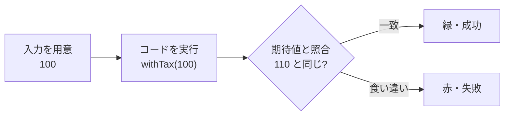

# そもそもテストとは何か — AI が書いたコードを確かめる仕組み

## 今日のゴール

- テストが「期待した結果と実際の結果の突き合わせ」だと知る
- エラー・欠陥・故障の違いと、テストとデバッグの違いを知る
- AI が書いたコードを確かめる土台としてテストが効くと知る

## テストとは期待と実際を突き合わせる小さなプログラム

テストと聞くと特別なものに感じますが、正体はふつうのコードです。**確かめたいコードを動かし、返ってきた結果が期待どおりかを照合するだけ**の小さなプログラムです。

たとえば、税込み価格を計算する関数があるとします。

```ts
// price.ts
export function withTax(price: number): number {
  return Math.round(price * 1.1);
}
```

これに対するテストは、こう書きます。

```ts
// price.test.ts
import { test, expect } from "vitest";
import { withTax } from "./price";

test("100 円は税込み 110 円", () => {
  expect(withTax(100)).toBe(110);
});
```

やっていることは 3 つだけです。

1. **入力を用意する**: `100`
2. **コードを実行する**: `withTax(100)`
3. **期待値と照合する**: その結果が `110` と同じか

この「期待した値と実際の値を突き合わせる」照合を**アサーション**と呼びます（上の `expect(...).toBe(...)` の部分）。一致すれば緑（成功）、食い違えば赤（失敗）になります。



この例のように、実際にコードを動かして確かめるものを**動的テスト**と呼びます。一方、コードを動かさずに確かめるやり方もあり、これを**静的テスト**と呼びます。型チェックやコードレビューがそれにあたります。「テスト」という言葉には、この両方が含まれます。

## エラー・欠陥・故障とデバッグの違い

テストの話には、似た言葉がいくつも出てきます。**エラー・欠陥・故障**は、順番につながった別々の段階です。

| 段階 | 中身 | 例 |
|------|------|---|
| **エラー**（人の誤り） | 頭の中や指の間違い | 「10% 上乗せ」を「1%」と打ち間違える |
| **欠陥**（バグ） | コードに残ってしまった間違い | `price * 1.01` と書かれた行 |
| **故障** | 実行したときに現れる症状 | 税込み価格が本来より安く出る |

人がエラーを起こし、それがコードの中に欠陥として残り、動かしたときに故障として表に出ます。欠陥があっても、その行が実行されなければ故障にならないこともあります。

ここで区別したいのが、**テストとデバッグの違い**です。

- **テスト**: 故障を起こして、欠陥があると気づく活動
- **デバッグ**: その原因の欠陥を見つけて取り除く活動

テストは「どこかがおかしい」と教えてくれるところまで、デバッグは「なぜおかしいか」を突き止めて直すところまでを受け持ちます。直したあとは、**確認テスト**で本当に直ったかを確かめ、**回帰テスト**（リグレッションテスト）で他の部分を壊していないかを確かめます。この「一度書いたテストを、変更のたびに走らせ直す」使い方が、次の話につながります。

## なぜテストするのか

一度きり動けばいいなら、手で動かして目で見れば十分です。それでもテストを書くのは、コードがこの先も変わり続けるからです。

- **変更の安全網になる**: 一度書いたテストは、後からコードを直すたびに自動で走り、前に動いていたものが壊れていないかを見張ってくれる。これがあると、安心して直せる
- **仕様を書き残せる**: 「100 円は税込み 110 円」というテストは、そのまま「こう動くべき」という仕様の記録になる。あとから読んだ人が、コードの意図を読み取れる
- **判断の根拠になる**: 通ったテストの積み重ねが、「リリースしてよい」と判断するときの拠りどころになる

3 つ目は感覚の話ではありません。JSTQB（テスト技術者資格の共通シラバス）でも、テストの目的のひとつに「品質に対する信頼を積み上げる」が挙げられています。

## AI に任せる時代の土台

テストの価値は、AI にコードを任せるほど上がります。理由はシンプルで、**AI に任せると、人が全部は読み切れない量のコードが積み上がる**からです。1 行ずつ目で追って正しさを保証するのは、もう現実的ではありません。

そこで、コードが期待どおり動くかを機械が繰り返し確かめるテストが、土台になります。AI が書いたコードを信じてよいかの根拠を、人の目視ではなくテストが引き受けてくれます。

ただし、大事な注意があります。**緑はバグがゼロである証明ではありません**。テストは「欠陥があること」は示せますが、「欠陥がないこと」は証明できません。これはテストの原則のひとつです。緑が意味するのは、あくまで「試した範囲では問題がなかった」ということです。

だから、AI が書いたコードやテストを前にしたとき、人に残る仕事は変わります。テストを一行ずつ用意することではなく、**何を確かめるべきかを決め、できたテストが本当に大事な所を確かめているかを読むこと**です。「どの値を試すか」を選ぶ技法は、ここから先の話になります。

## まとめ

- テストは、期待した結果と実際の結果を突き合わせて正しさを確かめる小さなプログラム
- エラー・欠陥・故障の区別と、見つけるテスト／直すデバッグの違い
- 価値は変更の安全網・仕様の記録・判断の根拠、そして AI が書いたコードを確かめる土台
- 緑はバグゼロの証明ではなく、試した範囲で問題なしという意味
