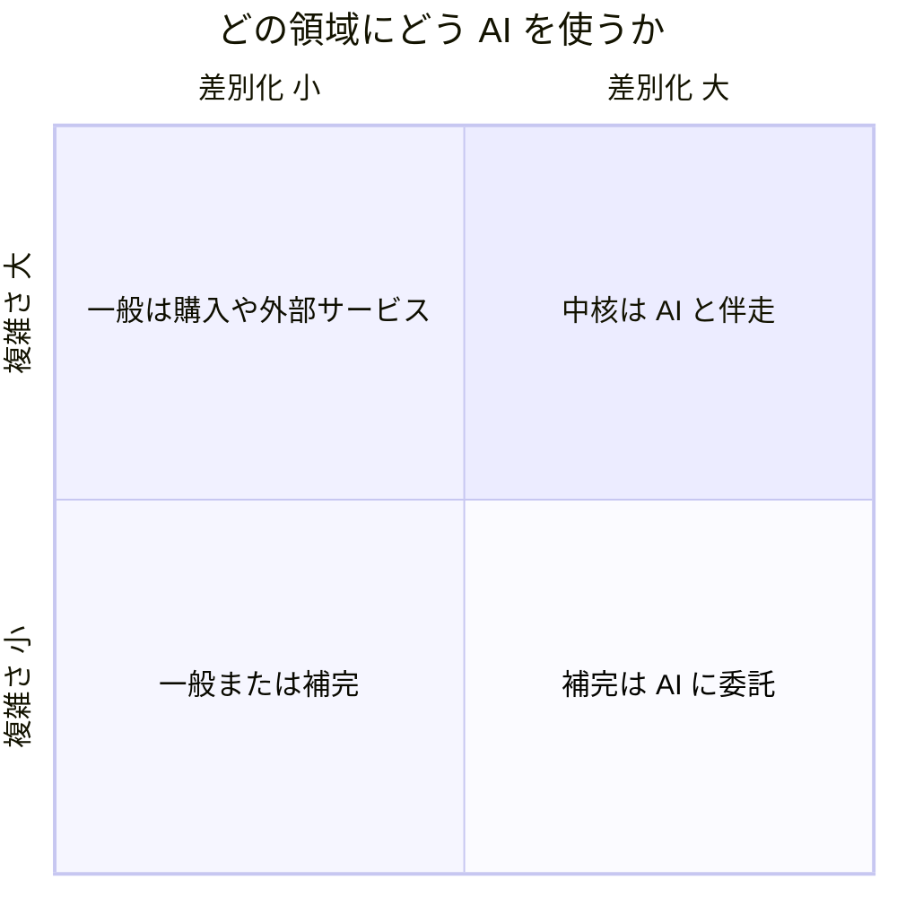

# AI との協働モード — 伴走と委託

## 今日のゴール

- AI との協働には伴走と委託という 2 つのモードがあると知る
- モードの使い分けが業務の複雑さと差別化の 2 軸で整理できると知る
- 任せて速くなるほどレビューが課題になると知る

## 対話しながら作る日と任せて待つ日

AI にお願いしてアプリを作るとき、進め方はひとつではありません。多くの人が最初に経験するのは、チャットで AI とやりとりしながら、出てきたものを確かめては次の直しを頼む作り方です。一方で最近は、指示を出したら AI が自分で作業を進め、できあがったところで人が確認する、という作り方も広がっています。

この 2 つは手離れの良し悪しの違いではなく、性質のまったく違う働き方です。テスト駆動開発の第一人者として知られる t_wada 氏は、登壇資料でこれを **AI と伴走** と **AI に委託** という 2 つのモードとして整理しています。名前が付くと、「今の作業はどちらのモードでやるべきか」を考えられるようになります。

## 伴走と委託の違い

| | AI と伴走 | AI に委託 |
|---|---|---|
| 進め方 | AI と対話しながら直列に開発する | 自走する AI たちに任せて並列に開発する |
| スピード | 委託に比べると遅い | 圧倒的に速い |
| コントロールと状況把握 | 高い | 低く、レビューが課題になる |
| 性質 | 決定論的だが、人力なのでスケールしない | 非決定論的で結果は確率的だが、非常によくスケールする |

伴走は、AI と対話しながら 1 本の流れで進める働き方です。一歩ごとに人が確かめるので、いま何がどうなっているかを把握でき、結果もコントロールできます。表の「決定論的」は、進め方を人が決めているぶん結果がぶれにくいという意味です。

そのかわり、進む速さは自分の確認の速さで頭打ちになります。体はひとつなので、同時にいくつも進められません。「人力なのでスケールしない」とはこのことです。

委託は、自走する AI（人が張り付かなくても作業を続けるコーディングエージェント）に任せて、複数の作業を並行で進める働き方です。コードができあがる速さは伴走の比ではなく、並列数を増やせばさらに伸びます。

そのかわり途中の様子は見えにくく、同じ指示でも出てくる結果は毎回変わりえます。これが「非決定論的で確率的」ということです。そして、できあがった大量のコードを誰がどう確かめるのか、つまり **レビューが課題** になります。

どちらが優れているという話ではなく、性質が違うので場面ごとに使い分けます。

## モードを選ぶ判断軸

どちらのモードを使うかは、作ろうとしている部分の性質で決まります。t_wada 氏の整理では、**業務ロジックの複雑さ** と **競合他社との差別化になるか** の 2 軸で判断します。この 2 軸の元になっているのは、書籍『ドメイン駆動設計をはじめよう』（Vlad Khononov 著）にあるドメインの分類で、ソフトウェアが扱う業務領域を中核・一般・補完の 3 つに分けます。

- **中核**: 業務ロジックが複雑で、差別化にもなる部分。事業の競争力そのものなので、**AI と伴走** して人がコントロールを保ったまま作る
- **補完**: 差別化にはなるが、ロジックは単純な部分。**AI に委託** して速さを取る
- **一般**: 差別化にならない部分。認証やメール配信のように、どの会社で作っても同じになる機能。そもそも自作せず、製品の購入や外部サービスの利用で済ませる

この分類を知っていると、全部 AI に任せるか全部自分で見るかの二択ではなく、「ここは中核だから伴走で作ろう」「この画面は補完だから委託でいい」のように部分ごとに態度を変えられます。チームの会話や AI への指示に使える言葉も増えます。

## 伴走のパターンと委託のパターン

同じ伴走でも、やることはひとつではありません。登壇資料に挙げられているパターンには、たとえばこんなものがあります。

- **根負けしない議論相手**: 設計の相談相手として、何往復でも飽きずに付き合ってもらう
- **リサーチアシスタント**: ライブラリの比較や技術調査を任せて、判断材料を集めてもらう
- **批判的レビュアー**: 自分の書いたコードや設計に、あえて厳しい指摘を出してもらう

このほかに、教習車・助手席・運転席と、車の運転にたとえた一連のパターンも挙げられています。

委託のパターンとしては、こんな例が挙げられています。

- **小人さん**: 夜のうちに作業を進めてもらい、朝できあがったものをレビューする
- **コンペ**: 同じ課題を複数の AI に並行で任せ、できあがったものを見比べて採用を決める

どのパターンでも、できあがったものは最後に必ず人がレビューします。

## 伴走の進め方の実例

伴走を実際にどう回すかの典型例も、登壇資料に示されています。2025 年初夏時点の例と断りが付いているとおり、この分野は動きが速いので細部は変わっていきますが、流れの骨組みは参考になります。

1. AI と議論しながら設計を練る。AI からの質問が設計を引き出すこともある
2. 生まれた設計を Design Doc や ADR といったプレーンテキストの文書に保存し、レビューする。必要なら議論に戻る
3. 設計書からタスクリストを Markdown で作って保存し、タスクもレビューする
4. タスクを 1 つ選んでサブタスクに分割し、順番を TDD（テスト駆動開発）のワークフローに合わせて調整する
5. タスクごとにコーディングエージェントのセッションを立ち上げ、Git のブランチも分けて実装する。うまくいかなければブランチごと捨てる
6. TDD のステップごとに、Conventional Commits というコミットメッセージの規約に沿ってコミットする
7. マージ前に全体をレビューし、必要なら人が手直ししてからマージする
8. 得られた学びを持って、また AI との議論に戻る

この流れには、設計・タスク・コードと、人がレビューする場面が何度も挟まっています。TDD を指定するのも、レビューできない量のコードが一度にできあがるのを防ぐためです。速く作ることより、人が評価できる大きさに作業を刻むことを優先しています。

委託でレビューが課題になるのも同じ理由です。作るスピードが上がるほど、出てきたものを評価する側が追いつけるかどうかが効いてきます。

## まとめ

- AI との協働には、対話しながら直列に進む伴走と、自走する AI に任せて並列に進む委託がある
- 伴走はコントロールと把握に強く、委託は速くスケールするがレビューが課題になる
- 使い分けの軸は複雑さと差別化で、中核は伴走、補完は委託、一般は自作せず買う
- 伴走の実例でも、人がレビューできる大きさに作業を刻む工夫が中心にある
