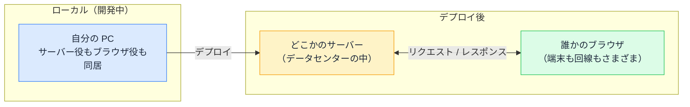

# ローカル・ステージング・本番 — コードが動く場所の違い

## 今日のゴール

- デプロイしたコードが「どこかのサーバー」と「誰かのブラウザ」で動くことを知る
- ローカル・ステージング・本番という環境の分け方と役割を知る
- 「本番だけ動かない」を環境の違いから切り分ける視点を知る

## localhost はすべてが 1 台の PC の中

AI に Next.js アプリを作ってもらい、`npm run dev` を実行して `http://localhost:3000` を開く。この流れは何度も経験があると思います。

このとき画面に映っているアプリは、すべて自分の PC の中で動いています。

- `npm run dev` が起動したのは、自分の PC の中で動く開発用サーバー
- `localhost` は「この PC 自身」を指す特別な名前で、リクエストはインターネットに出ていかない
- それを開いているブラウザも、当然自分の PC のブラウザ

サーバー役もブラウザ役も 1 台の PC に同居しているので、通信は一瞬で終わり、データを触るのは自分だけで、設定もすべて自分の思いどおりになっています。開発には都合のよい状態ですが、アプリが実際に使われる状況とはかけ離れた、かなり特殊な状態でもあります。

## デプロイ後はサーバーとブラウザに分かれる

デプロイすると、この同居が解消されます。コードは 2 つの離れた場所で動き始めます。

Next.js のアプリには、サーバーで動く部分とブラウザで動く部分があります。デプロイ後、それぞれはこんな場所で動きます。

- **サーバー側**: ホスティングサービスが管理するデータセンターのマシンで動く。自分の PC ではないが、どのサービスを使いどんな設定にするかはチームが決められる
- **ブラウザ側**: ページを開いた人の端末に JavaScript が送られて、そこで動く。こちらは**選べない**。最新の PC かもしれないし、5 年前のスマホと不安定な回線かもしれない

サーバー側は自分たちで選べるのに、ブラウザ側は選べない。この片側だけコントロールできない構造がフロントエンドの特徴です。「手元では速いのに、ユーザーからは遅いと言われる」現象の多くはここから生まれます。誰の端末で動くか選べないからこそ、性能やアクセシビリティを「自分の環境で問題ないから OK」で済ませられない、という話にもつながります。

## 環境 — 同じアプリを置く複数の場所

チーム開発では、同じアプリを複数の場所にデプロイして使い分けます。この場所のことを**環境**と呼びます。典型的な構成は 3 つです。

| 環境 | 使う人 | 役割 |
|------|-------|------|
| ローカル | 自分だけ | 開発しながらその場で確認する |
| ステージング | チームや関係者 | 本番に出す前の最終確認 |
| 本番 | 実際のユーザー | サービスそのものの提供 |

本番は実際のユーザーが使っている場所なので、動くかどうかわからない変更を直接置くわけにはいきません。かといってローカルで動いたからといって、デプロイして初めて起きる問題がないとは言い切れません。

そこで、本番とそっくりに作ったもう 1 つの環境に先にデプロイして動作を確かめてから、同じものを本番に出します。この確認用の環境が**ステージング**です。

配属先で「ステージングで確認して」と言われたら、「その変更が確認用の環境にデプロイされているから、実際に触って動作を見て」という意味です。手元のコードを読んでという話ではなく、デプロイされた実物を操作して確かめることを指しています。

環境の数や呼び方はチームによって違います。ステージングを「検証環境」「QA 環境」と呼ぶチームもあれば、開発チーム共用の「開発環境」を挟むチームもあります。それぞれの環境には別の URL が割り当てられていることが多く、`staging.example.com` のようなドメイン名から今どの環境を見ているのか判断できます。

## 環境ごとに何が違うか

環境が分かれていても、動いているコードは同じです。違うのはコードの外側にあるものです。

| 違うもの | 例 |
|---------|---|
| データ | ローカルはテストデータが数件、本番は実データが数万件 |
| 接続先 | ローカルは手元のデータベース、本番は本番用のデータベース |
| 設定値 | API キーや接続先 URL は環境変数として環境ごとに設定する |
| 使う人と端末 | ローカルは自分の PC だけ、本番はあらゆる端末とブラウザ |

「本番だけ動かない」「ステージングでは平気だったのに」という現象は、コードのバグとは限りません。この外側の違いが原因になっていることが多いのです。例えば、ローカルの 10 件のデータでは一瞬で表示された一覧画面が、本番の 10 万件のデータでは固まってしまう。あるいは、手元の `.env` ファイルに書いた設定値を本番環境に登録し忘れていて、機能が動かない。どちらも配属後によく出会うパターンです。

だから調査の第一歩は「どの環境では起きて、どの環境では起きないか」の切り分けです。AI に相談するときも、「動かない」だけでなく「ローカルでは動くが本番だけで再現する」と環境の情報を添えると、原因の候補が一気に絞られます。

## まとめ

- デプロイ後のコードは、どこかのサーバーと誰かのブラウザという 2 つの離れた場所で動く
- ローカル・ステージング・本番は同じアプリを置く別々の場所で、ステージングは本番前の確認用
- 「本番だけ動かない」は、まずデータ・設定・端末という環境ごとの違いを疑う
