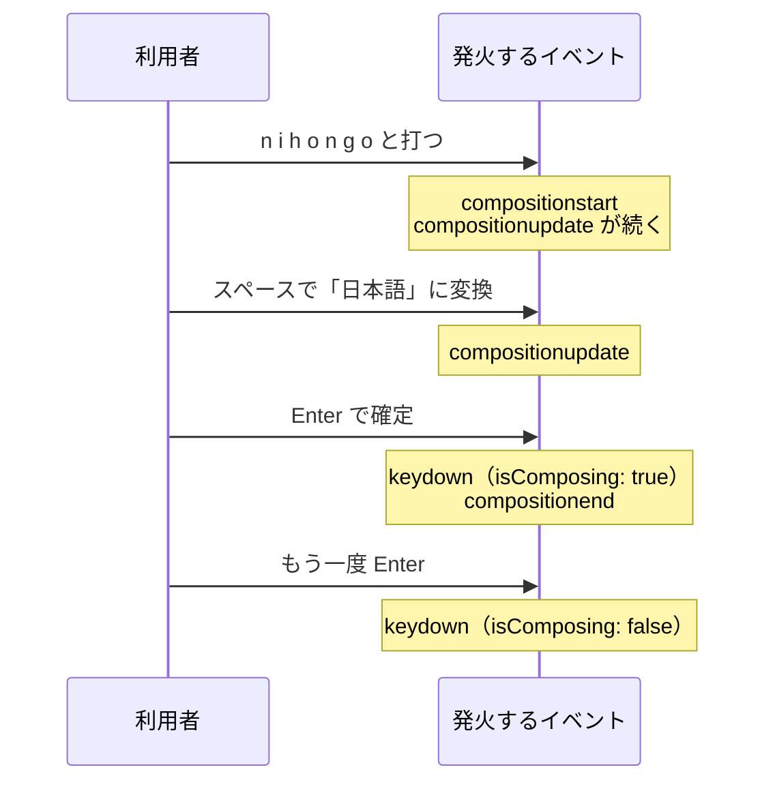

# IME 変換中の Enter — 日本語入力で誤送信が起きる仕組み

## 今日のゴール

- 日本語入力には変換中という状態があり、ブラウザが composition イベントで通知していると知る
- 変換確定の Enter でも keydown が発火するため、Enter で送信する実装は誤送信しうると知る
- `KeyboardEvent.isComposing` で変換中の Enter を見分けられると知る

## 変換確定の Enter で起きる誤送信

日本語でチャットツールを使っていれば、一度は経験があるはずです。

- **チャットの誤送信**: 「おつかれさまです」と打ち、漢字に変換して Enter で確定したつもりが、書きかけのメッセージがそのまま送信されてしまう
- **検索ボックスの誤発火**: 変換を確定しただけなのに、検索が走ってしまう

この不具合にはやっかいな性質があります。

- **英語では再現しない**: 英語には変換という操作がないので、英語で開発して英語で動作確認している限り、まず気づけない
- **海外製のツールやライブラリで繰り返し話題になってきた**: 日本語ユーザーだけが踏む不具合として
- **知らないと対策を頼めない**: 対策が要ること自体を知らないと、実装を頼むときに条件として伝えられず、対策の入っていないコードをそのまま受け取ることになる

つまり、日本語を使う自分たちが気づいて直す側に回りやすい不具合です。仕組みを知っていれば、原因の切り分けも AI への指示も一言で済みます。

## IME と変換中という状態

英語と日本語では、文字が決まるまでの道のりが違います。

| 入力 | 文字が決まるまで |
|------|----------------|
| 英語 | 押したキーがそのまま文字になる |
| 日本語 | 「nihongo」と打つと未確定の「にほんご」が現れ、スペースキーで「日本語」などの候補に切り替え、Enter で確定して初めて決まる |

この変換を担っているのが IME です。

> **IME**（Input Method Editor）: macOS の日本語入力や Windows の Microsoft IME のように、OS に組み込まれた日本語入力システム。ブラウザの外側で動いている

ブラウザから見ると、キーが押されてから文字が確定するまでの間に、未確定の文字列が現れたり書き換わったりする期間があります。

> **変換中**（composing）: 未確定の文字列が現れてから、確定または取り消しされるまでの期間

ブラウザはこの状態の変化を composition イベントとして通知します。

| イベント | 発火するタイミング |
|---|---|
| `compositionstart` | 変換中に入った。未確定の文字列が現れる直前 |
| `compositionupdate` | 未確定の文字列が変わった。文字の追加や候補の切り替えのたび |
| `compositionend` | 確定または取り消しで変換中が終わった |

## 変換確定の Enter でも keydown は発火する

Enter キーには 2 つの役割が同居しています。

- **変換中の Enter**: 未確定の文字列を確定する合図として IME が受け取る
- **変換中でない Enter**: 送信や改行など、ブラウザやアプリが割り当てた動作を起こす

利用者はこの 2 つを無意識に使い分けていますが、どちらの Enter でも `keydown` イベントは発火します。だから `onKeyDown` で Enter を拾って送信するコードは、確定のつもりの Enter を送信の合図と取り違えます。

この 2 つを見分けるために用意されているのが、キーボードイベントの `isComposing` プロパティです。

> **`isComposing`**: `compositionstart` から `compositionend` までの間に発火したキーボードイベントで `true` になるプロパティ

ただし、確定の Enter でイベントが発火する順番はブラウザで差があります。

| ブラウザ | 確定の Enter でのイベント順 | keydown 時の `isComposing` |
|---------|---------------------------|---------------------------|
| 多くのブラウザ | keydown → `compositionend` | `true`（変換中と見分けられる） |
| Safari | `compositionend` → keydown | すでに `false` に戻っている |

`isComposing` だけに頼ると Safari を取りこぼすので、実装では次に見るもう 1 つの手がかりを併用します。



図の最後の 2 つの Enter は、キーとしては同じでも `isComposing` の値が違います。ここが見分けの根拠になります。

## React の実装で防ぐ

チャットの入力欄で「Enter で送信、Shift+Enter で改行」という定番の挙動を作るとします。

- `<textarea>` の Enter は、本来ただの改行
- 送信に割り当てるには `onKeyDown` で自前の判定が必要で、ここが誤送信の温床になる

まず、対策が入っていないコードです。「Enter で送信、Shift+Enter で改行」という要件だけを満たすと、自然にこの形になります。

```tsx
"use client";

import { useState } from "react";

type Props = {
  onSend: (text: string) => void;
};

export function ChatInput({ onSend }: Props) {
  const [text, setText] = useState("");

  const send = () => {
    if (text.trim() === "") return;
    onSend(text);
    setText("");
  };

  return (
    <form
      onSubmit={(event) => {
        event.preventDefault();
        send();
      }}
    >
      <label htmlFor="chat-text">メッセージ</label>
      <textarea
        id="chat-text"
        rows={3}
        value={text}
        onChange={(event) => setText(event.target.value)}
        onKeyDown={(event) => {
          if (event.key === "Enter" && !event.shiftKey) {
            event.preventDefault();
            send(); // 変換確定の Enter でもここが動いてしまう
          }
        }}
      />
      <button type="submit">送信</button>
    </form>
  );
}
```

英語で試すぶんにはきれいに動きます。しかし日本語では、変換確定の Enter の keydown もこの条件に一致するため、書きかけの本文がそのまま送信されます。

直し方は、Enter の判定より先に変換中かどうかを確かめ、変換中なら何もしないことです。React の `onKeyDown` に渡ってくるのは React が包んだイベントなので、`event.nativeEvent` からブラウザ本来のイベントを参照します。

```tsx
        onKeyDown={(event) => {
          // isComposing に加えて keyCode 229 も見る。
          // Safari は確定の Enter で isComposing が先に false へ戻るため
          if (event.nativeEvent.isComposing || event.keyCode === 229) {
            return; // 変換確定の Enter では送信しない
          }
          if (event.key === "Enter" && !event.shiftKey) {
            event.preventDefault();
            send();
          }
        }}
```

`keyCode` は非推奨のプロパティですが、IME が処理したキーには `229` という特別な値を入れる歴史的な決まりがあり、各ブラウザが今も守っています。`isComposing` 単独ではなく、この 2 つを合わせて確認するのが実務でのよくある書き方です。

なお、Enter 送信を付けても、誰でも操作できるための要素は残しています。

- **`<form>` と送信ボタン**: キーボードの Enter はあくまで近道で、マウスや支援技術で操作する人はボタンから送信する
- **`htmlFor` で結びつけた `<label>`**: 何の入力欄かをスクリーンリーダーにも伝える

もう 1 つ、既存のコードでよく見かける書き方があります。React は composition イベントも `onCompositionStart` / `onCompositionEnd` として扱えるので、変換中かどうかを自前の state で持つ形です。さきほどのコンポーネントに当てはめると、次の部分が変わります。

```tsx
  const [composing, setComposing] = useState(false);
```

```tsx
      <textarea
        id="chat-text"
        rows={3}
        value={text}
        onChange={(event) => setText(event.target.value)}
        onCompositionStart={() => setComposing(true)}
        onCompositionEnd={() => setComposing(false)}
        onKeyDown={(event) => {
          if (composing) return;
          if (event.key === "Enter" && !event.shiftKey) {
            event.preventDefault();
            send();
          }
        }}
      />
```

`isComposing` が広く使える今は必須の書き方ではありませんが、既存のコードや記事にはよく登場します。見かけたら「変換中フラグを自前で管理しているんだな」と読めれば十分です。

## AI への指示と確認

- **指示**: 「Enter で送信、Shift+Enter で改行。日本語 IME の変換確定の Enter では送信しない」と、最初から条件に入れて頼める
- **確認**: 出てきたコードに `isComposing` か composition という単語が見当たらなければ、日本語入力で誤送信しないか実際に試す

動作確認を英語だけで済ませないことも大切です。日本語の変換確定まで含めて操作して、初めてこの不具合は見つかります。

## まとめ

- 日本語入力には変換中という状態があり、compositionstart / compositionend がその始まりと終わり
- 変換確定の Enter でも keydown は発火するので、Enter 送信の実装は誤送信の元になる
- `isComposing` が `true` のキーボードイベントは変換中なので、Enter 判定の前に無視する
