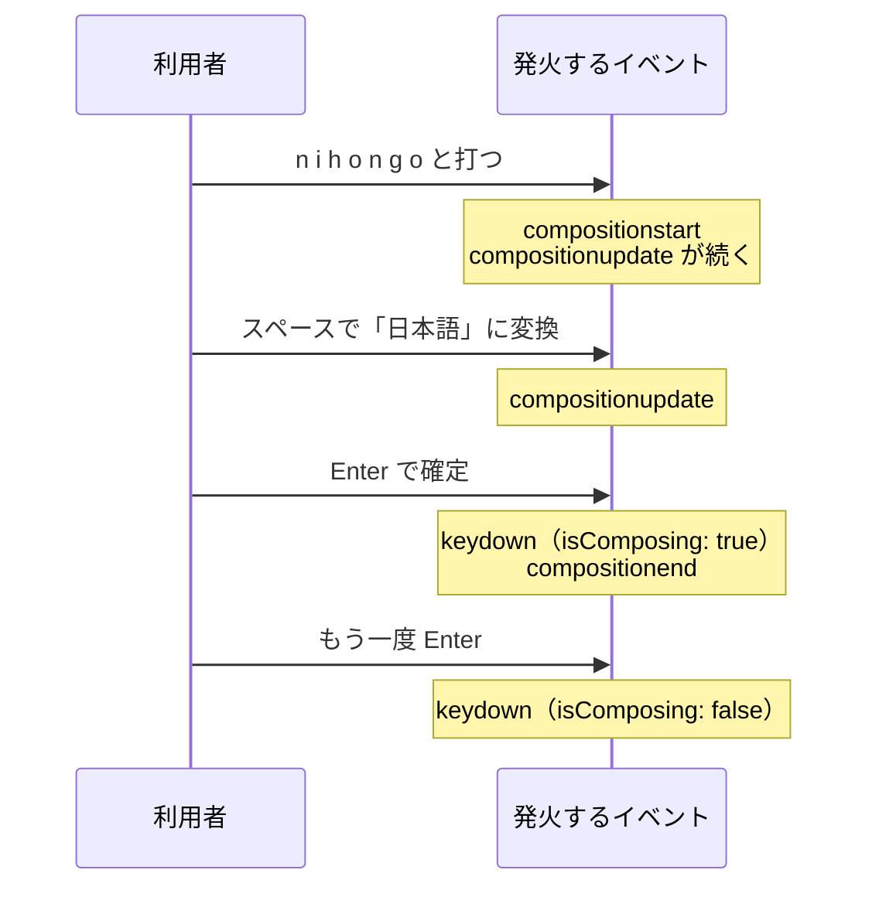

# IME 変換中の Enter — 日本語入力で誤送信が起きる仕組み

## 今日のゴール

- 日本語入力には変換中という状態があり、ブラウザが composition イベントで通知していると知る
- 変換確定の Enter でも keydown が発火するため、Enter で送信する実装は誤送信しうると知る
- `KeyboardEvent.isComposing` で変換中の Enter を見分けられると知る

## 変換確定の Enter で起きる誤送信

チャットの入力欄に「おつかれさまです」と打ち、漢字に変換して Enter で確定したつもりが、書きかけのメッセージがそのまま送信されてしまう。日本語でチャットツールを使っていれば、一度は経験があるはずです。検索ボックスで、変換を確定しただけなのに検索が走ってしまうのも同じ現象です。

この不具合にはやっかいな性質があります。

- 英語には変換という操作がないので、英語で開発して英語で動作確認している限り、まず気づけない
- そのため海外製のツールやライブラリでは、日本語ユーザーだけが踏む不具合として繰り返し話題になってきた
- Enter で送信する処理の実装を AI に任せると、この対策が入っていないコードのまま出てくることがよくある

つまり、日本語を使う自分たちが気づいて直す側に回りやすい不具合です。仕組みを知っていれば、原因の切り分けも AI への指示も一言で済みます。

## IME と変換中という状態

英語のキーボード入力は、押したキーがそのまま文字になります。日本語は違います。「nihongo」と打つと「にほんご」という未確定の文字列が現れ、スペースキーで「日本語」などの候補に切り替え、Enter で確定して初めて文字が決まります。

この変換を担っているのが IME（Input Method Editor）です。macOS の日本語入力や Windows の Microsoft IME のように OS に組み込まれた日本語入力システムのことで、ブラウザの外側で動いています。

ブラウザから見ると、キーが押されてから文字が確定するまでの間に、未確定の文字列が現れたり書き換わったりする期間があります。この期間を**変換中**と呼びます。英語では composing です。ブラウザはこの状態の変化を composition イベントとして通知します。

| イベント | 発火するタイミング |
|---|---|
| `compositionstart` | 変換中に入った。未確定の文字列が現れる直前 |
| `compositionupdate` | 未確定の文字列が変わった。文字の追加や候補の切り替えのたび |
| `compositionend` | 確定または取り消しで変換中が終わった |

## 変換確定の Enter でも keydown は発火する

Enter キーには 2 つの役割が同居しています。

- 変換中の Enter は、未確定の文字列を確定する合図として IME が受け取る
- 変換中でない Enter は、送信や改行など、ブラウザやアプリが割り当てた動作を起こす

利用者はこの 2 つを無意識に使い分けていますが、どちらの Enter でも `keydown` イベントは発火します。だから `onKeyDown` で Enter を拾って送信するコードは、確定のつもりの Enter を送信の合図と取り違えます。

この 2 つを見分けるために用意されているのが、キーボードイベントの `isComposing` プロパティです。`compositionstart` から `compositionend` までの間に発火したキーボードイベントでは `true` になります。変換確定の Enter の keydown は `compositionend` より前に発火するので、そこでは `isComposing` が `true` です。



図の最後の 2 つの Enter は、キーとしては同じでも `isComposing` の値が違います。ここが見分けの根拠になります。

## React の実装で防ぐ

チャットの入力欄で「Enter で送信、Shift+Enter で改行」という定番の挙動を作るとします。`<textarea>` の Enter は本来ただの改行なので、送信に割り当てるには `onKeyDown` で自前の判定が必要です。ここが誤送信の温床になります。

まず、対策が入っていないコードです。この機能を AI に任せると、こういう形で出てくることがよくあります。

```tsx
"use client";

import { useState } from "react";

type Props = {
  onSend: (text: string) => void;
};

export function ChatInput({ onSend }: Props) {
  const [text, setText] = useState("");

  const send = () => {
    if (text.trim() === "") return;
    onSend(text);
    setText("");
  };

  return (
    <form
      onSubmit={(event) => {
        event.preventDefault();
        send();
      }}
    >
      <label htmlFor="chat-text">メッセージ</label>
      <textarea
        id="chat-text"
        rows={3}
        value={text}
        onChange={(event) => setText(event.target.value)}
        onKeyDown={(event) => {
          if (event.key === "Enter" && !event.shiftKey) {
            event.preventDefault();
            send(); // 変換確定の Enter でもここが動いてしまう
          }
        }}
      />
      <button type="submit">送信</button>
    </form>
  );
}
```

英語で試すぶんにはきれいに動きます。しかし日本語では、変換確定の Enter の keydown もこの条件に一致するため、書きかけの本文がそのまま送信されます。

直し方は 1 行です。Enter の判定より先に `isComposing` を確かめ、変換中なら何もしません。React の `onKeyDown` に渡ってくるのは React が包んだイベントなので、`event.nativeEvent` からブラウザ本来のイベントを参照します。

```tsx
        onKeyDown={(event) => {
          if (event.nativeEvent.isComposing) {
            return; // 変換確定の Enter では送信しない
          }
          if (event.key === "Enter" && !event.shiftKey) {
            event.preventDefault();
            send();
          }
        }}
```

なお、Enter 送信を付けても `<form>` と送信ボタンは残しています。キーボードの Enter はあくまで近道で、マウスや支援技術で操作する人はボタンから送信するためです。`<label>` を `htmlFor` で結びつけておくのも同じ理由で、何の入力欄かをスクリーンリーダーにも伝えます。

もう 1 つ、既存のコードでよく見かける書き方があります。React は composition イベントも `onCompositionStart` / `onCompositionEnd` として扱えるので、変換中かどうかを自前の state で持つ形です。さきほどのコンポーネントに当てはめると、次の部分が変わります。

```tsx
  const [composing, setComposing] = useState(false);
```

```tsx
      <textarea
        id="chat-text"
        rows={3}
        value={text}
        onChange={(event) => setText(event.target.value)}
        onCompositionStart={() => setComposing(true)}
        onCompositionEnd={() => setComposing(false)}
        onKeyDown={(event) => {
          if (composing) return;
          if (event.key === "Enter" && !event.shiftKey) {
            event.preventDefault();
            send();
          }
        }}
      />
```

`isComposing` が広く使える今は必須の書き方ではありませんが、既存のコードや記事にはよく登場します。見かけたら「変換中フラグを自前で管理しているんだな」と読めれば十分です。

## AI への指示と確認

- **指示**: 「Enter で送信、Shift+Enter で改行。日本語 IME の変換確定の Enter では送信しない」と、最初から条件に入れて頼める
- **確認**: 出てきたコードに `isComposing` か composition という単語が見当たらなければ、日本語入力で誤送信しないか実際に試す

動作確認を英語だけで済ませないことも大切です。日本語の変換確定まで含めて操作して、初めてこの不具合は見つかります。

## まとめ

- 日本語入力には変換中という状態があり、compositionstart / compositionend がその始まりと終わり
- 変換確定の Enter でも keydown は発火するので、Enter 送信の実装は誤送信の元になる
- `isComposing` が `true` のキーボードイベントは変換中なので、Enter 判定の前に無視する
